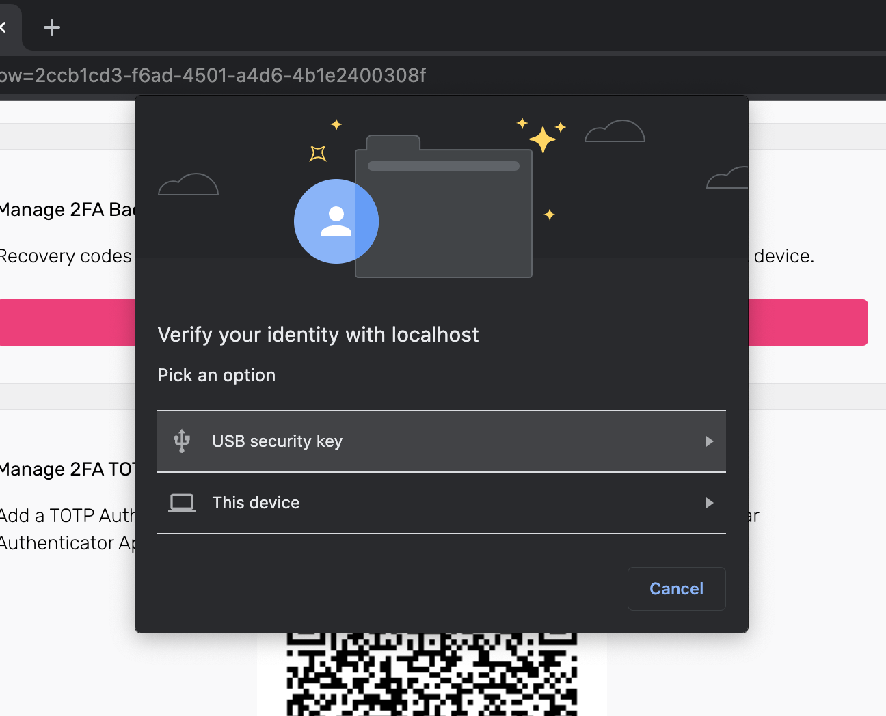

The Web Authentication Browser API (also known as WebAuthn) is a
[specification](https://w3c.github.io/webauthn/) written by the
[W3C](https://www.w3.org/) and [FIDO](https://fidoalliance.org/). The WebAuthn
API allows servers to register and authenticate users using public key
cryptography instead of a password. WebAuthn is commonly used with

- a USB, NFC, or Bluetooth low energy device (e.g.
  [YubiKey](https://www.yubico.com)) to authenticate;
- using an Operating System "platform module" (e.g. TouchID, FaceID, Windows
  Hello Face, Android Biometric Authentication, ...);

Once the end-user triggers the WebAuthn process, the browser will show a
WebAuthn prompt which looks different per browser:

Ory's WebAuthN implementation can be used for both multi-factor authentication
and passwordless authentication. You need to configure whether WebAuthn is used
for passwordless, or for multi-factor authentication.
