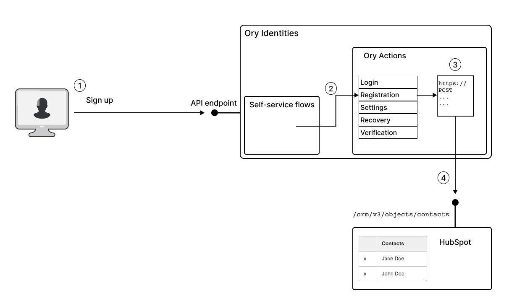
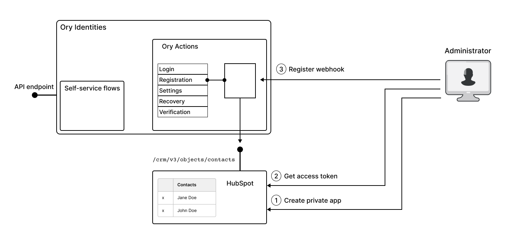

[HubSpot](https://www.hubspot.com/) is a CRM platform that can be used to manage data from marketing, sales, content management,
and customer service. The HubSpot API in combination with Ory Actions makes it possible to integrate any of the Ory self-service
flows with HubSpot. A common use case is to integrate via the
[HubSpot Contacts API](https://developers.hubspot.com/docs/api/crm/contacts) with the Ory registration flow, so that new contacts
are automatically created in the HubSpot contacts list whenever a new user signs up to our service.

The advantage of integrating Ory with HubSpot is that users signing up automatically become available to the CRM platform,
facilitating lead generation and marketing campaigns (provided that users give the appropriate consents).

## How Ory integrates with HubSpot

The following diagram illustrates how Ory integrates with HubSpot. In this example, we consider the case where the registration
flow in Ory triggers an API call to HubSpot, automatically creating a new contact in HubSpot. In other words, a new record is
created simultaneously in the Ory Identities database and in the HubSpot contacts list.



In this example, the API call to HubSpot is triggered as follows:

1. The end user signs up to a new account using Ory Identities, completing the registration self-service flow.
2. Upon completion, the registration flow triggers any actions registered under the `flows.registration.after.hooks` section of
   Ory Identities configuration.
3. The hook for the HubSpot CRM platform, registered under `flows.registration.after.hooks`, is now triggered, and Ory evaluates
   the Jsonnet template to construct the body of the API call.
4. The Ory action invokes the `/com/v3/objects/contacts` HubSpot API endpoint to create a new contact in HubSpot.

## Create a HubSpot webhook



To set up the integration follow these steps

1. Set up the necessary [contact lists](https://knowledge.hubspot.com/lists/create-active-or-static-lists) for your customer data.
   Creates a new private app for this integration in the Hubspot settings. For details of how to create a private app in HubSpot,
   see the [Private apps](https://developers.hubspot.com/docs/api/private-apps) page in the HubSpot documentation.
2. Copies the access token from the new private app.
3. Using the access key from the previous step, create and register an Ory Action for triggering a HubSpot API call whenever a
   user completes the registration flow.
4. Test the integration to ensure that data is routed correctly from your application to HubSpot.

### Configuration

Follow these steps to configure an integration that adds every newly registered user to your HubSpot contacts:

```mdx-code-block
import JsonnetInfo from './_common/jsonnetinfo.mdx'

<JsonnetInfo />
```

1. Create a Jsonnet file. It transforms the identity data from Ory to a format HubSpot understands.

   ```jsonnet title="./hubspot_identify.jsonnet"
   function(ctx) {
   properties: {
      email: ctx.identity.traits.email,
      firstname: ctx.identity.traits.name, # User's first name taken from the "name" identity trait.
      # ... # You can get more user data depending on the identity schema you're using.
   },
   }
   ```

2. To use this Jsonnet snippet, encode it to Base64 and save it to the clipboard:

   ```shell
   cat hubspot_identify.jsonnet | base64 | pbcopy
   ```

3. Define the Ory Action as a JSON object. Remember to replace the placeholders with your data.

   ```json title="./webhook-action.json"
   {
     "hook": "web_hook",
     "config": {
       "response": {
         "ignore": true
       },
       "auth": {
         "type": "api_key",
         "config": {
           "name": "Authorization",
           "value": "Bearer {PRIVATE_APP_ACCESS_TOKEN}",
           "in": "header"
         }
       },
       "url": "https://api.hubapi.com/crm/v3/objects/contacts",
       "method": "POST",
       "body": "base64://{BASE64_ENCODED_JSONNET}"
     }
   }
   ```

4. Add this action to your Ory Network project using the Ory CLI.

- Use this command to trigger this action after all successful registrations:

  ```shell
  ory patch identity-config --project <project-id> --workspace <workspace-id> \
    --add "/selfservice/flows/registration/after/hooks/0=$(cat webhook-action.json)" \
    --format yaml
  ```

- Alternatively, use this command to trigger the action only for registrations with social sign-in profiles:

  ```shell
  ory patch identity-config --project <project-id> --workspace <workspace-id> \
    --add "/selfservice/flows/registration/after/oidc/hooks/0=$(cat webhook-action.json)" \
    --format yaml
  ```

:::tip

Read [this document](../../kratos/hooks/01_configure-hooks.mdx) to learn more about choosing the authentication/registration
method that triggers the action.

:::
