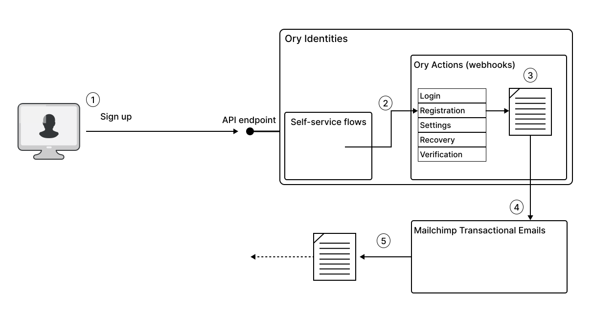
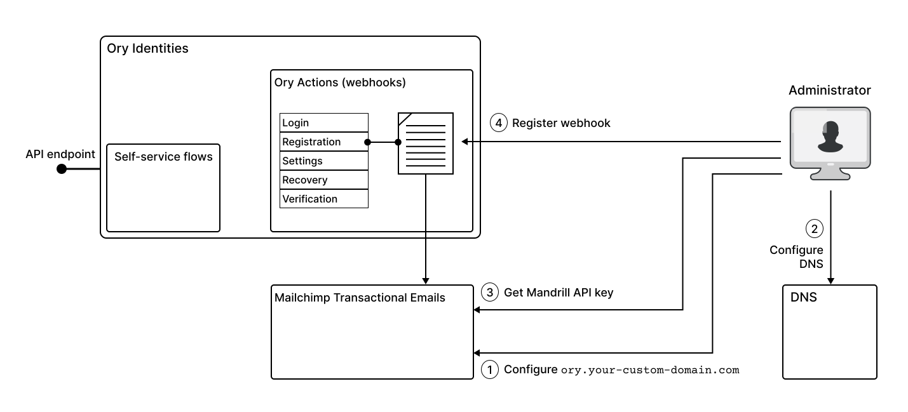

[Mailchimp](https://www.mailchimp.com/) is an email marketing platform that provides tools and services to help businesses send
marketing emails, newsletters, and automated campaigns to their customers. It allows you to create, manage, and send emails to
your subscribers, as well as segment and target specific groups of subscribers based on their interests and behaviors.

There are two main subsystems of Mailchimp that are of interest:

- **Mailchimp email campaign tools** - available from the main Mailchimp dashboard, the campaign tools enable you to organize and
  manage mass mailings to specific audiences (subscriber lists).
- **Mailchimp Transactional Email** - available from the [Mandrill app](https://mandrillapp.com/) dashboard, Mailchimp
  transactional email is a paid optional add-on for Mailchimp for managing transactional emails, which are user-specific emails
  sent to one user at a time.

In fact, it is the transactional email subsystem that is most relevant to the Ory integration use case. A transactional email is
an automated email message sent to an individual user, in response to some event or interaction with your application. For
example, when a user signs up to your website for the first time, this might trigger a welcome email to be sent to their email
address. This is where the integration with Ory comes in. You can configure Ory Actions to trigger transactional emails in
response any event that occurs in a self-service flow such as login, registration, or account validation.

The advantage of integrating Ory with the Mailchimp Transactional Email system is that Mailchimp sends these emails on your behalf
and is able to track all of the transactional emails that pass through the system. You can use the Mandrill dashboard to track all
of the inbound and outbound transactional emails and generate reports and analytics for this email traffic.

## How Ory integrates with Mailchimp

The following diagram illustrates how Ory integrates with the Mailchimp Transactional Email system. In this particular example, we
consider the case where a transactional email is triggered immediately after a user signs up.



In this example, the transactional email is triggered as follows:

1. The end user signs up to a new account, completing the registration self-service flow.
2. Upon completion, the registration flow triggers any actions registered under the `flows.registration.after.hooks` section of
   Ory Identities configuration.
3. The hook for Mailchimp Transactional Email, registered under `flows.registration.after.hooks` is now triggered, and Ory
   evaluates the Jsonnet email template, personalizing the content with the user's name and email address.
4. The Ory action forwards the content of the email to Mailchimp by invoking an API endpoint on the Mailchimp Transactional Email
   system.
5. Mailchimp imports the email into its email system and then sends the transactional email to the end user on behalf of your
   email domain.

:::info

If you plan to send a transactional email that includes the header `From: info@{your-domain}.com`, you need to configure Mailchimp
so that it has the authority to send (and receive) emails for the `{your-domain}.com` email domain.

:::

## Create a Mailchimp webhook



To integrate Mailchimp using Ory Actions, you must complete these steps:

1. Go to the Mailchimp Transactional Email dashboard and add your domain, `{your-domain}.com`, as a sending domain. See
   [Add a sending domain](https://mailchimp.com/developer/transactional/guides/send-first-email/#add-a-sending-domain) in the
   Mailchimp developer documentation.
2. Next, configure your DNS record, so that Mailchimp can act as a trusted email server in your domain. See
   [Configure your DNS](https://mailchimp.com/developer/transactional/guides/send-first-email/#configure-your-dns) in the
   Mailchimp developer documentation.
3. Create a Mandrill API key to authorize Ory to access the Mandrill API, enabling the system to forward transactional emails to
   Mailchimp.

   :::note

   Mandrill and Mailchimp are separate applications that have their own API keys. You can't use the Mailchimp API key to interact
   with Mandrill APIs. To generate a Mandrill API key go to the [Settings](https://mandrillapp.com/settings) page on the Mailchimp
   Transactional Email system dashboard.

   :::

4. Using the API key from the previous step, create an Ory Action for triggering a transactional email whenever a user completes
   the registration flow. See [Mailchimp integration with Ory Actions](https://www.ory.sh/docs/actions/integrations/mailchimp) in
   the Ory documentation.
5. Test the integration by signing up with a test account in your Ory Network project and checking that the corresponding user
   data is updated in Mailchimp.

## Configuration

```mdx-code-block
import JsonnetInfo from './_common/jsonnetinfo.mdx'

<JsonnetInfo />
```

1. First, create a Jsonnet file. It transforms the identity data from Ory to a format Mailchimp understands:

   :::info

   For Mailchimp, you must pass the API key in the request body. This means you must include it in the Jsonnet snippet.

   :::

   ```jsonnet title="./mailchimp_identify.jsonnet"
   function(ctx) {
   key: "{Your-Mailchimp-Api-Key}",
   message: {
      from_email: "hello@example.com",
      subject: "Hello from Ory",
      text: "Welcome to Ory! Have fun and happy hacking!",
      to: [
         {
         email: ctx.identity.verifiable_addresses[0].value,
         type: "to"
         }
      ]
   }
   }
   ```

2. To use this Jsonnet snippet, encode it to Base64 and save it to the clipboard:

   ```shell
   cat mailchimp_identify.jsonnet | base64 | pbcopy
   ```

3. Next, define the Ory Action as a JSON Object. Remember to replace the placeholders with your data.

   ```json title="./webhook-action.json"
   {
     "hook": "web_hook",
     "config": {
       "url": "https://mandrillapp.com/api/1.0/messages/send",
       "method": "POST",
       "body": "base64://{ENCODED_JSONNET}"
     }
   }
   ```

4. Finally, add this action to your Ory Network Project using the Ory CLI.

- You can trigger this webhook after successful registration:

  ```shell
  ory patch identity-config --project <project-id> --workspace <workspace-id> \
    --add "/selfservice/flows/registration/after/hooks/0=$(cat webhook-action.json)" \
    --format yaml
  ```

- Alternatively, you can trigger this action only when the user signs up with a password or social sign-in:

  ```shell
  ory patch identity-config --project <project-id> --workspace <workspace-id> \
    --add "/selfservice/flows/registration/after/password/hooks/0=$(cat webhook-action.json)" \
    --format yaml
  ```
