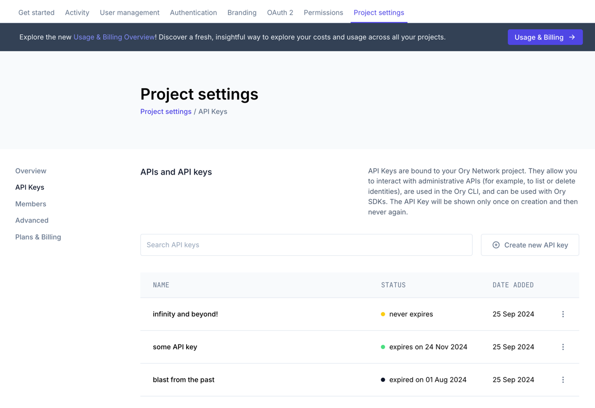
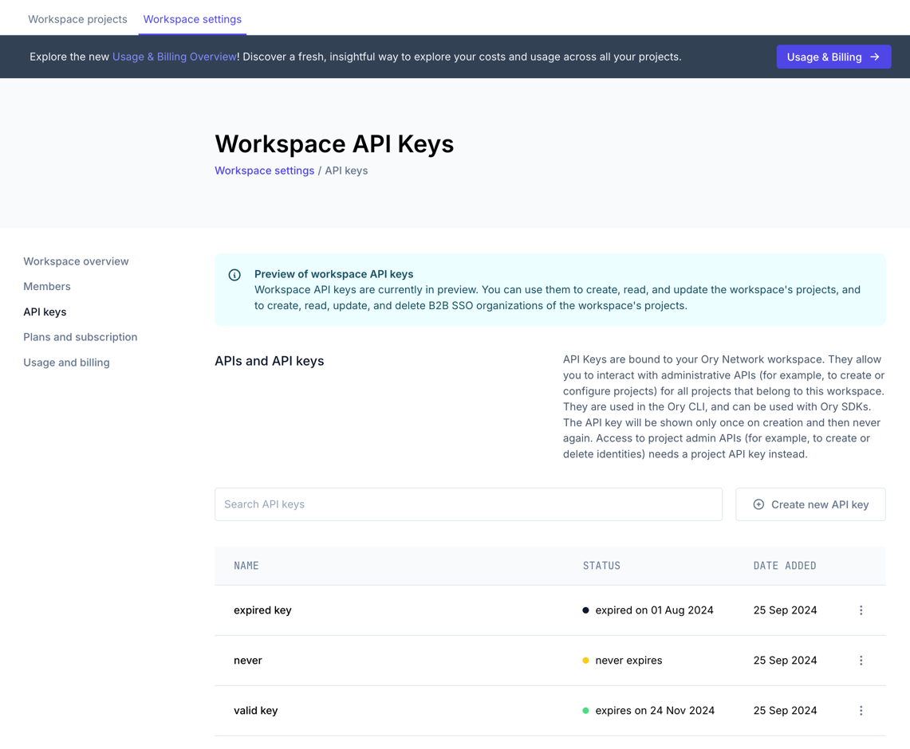

```mdx-code-block
import BrowserWindow from "@site/src/theme/BrowserWindow"
```

# Ory Network API Keys

**Ory Network Project APIs** are separated into:

- **Ory Network Frontend APIs** are used to interact with Ory Network projects, such as register users or checking login state.
- **Ory Network Admin APIs** are used to perform privileged operations on Ory Network projects, such as deleting users or creating
  permissions.

**Ory Network Management APIs** are used to manage Ory Network projects, such as creating a new project or changing settings.

## Authorizing Ory Network Project Frontend APIs

Frontend APIs are used to interact with Ory Network projects from your frontend application and do not require any special
authorization.

## Authorizing Ory Network Project Admin APIs

API Keys are used to authorize privileged operations to Ory Network Project Admin APIs. For example, you must use an API Key to
call the Admin API, which allows you to delete users.

API Keys work only in the context of the Project for which they were created. You create API Keys in the
[Ory Console](https://console.ory.sh/).

### Creating API Keys

Follow these steps to create API Keys for your Project:

1. Go to <ConsoleLink route="project.developers" />.
2. Click **Create new API key**
3. Enter the API Key name
4. Select an **expiration** date.
5. Click **Create**
6. Copy the created API Key

Finding the best expiration date for an API key is always a tradeoff between security and usability. Rotating keys is generally a
good practice, however it comes at the cost of increased maintenance -- automatic or manual. If your API keys expire before you
renew them, your service might degrade or become unavailable.

```mdx-code-block
<BrowserWindow url="https://console.ory.sh/projects/current/developers">



</BrowserWindow>
```

:::caution

The API Key you created is displayed only once. When you close the prompt, you can't access the key again. Make sure to save the
API Key before you close the prompt or reload the page.

API Keys are bound to an Ory Network project, and not to a specific user. This means that any user with access to the API Key can
perform the operations that the API Key allows, even if they are no longer part of the project. Make sure to keep your API Keys
secure and rotate them if necessary.

:::

### Usage

Use the API Key in API calls, SDK calls, or command-line interactions. Ory API Keys have a `ory_apikey_` or `ory_pat_` prefix,
which makes it easy to identify them when analyzing code.

For example, when calling the Admin API at `/admin/identities`, include the API Key in the `Authorization` header:

```shell
GET /admin/identities HTTP/1.1
Host: $PROJECT_SLUG.projects.oryapis.com
Accept: application/json
# highlight-next-line
Authorization: Bearer $API_KEY
```

## Authorizing Ory Network Workspace Admin APIs

Workspace API keys are used to authorize privileged operations to Ory Network Workspace admin APIs as well as the project admin
APIs of all projects that belong to this workspace. For example, you must use a Workspace API key to create a new project in a
workspace, or add a new B2B SSO organization to a project within that workspace.

API Keys work in the context of the workspace for which they were created, as well as for all projects of that workspace. You
create API Keys in the [Ory Console](https://console.ory.sh/).

However, workspace API keys do not work for managing the data of the projects itself, such as interacting with identities,
sessions, or OAuth2 clients. For these operations, you need to use the
[project API keys](#authorizing-ory-network-project-admin-apis).

### Creating API keys

Follow these steps to create API keys for your workspace:

[//]: # "TODO: use the <ConsoleLink> once it works with `current` workspace links"

1. Go to the [Ory Console](https://console.ory.sh/).
2. Go to **Workspace settings** through the workspace menu in the top left corner.
3. Select **API keys** in the sidebar.
4. Click the **+** icon in the **API Keys** section.
5. Enter the API Key name
6. Select an **expiration** date.
7. Click **Create** . Copy the created API Key from the prompt that shows at the bottom right of the screen.

Finding the best expiration date for an API key is always a tradeoff between security and usability. Rotating keys is generally a
good practice, however it comes at the cost of increased maintenance -- automatic or manual. If your API keys expire before you
renew them, your service might degrade or become unavailable.

```mdx-code-block
<BrowserWindow url="https://console.ory.sh/workspaces/current/settings/api-keys">



</BrowserWindow>
```

:::caution

The API Key you created is displayed only once. When you close the prompt, you can't access the key again. Make sure to save the
API Key before you close the prompt or reload the page.

API Keys are bound to an Ory Network workspace, and not to a specific user. This means that any user with access to the API Key
can perform the operations that the API Key allows, even if they are no longer part of the workspace. Make sure to keep your API
Keys secure and rotate them if necessary.

:::

### Usage

Use the API Key in API calls, SDK calls, or command-line interactions. Ory Workspace API Keys have a `ory_wak_` prefix, which
makes it easy to identify them when analyzing code.

For example, when calling the API to get a project at `/projects/:project_id`, include the API Key in the `Authorization` header:

```shell
GET /projects/$PROJECT_ID HTTP/1.1
Host: api.console.ory.sh
Accept: application/json
# highlight-next-line
Authorization: Bearer $API_KEY
```

## Workspace API Keys vs Project API Keys

See the following table for which operations can be performed with Workspace API keys and Project API keys. CRUD stands for
create, read, update, delete.

|                                                                                                     | Workspace API Keys   | Project API Keys                     |
| --------------------------------------------------------------------------------------------------- | -------------------- | ------------------------------------ |
| Base URL                                                                                            | `api.console.ory.sh` | `$PROJECT_SLUG.projects.oryapis.com` |
| Create projects                                                                                     | Yes                  | No                                   |
| Change project configurations, including the identity, oauth2, and permission service configuration | Yes                  | No                                   |
| Delete projects                                                                                     | Yes                  | No                                   |
| List and invite members                                                                             | Yes                  | No                                   |
| CRUD B2B SSO organizations                                                                          | Yes                  | No                                   |
| CRUD onboarding portal links                                                                        | Yes                  | No                                   |
| CRUD project API keys                                                                               | Yes                  | No                                   |
| CRUD identities                                                                                     | No                   | Yes                                  |
| CRUD OAuth2 clients                                                                                 | No                   | Yes                                  |
| CRUD relation tuples                                                                                | No                   | Yes                                  |
