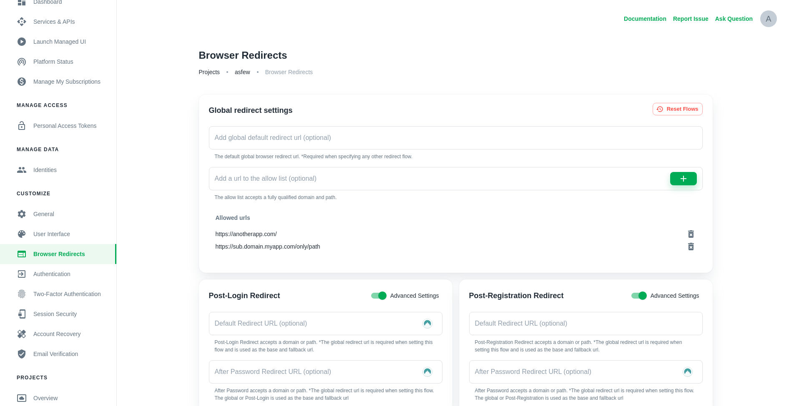
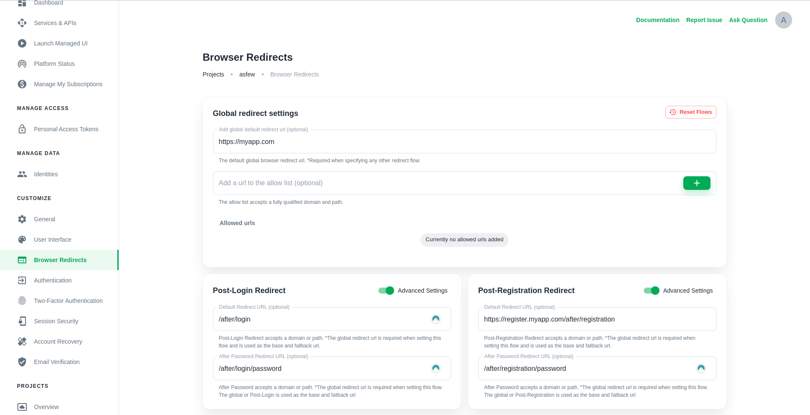
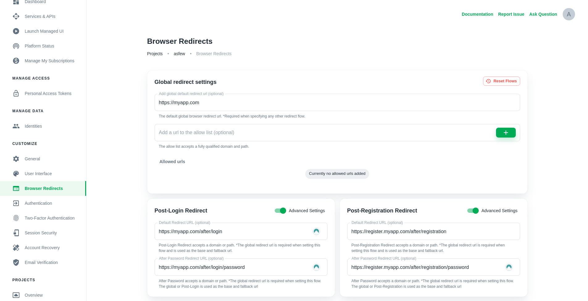
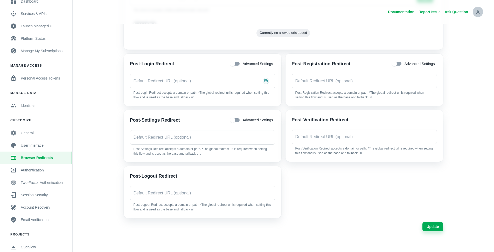
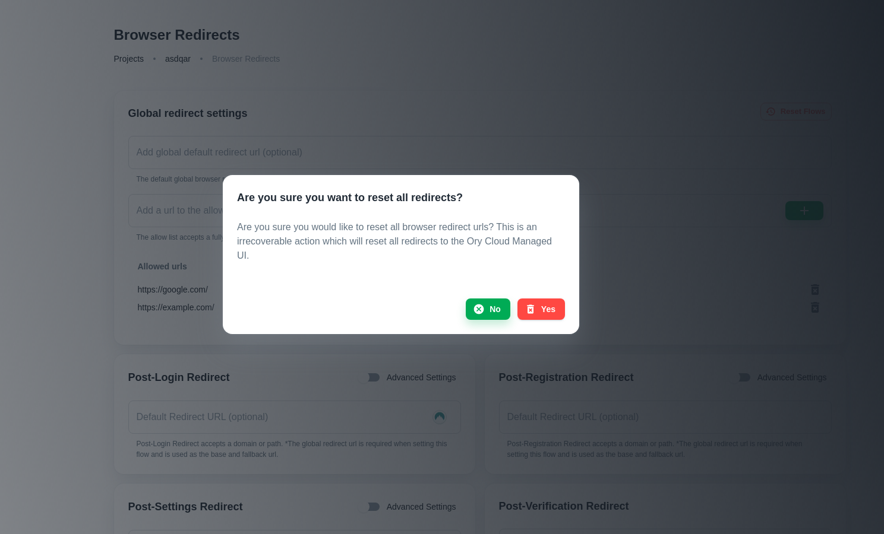
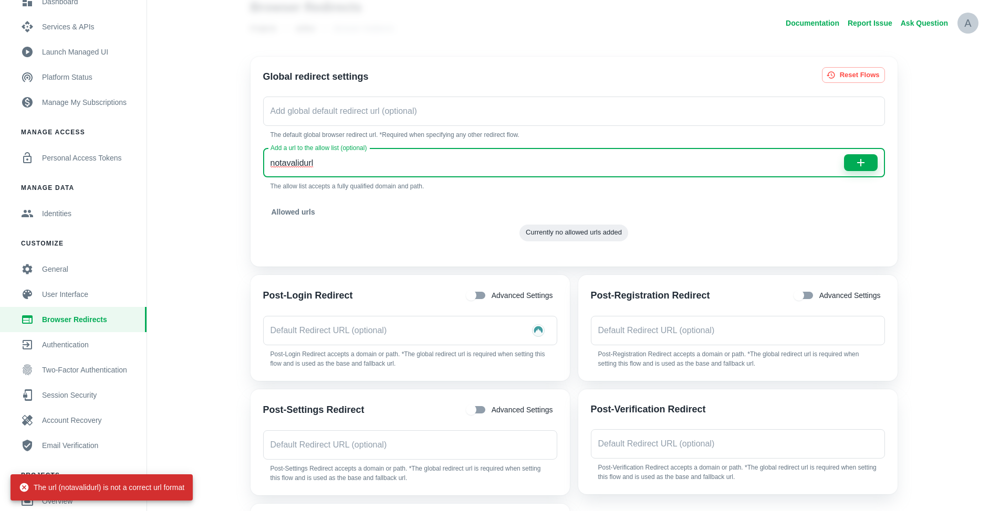
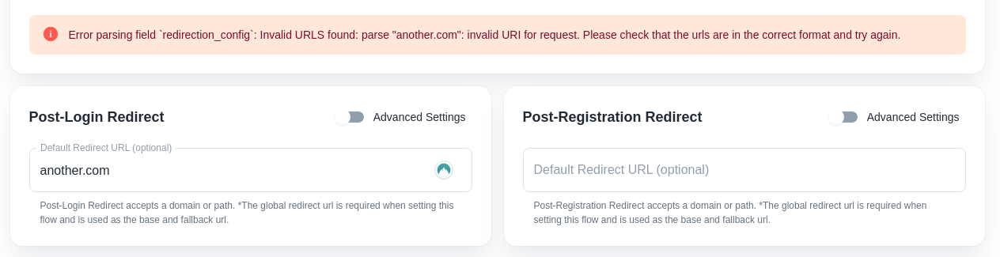
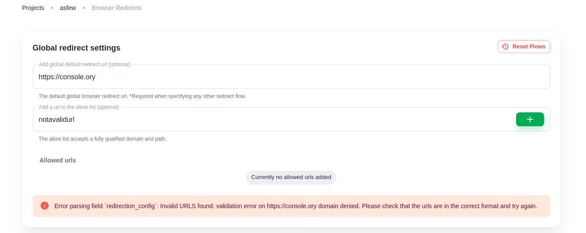

This document covers browser redirects for Server Side Applications (Node.js, PHP, Golang etc.) and how to configure them.

## Allow list

Set dynamic redirects using the `?return_to=` query parameter on self-service flows. For example: a user opens a sharable link to
go to `https://myapp.com/posts`. This URL requires the user to have an active session and redirects the user back to the login
page. To return the user back to the original URL, append `?return_to=https://myapp.com/posts` when starting the
[self-service login flow](../reference/api#operation/initializeSelfServiceLoginFlowForBrowsers):

```js
curl -X GET 'http://<your-project>.projects.oryapis.com/self-service/login/browser?return_to=...'
```

When the login flow starts in a browser with a `return_to` URL set, `return_to` will be set. For API clients such as AJAX
[visit this section](#api-clients).

The `allow list` prevents
[Open Redirect Attacks](https://cheatsheetseries.owasp.org/cheatsheets/Unvalidated_Redirects_and_Forwards_Cheat_Sheet.html) by
just allowing certain domains, or paths on a domain. As in the example below `https://sub.domain.myapp.com/only/path` needs to
match the sub-domain and path. Other redirects using `myapp.com` will fail. Redirects using `https://anotherapp.com` will succeed
on any path.



## Redirect flows

The Ory Network has a total of six flows, **Login**, **Registration**, **Verification**, **Recovery**, **Settings** and **Logout**
which can be configured to redirect back to any URL. A common use case would be to redirect the user to your application home
screen after a logout or to a specific URL on a sub-domain after a settings password update.

On project creation the redirect flows are by default set to the Ory Account Experience pages.

### Login, registration, and settings

The Login and Registration flows have three fields (all optional):

1. Default Redirect URL domain or path relative to your application URL
2. Post-Password Redirect URL
3. Post-OIDC Redirect URL

```yaml file="config.yml"
selfservice:
  flows:
    login:
      after:
        default_browser_return_url: https://this-is-overridden-by-password/
        password:
          # redirect after successful login or registration with `password` method
          default_browser_return_url: https://end-up-here-after-login-with-password/
        oidc:
          # redirect after successful login or registration with `OIDC` method
          default_browser_return_url: https://end-up-here-after-login-with-oidc/
    registration:
      after:
        default_browser_return_url: https://end-up-here-after-registration/
    # password:
    # ...
```

The Settings flow has three fields (all optional):

1. Default Redirect URL domain or path relative to your application URL
2. Post-Password Redirect URL
3. Post-Profile Redirect URL

```yaml file="config.yml"
selfservice:
  flows:
    settings:
      after:
        default_browser_return_url: https://this-is-overridden-by-password/
        password:
          # redirect after successfully updating the password in settings
          default_browser_return_url: https://end-up-here-after-login-with-password/
        profile:
          # redirect after successfully updating the username or email in settings
          default_browser_return_url: https://end-up-here-after-login-with-password/
```

The Default Redirect URL is used when Ory isn't sure where to redirect. It’s a good idea for this to be your default app URL, for
example `/` or the dashboard. Use sub-conditions to control where users are redirected after registration, login, and other
self-service flows.

When setting the Post-Login Redirect as an fully qualified domain name
([FQDN](https://en.wikipedia.org/wiki/Fully_qualified_domain_name) such as `https://domain.example/login` it will overwrite the
Default Redirect URL. As a path it will replace the Default Redirect URL path, for example `/login` will alter
`https://domain.example/default/path` to `https://domain.example/login`. This works the same for all other Post- flows and
sub-conditions.

On sub-conditions such as After Password or After Profile an FQDN or a path can be set. All the relative URLs will be updated with
their respective base URL. As shown in the example below, the Post-Login Redirect URL is a path. This means the base URL will be
the Default Redirect URL (`https://myapp.com`). This will set the Post-Login Redirect URL to `https://myapp.com/after/login` and
the Post-Password Redirect URL to `https://myapp.com/after/login/password`.



In the example below, the Post-Login Redirect URL is a FQDN. This will set the Post-Login Redirect URL to
`https://myapp.com/after/login` and the Post-Password Redirect URL to `https://myapp.com/after/login/password`.



### Verification, recovery, and logout

:::tip

The Post-Recovery redirect isn't supported and will automatically redirect the user to the Settings UI URL. Use the Post-Settings
redirect for Post-Recovery flows.

:::

Each of these flows has a single field, the Default Redirect URL. As with Login, Registration, and Settings configurations, the
Default Redirect URL can be an FQDN or a path.



## Reset and update flows

Update or delete a redirect by either changing the current redirects value or deleting the entry and clicking the **Update**
button. Reset all flows at once with the **Reset Flows** button which will prompt a confirmation box. Resetting all flows will
reset all the fields back to the default value which is the Ory Account Experience.

Updates to flows will take effect on **new** flows. It will have no effect on old flows that haven't expired yet.



## Troubleshooting

### API clients

The browser redirects work just for regular browser requests.  
If you are using an API Client, for example AJAX, redirect the user to the right endpoint in the application:

```ts
          .then((res) => {
            router.push('/<your-route>')
          })
```

### Invalid URL

The [allow list](#allow-list) and any of the post-flow redirects require a valid URL with a scheme (HTTP or HTTPS). An example of
a valid URL is `https://www.google.com`.





### Domain denied

It's not possible to set the any Ory-owned domain as redirect URL.



## Read more

For a deeper dive into the background of browser redirects, read
[this document](https://www.ory.com/kratos/docs/concepts/browser-redirect-flow-completion)
