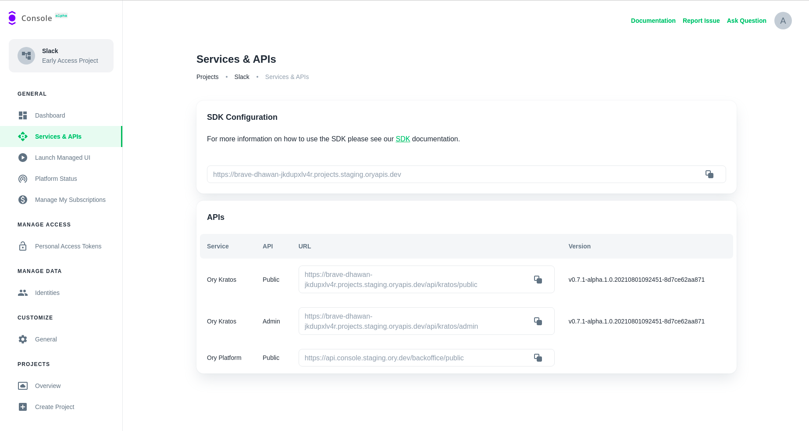

The Ory Cloud exposes APIs to its services to easily integrate your applications
using our SDKs or HTTP Endpoints directly. This makes it possible for you to
integrate your own user interface (UI) in the form of a Web or Native
Application.

## SDK Configuration

The SDK url is the easiest way to integrate your interface with the Ory Cloud.
It is only a single API endpoint which is used to speak directly to your Ory
project. You can read more about the different
[SDKs here](../start-building/other-languages).

## APIs

These endpoints are for integration with the individual Ory Cloud services such
as [Ory Kratos](https://ory.sh/kratos). Currently the Ory Cloud offers a hosted
instance of [Ory Kratos](https://ory.sh/kratos) with more to follow in the
coming months.

For more information on our offering, please refer to our
[roadmap](../cloud/cloud-roadmap.mdx).

## Implementation

Please refer to our [Start Building](../start-building.mdx) guides on
implementing the SDK as well as the usage of the Ory Cloud services.
