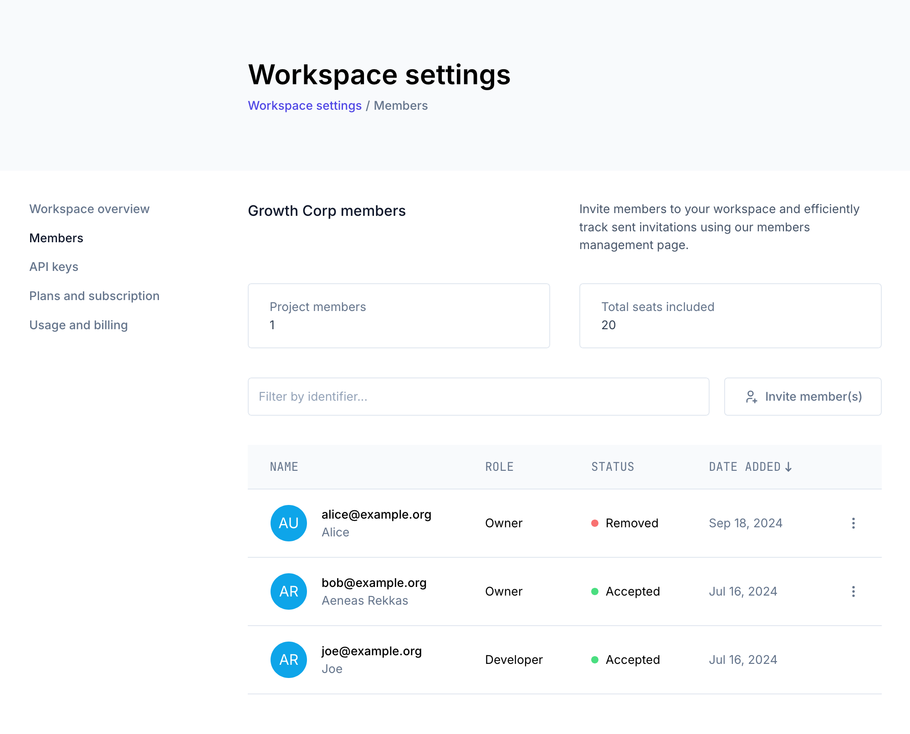
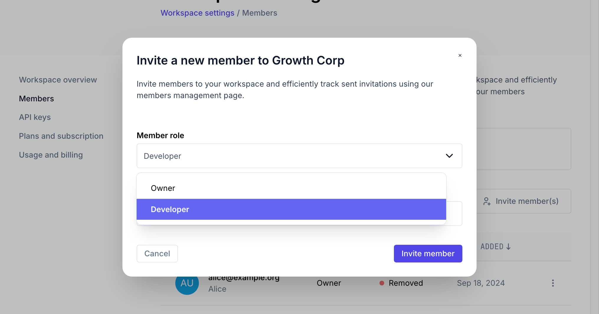
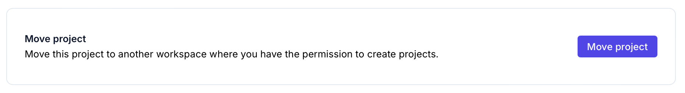

In Ory Network, managing project ownership is sometimes required. Projects are typically part of a workspace, where you can easily
assign multiple owners. However, legacy projects that predate the workspace system might require a few extra steps. Follow the
appropriate instructions below based on your project's status.

## The project is part of a workspace

For most projects, which are already within a workspace, transferring ownership is simple.

1. **Adding a new owner**:

   1. Select the workspace or project.
   2. Navigate to the **"Workspace settings"**.
   3. Select the **"Members"** section.

      

   4. Select the **"Members"** section. Here, you can add the new owner (e.g., `new_owner@example.com`). This allows both of you
      to manage the project seamlessly.

      

2. **Adjusting current ownership**: If you need to change the role of someone:
   - Remove the user from the workspace.
   - Re-invite the user to the workspace with the desired new role (e.g., as a member instead of an owner).

Workspaces are designed to streamline collaboration, making it easy to manage team members and their access to projects.

## The project is not part of a workspace (legacy projects)

For legacy projects that were created before the introduction of workspaces, you need to take an extra step to enable ownership
transfer.

1. **Moving the project to a workspace**:

   1. First, select the project you want to transfer.
   2. Go to the [project settings](https://console.ory.com/projects/7c256603-6750-4f22-8fc0-9430fc3fc747/settings) and click on
      _"Move project"_:

      

   3. Select the workspace to move the project to.
   4. Change to the workspace you just selected.

2. **Assigning ownership in the workspace**: See the instructions above for projects that are part of a workspace.
