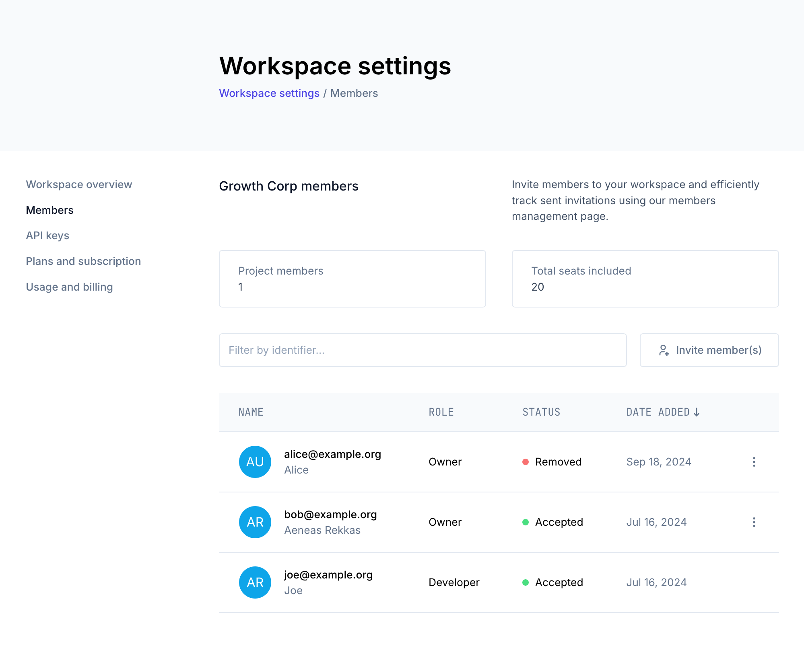

The Ory Console uses role-based access control enforced through Ory Keto. Roles are assigned at two levels: workspace and project.

## Workspace roles

A workspace has three roles: Owner, Developer, and Viewer.

### Owner

The Owner role has full administrative control over the workspace.

- View and edit workspace metadata
- Upgrade the workspace plan
- View and manage billing
- View and manage members
- Create and delete workspace API keys
- Create projects and view the projects list

### Developer

The Developer role provides day-to-day access without administrative capabilities.

- View workspace metadata
- Create projects and view the projects list
- View members
- View workspace API keys

Developers cannot:

- Edit workspace metadata
- Manage billing
- Manage workspace members
- Create or delete workspace API keys

### Viewer

The Viewer role provides read-only access to the workspace.

- View workspace metadata
- View members
- View workspace API keys
- View the projects list

Viewers also get read-only access to the settings of every project in the workspace. See [project Viewer](#viewer-1) for what that
includes.

Viewers cannot:

- Create projects
- View or manage billing
- Change any workspace setting

### Workspace permission matrix

| Permission                       | Viewer | Developer | Owner |
| -------------------------------- | ------ | --------- | ----- |
| View workspace metadata          | Yes    | Yes       | Yes   |
| Edit workspace metadata          | No     | No        | Yes   |
| Upgrade workspace plan           | No     | No        | Yes   |
| View billing                     | No     | No        | Yes   |
| Manage billing                   | No     | No        | Yes   |
| View members                     | Yes    | Yes       | Yes   |
| Manage members                   | No     | No        | Yes   |
| View workspace API keys          | Yes    | Yes       | Yes   |
| Create/delete workspace API keys | No     | No        | Yes   |
| Create projects                  | No     | Yes       | Yes   |
| View projects list               | Yes    | Yes       | Yes   |

## Project roles

A project has three roles: Owner, Developer, and Viewer.

### Owner

The Owner role has full control over the project, including destructive and administrative actions. Owners inherit all Developer
permissions.

In addition to Developer permissions, Owners can:

- Delete the project
- Move the project between workspaces
- Upgrade the project plan
- Add and remove collaborators
- Modify project workspace settings

### Developer

The Developer role provides full access to project configuration and all Ory services.

- Read and write project configuration
- View collaborators
- Manage project API keys
- Manage custom domains (CNAMEs)
- Manage event streams
- Full access to Ory Identities (read/write identities, credentials, sessions, and messages)
- Full access to Ory Permissions (read/write relationships, read permissions)
- Full access to Ory OAuth2 (read/write clients)

Developers cannot:

- Delete or move the project
- Add or remove collaborators
- Modify project workspace settings

### Viewer

The Viewer role provides read-only access to project settings.

- Read project configuration
- View collaborators
- View project API keys
- View custom domains (CNAMEs)
- View event streams

Viewers have no access to data managed by Ory services. They cannot read or write identities, sessions, message delivery, OAuth2
clients, permission relationships, or issued and imported API keys.

In the Ory Console, the actions that would change a resource — such as save, create, delete, and invite — are disabled for
Viewers, with a tooltip explaining the missing permission.

### Project permission matrix

| Permission                          | Viewer | Developer | Owner |
| ----------------------------------- | ------ | --------- | ----- |
| Read project configuration          | Yes    | Yes       | Yes   |
| Write project configuration         | No     | Yes       | Yes   |
| View collaborators                  | Yes    | Yes       | Yes   |
| Add/remove collaborators            | No     | No        | Yes   |
| View project API keys               | Yes    | Yes       | Yes   |
| Manage project API keys             | No     | Yes       | Yes   |
| View issued and imported API keys   | No     | Yes       | Yes   |
| Manage issued and imported API keys | No     | Yes       | Yes   |
| View custom domains (CNAMEs)        | Yes    | Yes       | Yes   |
| Manage custom domains (CNAMEs)      | No     | Yes       | Yes   |
| View event streams                  | Yes    | Yes       | Yes   |
| Manage event streams                | No     | Yes       | Yes   |
| Ory Identities (full read/write)    | No     | Yes       | Yes   |
| Ory Permissions (full read/write)   | No     | Yes       | Yes   |
| Ory OAuth2 (full read/write)        | No     | Yes       | Yes   |
| Delete project                      | No     | No        | Yes   |
| Move project                        | No     | No        | Yes   |
| Upgrade project plan                | No     | No        | Yes   |
| Modify workspace settings           | No     | No        | Yes   |

## Managing roles

To change a member's role, a workspace Owner can go to <ConsoleLink route="workspace.settings.members" />.

When inviting a member to a workspace or a collaborator to a project, you select the role as part of the invitation.

Project roles are additive to workspace roles. A member's effective role on a project is the higher of their workspace role and
any role they hold directly on that project. To raise a workspace Viewer to Developer on a single project, invite that member to
the project with the Developer role — the role is chosen in the invitation and can't be changed afterwards. They then have
Developer access on that project while staying read-only across the rest of the workspace.

For more information on workspaces and member management, see [Workspaces & Environments](../guides/workspaces.mdx).
