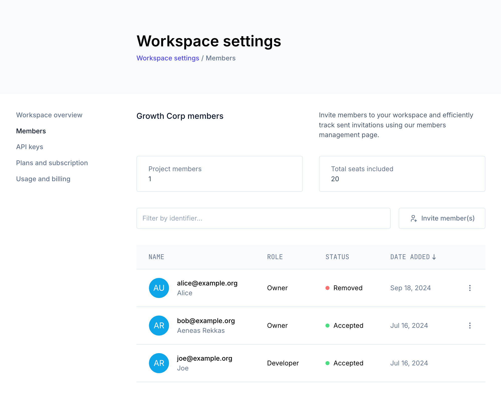

The Ory Console uses role-based access control enforced through Ory Keto. Roles are assigned at two levels: workspace and project.

## Workspace roles

A workspace has two roles: Owner and Developer.

### Owner

The Owner role has full administrative control over the workspace.

- View and edit workspace metadata
- Upgrade the workspace plan
- View and manage billing
- View and manage members
- Create and delete workspace API keys
- Create projects and view the projects list

### Developer

The Developer role provides day-to-day access without administrative capabilities.

- View workspace metadata
- Create projects and view the projects list
- View members
- View workspace API keys

Developers cannot:

- Edit workspace metadata
- Manage billing
- Manage workspace members
- Create or delete workspace API keys

### Workspace permission matrix

| Permission                       | Developer | Owner |
| -------------------------------- | --------- | ----- |
| View workspace metadata          | Yes       | Yes   |
| Edit workspace metadata          | No        | Yes   |
| Upgrade workspace plan           | No        | Yes   |
| View billing                     | No        | Yes   |
| Manage billing                   | No        | Yes   |
| View members                     | Yes       | Yes   |
| Manage members                   | No        | Yes   |
| View workspace API keys          | Yes       | Yes   |
| Create/delete workspace API keys | No        | Yes   |
| Create projects                  | Yes       | Yes   |
| View projects list               | Yes       | Yes   |

## Project roles

A project has two roles: Owner and Developer.

### Owner

The Owner role has full control over the project, including destructive and administrative actions. Owners inherit all Developer
permissions.

In addition to Developer permissions, Owners can:

- Delete the project
- Move the project between workspaces
- Upgrade the project plan
- Add and remove collaborators
- Modify project workspace settings

### Developer

The Developer role provides full access to project configuration and all Ory services.

- Read and write project configuration
- View collaborators
- Manage project API keys
- Manage custom domains (CNAMEs)
- Manage event streams
- Full access to Ory Identities (read/write identities, credentials, sessions, and messages)
- Full access to Ory Permissions (read/write relationships, read permissions)
- Full access to Ory OAuth2 (read/write clients)

Developers cannot:

- Delete or move the project
- Add or remove collaborators
- Modify project workspace settings

### Project permission matrix

| Permission                        | Owner | Developer |
| --------------------------------- | ----- | --------- |
| Read project configuration        | Yes   | Yes       |
| Write project configuration       | Yes   | Yes       |
| View collaborators                | Yes   | Yes       |
| Add/remove collaborators          | Yes   | No        |
| Manage project API keys           | Yes   | Yes       |
| Manage custom domains (CNAMEs)    | Yes   | Yes       |
| Manage event streams              | Yes   | Yes       |
| Ory Identities (full read/write)  | Yes   | Yes       |
| Ory Permissions (full read/write) | Yes   | Yes       |
| Ory OAuth2 (full read/write)      | Yes   | Yes       |
| Delete project                    | Yes   | No        |
| Move project                      | Yes   | No        |
| Upgrade project plan              | Yes   | No        |
| Modify workspace settings         | Yes   | No        |

## Managing roles

To change a member's role, a workspace Owner can go to **Console > Workspace Settings > Members**.

For more information on workspaces and member management, see [Workspaces & Environments](../guides/workspaces.mdx).
