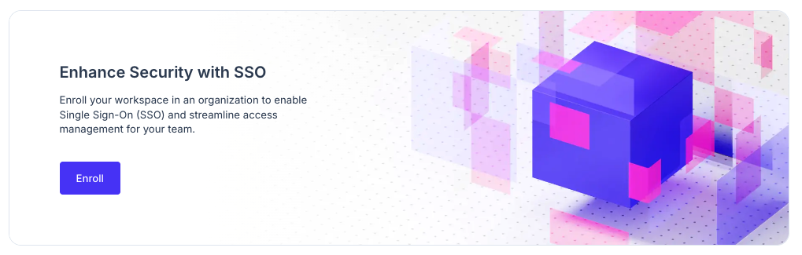
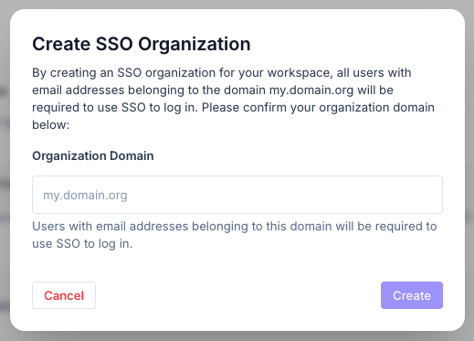

The Ory Console supports Single-Sign-On (SSO) via OpenID Connect (OIDC) or SAML. This allows you to use your existing identity
provider (IdP) to authenticate users of the Ory Console.

Once configured, all users with email addresses matching the enrolled domain will be required to use SSO to log in to the Ory
Console. This means that they will not be able to log in using their Ory Console credentials, and will instead be redirected to
your IdP's login page to authenticate.

## Configuration

Follow these steps to configure SSO for your workspace:

1. Go to your workspace's settings, and scroll down to the Single Sign-On (SSO) section.
2. Click on the **Enroll** button to start the enrollment process.
3. _If you did not verify your email address, you will be prompted to do so. Please check your inbox for a verification email and
   click on the link provided._
4. Confirm the domain that you want to enroll for SSO. This should be the domain of your email address (e.g., `example.com`).
   
5. Click the **Configure SSO now** button to proceed to the SSO configuration page.
6. On the SSO configuration page, you can choose between OIDC and SAML as your SSO protocol. Follow the instructions for your
   chosen protocol to complete the setup.
7. After completing the SSO configuration, you must confirm the setup with your account.
   1. Logout from the Ory Console.
   2. Enter your email address and click on the **Continue with SSO** button.
   3. You will be redirected to your IdP's login page. Enter your credentials and log in.
   4. Follow any additional steps required by your IdP (e.g., multi-factor authentication). Note that you might be asked to enter
      your existing password for the Ory Console one last time to confirm the SSO setup.
   5. After successful authentication, you will be redirected back to the Ory Console and logged in.
8. Congratulations! You have successfully set up Single Sign-On for your workspace in Ory Console. You can now use your IdP
   credentials to access the console.

### Restricting access to your workspace

In addition to forcing all users of your organization to use SSO, you can also restrict access to your workspace or any projects
within it to specific email domains.

To do so, you must have completed all steps in the [configuration guide](#configuration) above. After completing the SSO setup,
you can go back to the Single Sign-On (SSO) section in your workspace's settings and scroll down to the **Restrict access to this
workspace** section.

- **All invited Members** _(default)_: All invited members have access to the workspace, regardless of their email domain.
- **Invited Organization Members only**: Only users who have been invited to the workspace and have accepted the invitation and
  are part of the organization will be able to log in to the Ory Console. This means that even if a user is a workspace member,
  but has not logged in through SSO they won't be able to access the workspace.

:::warning

Make sure that any user who needs access to the workspace has accepted their invitation and logged in through SSO before enabling
this setting, as it may lock out users who have not completed the SSO setup.

:::

## Known limitiations

- Only one domain is supported. If you need to support multiple domains, choose one primary domain for SSO and ensure that all
  users have email addresses under that domain.
- If you have multiple workspaces, you will need to configure SSO separately for each workspace, as SSO settings are applied at
  the workspace level. Note that it's not possible to use the same domain for multiple workspaces, as this would create conflicts
  in the authentication process.

## Troubleshooting

- A common issue in SSO setups is that the IdP may be unreachable, and thus preventing users from logging in to the Ory Console.
  If you encounter this, please email support@ory.com with the following information:
  - The email address you are trying to log in with.
  - The error message you are seeing (if any).
  - The time and date when the issue occurred.
  - Any additional details that may be relevant for example steps you took before encountering the issue.
