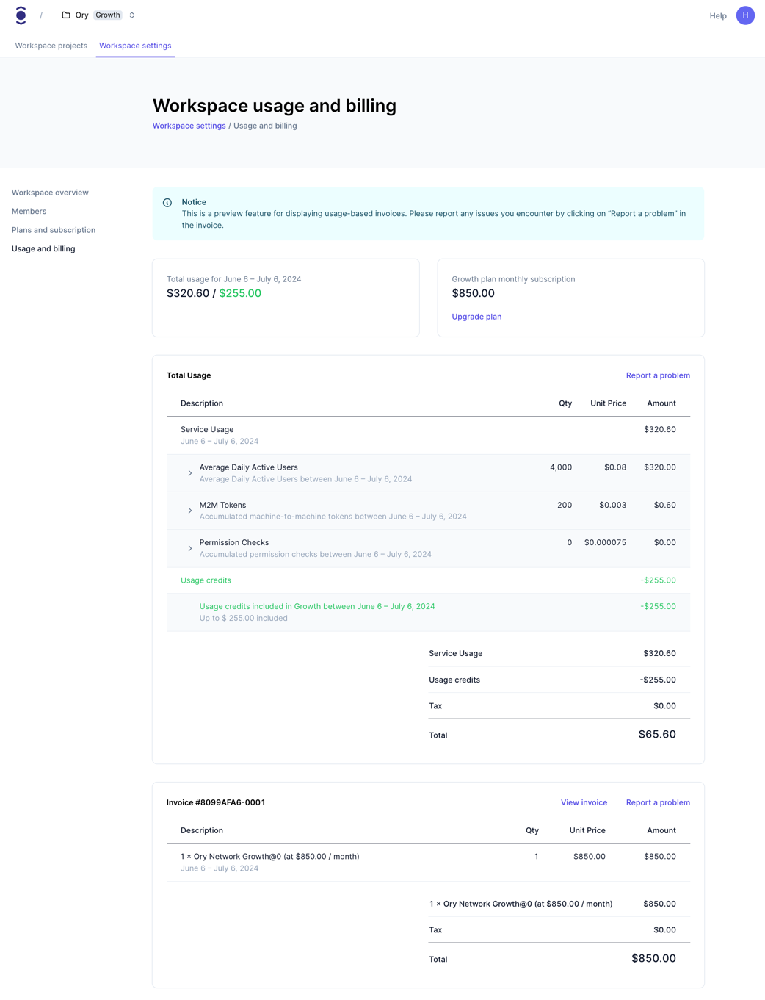

## Overview

Usage-based invoices are a feature in the Ory Console that allows you to understand your usage of Ory Network services, the usage
that is included in your plan, and the overuse. Usage-based invoices are generated every month. For the current billing period, a
draft invoice is generated every six hours.

Usage-based invoices only apply to workspaces and projects contained therein, but not to legacy plans that have individual
subscriptions.

### Ory Console UI

Usage invoices are only available for workspaces on a paid subscription plan. The usage will always be invoiced monthly, even if
the plan is paid annually. For the current billing period, the usage is generated as a preview and refreshed at most every six
hours. The final invoice is generated at the end of the billing period.

Depending on the plan, the service usage is comprised of at least three components:

- the average daily active users (aDAU),
- the number of machine-to-machine (M2M) tokens issued, and
- the number of permission checks.

Additionally, your invoice might include extra charges for additional multi-tenant production environments, etc. For more
information of what's included in your plan visit [our pricing page](https://www.ory.com/pricing).

Usage credits will be applied to the total service usage, but unused credits will not be carried over to the next billing period.

```mdx-code-block
import BrowserWindow from "@site/src/theme/BrowserWindow"

<BrowserWindow url="https://console.ory.sh/workspaces/<id>/settings/billing">



</BrowserWindow>
```

##### Total costs and usage breakdown in time

The Total usage cost dashboard provides a comprehensive view of your project's expenditure over time. From here you can track the
total cost of all projects, filter costs by specific projects, and visualize cost trends over time. You can see the pre-credited
cost of each project and also the total cost of all projects (with and without credits included).

You can additionally filter the data by:

- **Date Range** You can select a specific date range to view the cost data for that period.

- **Project Filter** Dropdown in the top right corner allows you to filter the data by specific projects.

```mdx-code-block

<BrowserWindow url="https://console.ory.sh/workspaces/<id>/settings/billing">


</BrowserWindow>
```

You can also view the usage breakdown for the selected data range. This breakdown shows the billed cost of all components per
project. The data displayed on this charts is affected by previous filter selections.

```mdx-code-block

<BrowserWindow url="https://console.ory.sh/workspaces/<id>/settings/billing">


</BrowserWindow>
```

### Invoices for the current billing period

The invoice for the current billing period is a preview of the costs. While M2M token issuance and permission checks are billed
per usage (accumulative), the aDAU usage is calculated as the average of the last 30 days. This means that the aDAU usage for the
current billing period can increase or decrease until the end of the billing period.

### Proration, upgrades and downgrades

Upgrades and downgrades of the base plan affect the usage-based billing in both the usage credits as well as the per-unit price.

Downgrades always become effective at the end of the billing period, and will therefore not be reflected on the current usage
invoice.

Upgrades are effective immediately and will be prorated. Specifically for usage credits, this means that the usage credits will be
factored by the relation of time on that plan to the total time span of the billing period. As an example, if you upgrade from
plan A to plan B after ⅔ of the billing period, you will receive ⅔ of the usage credits of plan A and ⅓ of the usage credits of
plan B.
