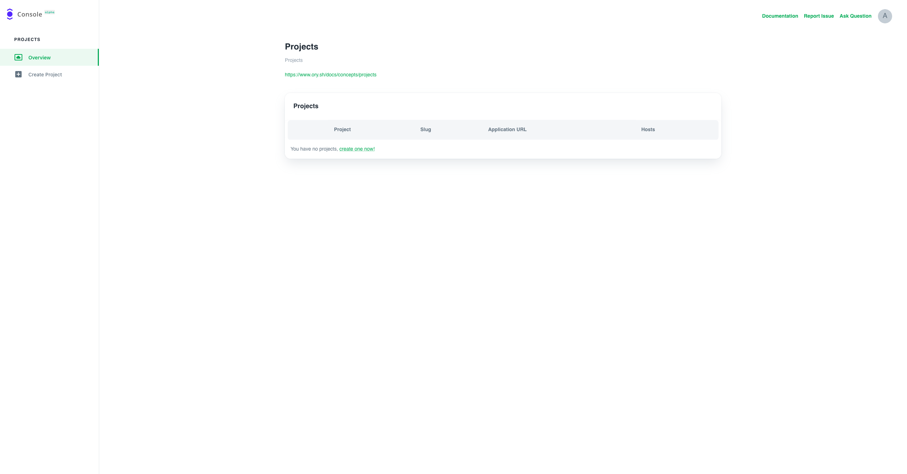

This document describes what you can expect when signing up for a Developer Plan
in Ory Cloud.

The Developer Plan includes Ory Cloud Projects for testing, research and
personal projects.

**Sign up at [console.ory.sh](https://console.ory.sh/registration).**

### What you get

Features:

- Login
- Registration
- APIs for Web App
- APIs for Single Page App
- APIs for Mobile App
- Secure Account Recovery
- E-Mail Verification
- Breached Password Detection
- Bring your own UI
- User Management
- Custom Identity Models
- Standard 2FA
- FIDO2-compliant 2FA
- Instant Log Out
- Encryption in Transit
- Administrate Identities, Cookies & Sessions

Support options:

- Dedicated Developer Relations
- Chat support via public Slack channel
- Ticket via GitHub Issues

Have a look at the [roadmap](./cloud-roadmap.mdx).

You can upgrade your Ory Cloud Project at any time after starting on the
Developer Plan. Check the [pricing](https://www.ory.sh/pricing/) or
[reach out](mailto:hi@ory.sh) to us for more information.

Once your account is set up, you will be greeted with the Projects Overview.

Next, [create a project](https://console.ory.sh/projects/create).

## Create your Ory Cloud Project

For a step by step guide please visit the
[Create Ory Cloud Project](./start-building/create-project.mdx) documentation.

### Get Started with Ory Cloud

As we are building Ory Cloud as the most convenient way to run Ory for
developers, user feedback and constructive exchange with the community is most
important to us. Production systems are running on Ory Cloud, and we hope we can
count you among those early adopters.

We also want to give back to our open source community and let them experience
the vision we have for Ory Cloud firsthand. It will make clear that a commercial
Ory service will help our open source ecosystem grow and thrive, not work
against it.
