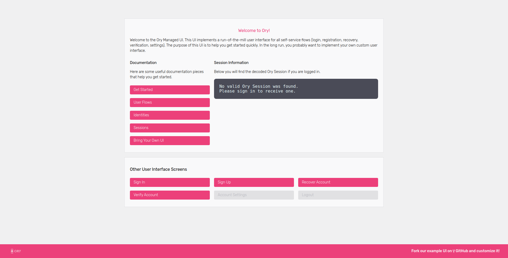
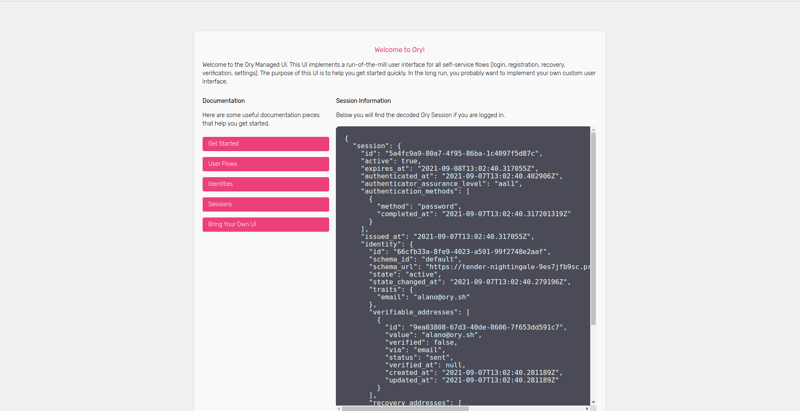
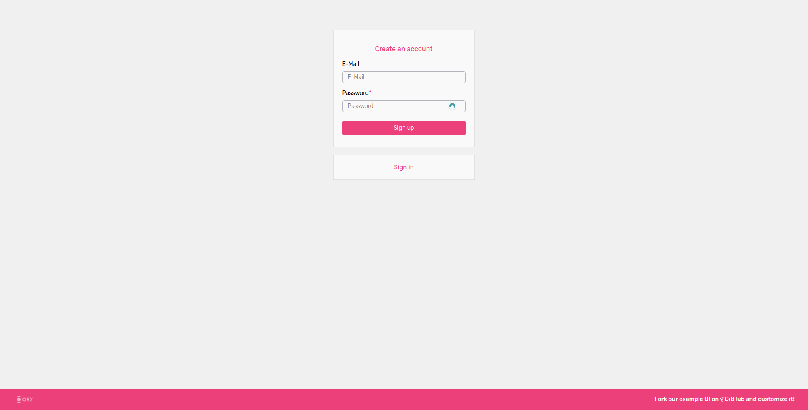
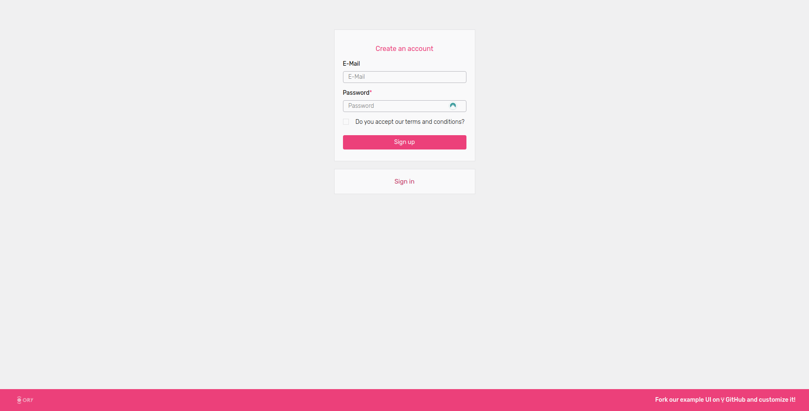
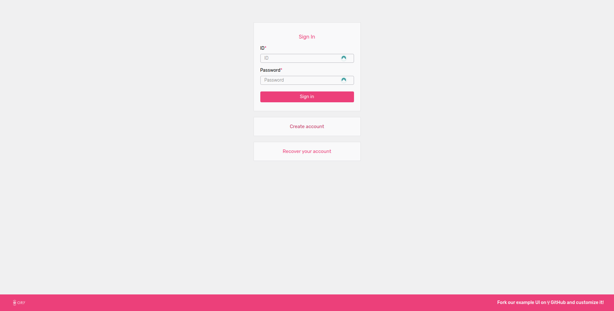
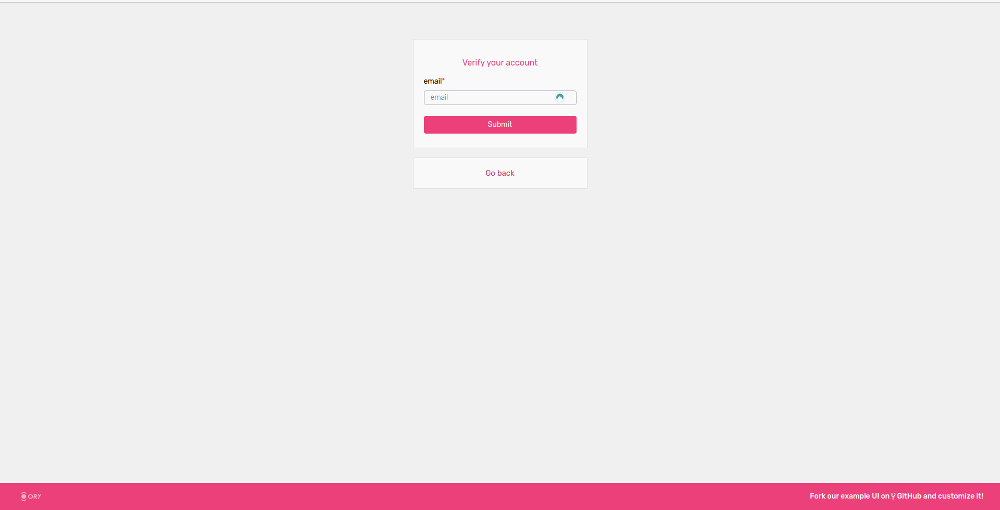

Ory Cloud provides a managed user interface (UI) by default per Ory Project. The
Managed UI gives you the ability to quickly integrate with the Ory Cloud with
minimal setup, but also provides all of the Ory Cloud's features through the
Managed UI (such as [Identity Schema Customization](./identity.mdx)).

Setting up the Managed UI does not require much configuration as it is enabled
by default. The only configurations which would require some setup would be
redirecting the user back to your application. For more information on how to
configure Browser Redirects, please visit the
[Redirects and Flow Completion](./redirects.mdx) page.

The projects' Managed UI can be tested using the "Launch Managed UI" option on
the Console sidebar.


The Welcome screen allows for easy navigation and testing of the Managed UI's
features.

:::info

The Managed UI is dynamic which means enabling certain features (such as
Two-Factor Authentication) or customising the [Identity Schema](./identity.mdx)
will update your Ory project's Managed UI to accommodate the enabled features.

:::

## Welcome Screen

The Welcome screen is a starting point for developers integrating with the Ory
Cloud. Here developers can test their configurations and validate the system's
behaviour without the need to code anything.


Here is an example of the welcome screen showing the current user session.


## Sign Up

The Managed Sign Up screen can be customised by creating a custom
[Identity Schema](./identity.mdx) - such as adding more fields or updating their
user facing titles.



By adding the following json to the project's Identity Schema, we are able to
add an additional trait to our user as well as an additional field on our
Managed UI.

```json5
{
  agreement: {
    type: 'boolean',
    title: 'Do you accept our terms and conditions?'
  }
}
```



## Sign In



## Account Settings


## Recovery


## Verification


