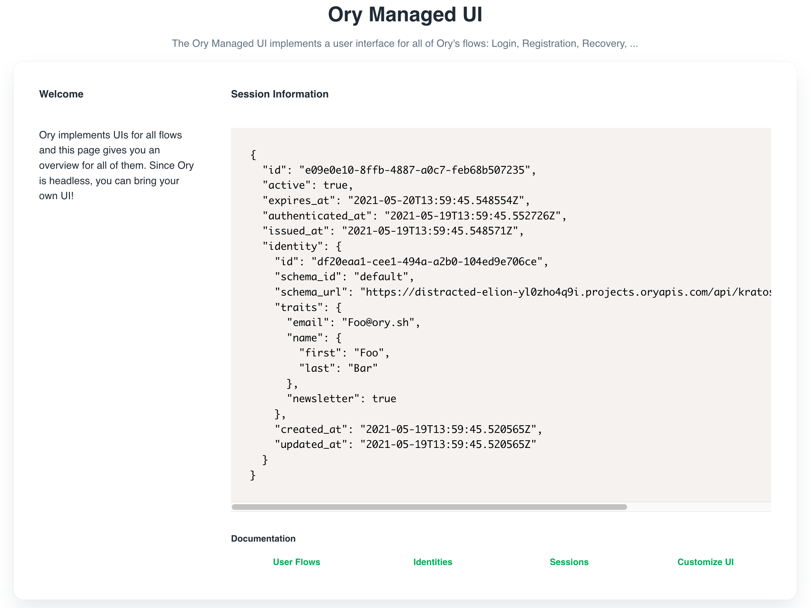

## Project Name

Helps you identify your project.

## Application URL

Your users will be redirected to this URL when they successfully complete a
login, logout, verification, recovery, or registration flow. More fine-grained
redirection patterns are available for the individual flows (login,
registration, ...).

If left empty, our hosted dashboard will be used instead. It contains technical
information on the identities and is useful when developing a new project or
trying out Ory Cloud.

Additionally, the Application URL's hostname will be allowed in CORS and cookie
requests, enabling you to easily check if a user is logged in.
