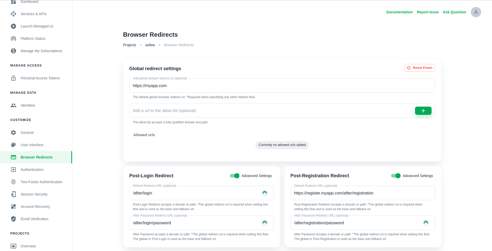
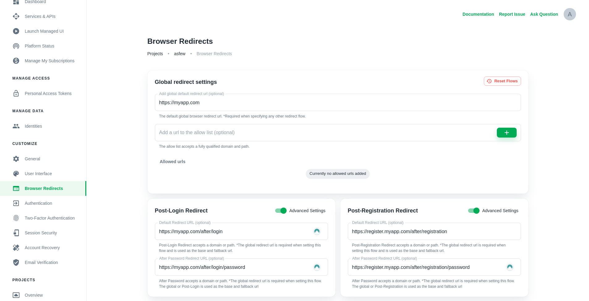
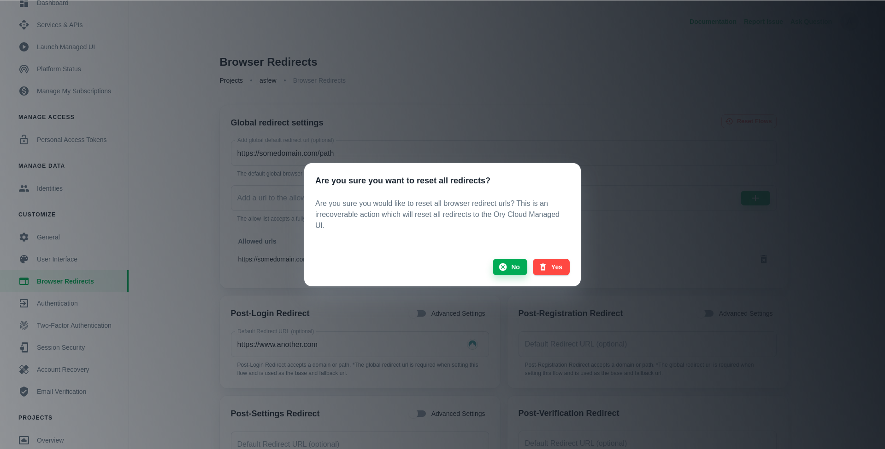
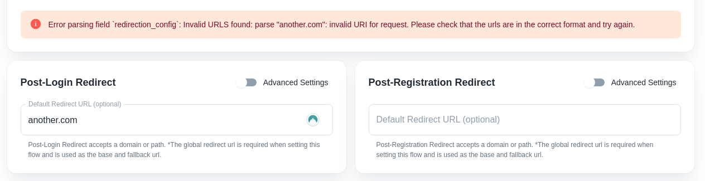

Ory Cloud offers a few methods to integrate your own user interface (UI) such as
utilising the SDK in Single Page Applications (ReactJs, Angular, VueJs etc.) or
using redirects in Server Side Applications (NodeJs, PHP, Golang etc.).

On this page of the documentation we will be covering Browser Redirects and how
to configure it on the Ory Cloud console. If you are interested in utilising the
SDK for Single Page Applications, check out our [SDK](./services-api.mdx)
documentation.

For a deeper dive into the background of this setup, head over to our open
source documentation:

- https://www.ory.sh/kratos/docs/concepts/browser-redirect-flow-completion

## Allow list

The Ory Cloud allows dynamic redirects to be set using the `?return_to=` query
parameter on [Self-Service Flows](./self-service.mdx). As an example a user
opens a sharable link to go to https://myapp.com/posts, however, this url
requires the user to be signed in and thus redirects the user back to the login
page. To return the user back to the original url we can append
`?return_to=https://myapp.com/posts` to the specified Self-Service initialise
flow url.

The `Allow list` is used in this scenario to prevent Open Redirect Attacks by
only allowing certain domains, or paths on a domain. As shown in this example
below the https://sub.domain.myapp.com/only/path needs to match perfectly for
this sub-domain and path for it to be allowed. Other redirects using myapp.com
will fail, however, for https://anotherapp.com will succeed on any path.

## Redirect Flows

The Ory Cloud has a total of 6 flows, Login, Registration, Verification,
Recovery, Settings and Logout which can be configured to redirect back to any
URL you specify. As an example you can redirect the user to your application
home screen after a logout or to a specific url on a sub-domain after a settings
password update. On project creation the redirect flows are all set to the
default Ory Cloud Managed UI. For more information on the Ory Managed UI, please
see the [Managed User Interface](./managed-ui.mdx) documentation.

### Login, Registration and Settings

The Login and Registration flows have three fields (all optional):

1. `Default Redirect URL` domain or path relative to your application URL
2. An `Post-Password Redirect URL`
3. An `Post-OIDC Redirect URL` (**currently not supported**)

And Settings has three fields (all optional):

1. `Default Redirect URL` domain or path relative to your application URL
2. An `Post-Password Redirect URL`
3. An `Post-Profile Redirect URL`

:::info

Setting `Post-OIDC` redirects for Login and Registration are currently not
supported since an Ory Cloud project cannot be setup to use OIDC yet. This will
be supported in the future. For more information see the
[Ory Cloud Roadmap](../cloud/cloud-roadmap.mdx).

:::

When setting the `Default Redirect URL` as an FQDN (fully qualified domain name)
such as e.g. https://domain.example/login it will overwrite the
`Global Redirect URL`. As a path it will replace the `Global Redirect URL` path,
e.g. a path such as `/login` will alter https://domain.example/global/path to
https://domain.example/login.

On the sub-conditions such as `Post-Password` or `Post-OIDC` an FQDN or a path
can be set. In the case of an FQDN it will replace the closest relative starting
with the Login/Registration `Default Redirect URL` and then the
`Global Redirect URL`. With a path it will use the closest relative as the base
URL as described above with the `Default Redirect URL`.

All the relative URLs will be updated with their respective base URL. As shown
in the example below, the Login `Default Redirect URL` has been set to use a
relative URL and thus the base URL will be the `Global Redirect URL`
(https://myapp.com). This will then set the Login `Default Redirect URL` to
https://myapp.com/after/login and the `Post-Password` to
https://myapp.com/after/login/password.

### Verification, Recovery and Logout

:::warning

The `Post-Recovery` redirect is currently not supported and will automatically
redirect the user to the `Settings UI` URL. This implies that you should
currently rely on the `Post-Settings` redirect URL for `Post-Recovery` flows as
well.

:::

Each of these flows have only a single field, the `Default Redirect URL`. As
with the Login, Registration and Settings configurations, the
`Default Redirect URL` can be an FQDN or a path.

## Resetting/Updating Flows

A redirect can easily be updated or reset by either changing the current
redirects value or deleting the entry and clicking the "Update" button. All the
flows can be reset at once by pressing the "Reset Flows" button which will
prompt a confirmation box. Resetting all flows will reset all the fields back to
the default value which is the Ory Cloud
[Managed User Interface](./managed-ui.mdx).

Once a flow has been reset or updated it will take effect immediately on **new**
flows. Old flows that have not expired yet will not be updated.

## Troubleshooting Guide

### Allow List

The `Allow List` requires a valid URL to be set with a scheme (http or https).

### Post Flow

Any of the Post-flow redirects require a valid URL with scheme (http or https)
or path. An example of a valid URL is https://www.google.com.

### Domain Denied

URLs matching any of the denied URLs, such as the Ory domain will automatically
be denied. This deny list can be extended in future to prevent any abuse on the
Ory Cloud.

