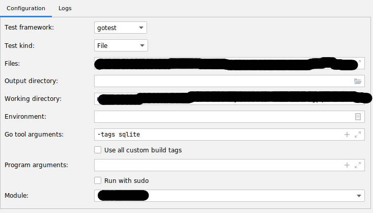
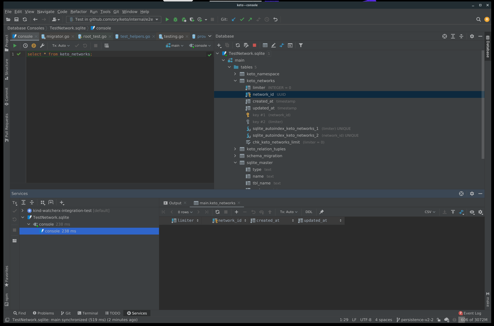
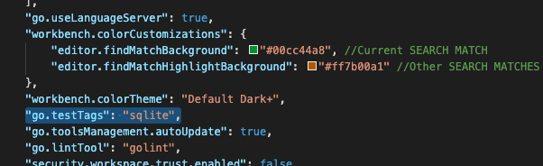

:::tip

For an introduction to contributions please refer to the specific project, for
example the
[Contribution Guidelines for Ory Kratos](https://www.ory.sh/kratos/docs/contributing/).

:::

This document is a work in progress and documents the inner workings of the Ory
GitHub ecosystem and project structures, as well as providing more in-depth tips
& guides to contributors. If you feel there is something missing or should be
added, please open an issue in [ory/docs](https://github.com/ory/docs) or
contact us in the [Ory Chat](https://www.ory.sh/chat). We also offer discussions
on GitHub for all major projects:
[Ory Kratos](https://github.com/ory/kratos/discussions),
[Ory Hydra](https://github.com/ory/hydra/discussions),
[Ory Keto](https://github.com/ory/keto/discussions),
[Ory Oathkeeper](https://github.com/ory/oathkeeper/discussions/), as well as one
for all other Ory projects, events and content:
[Ory Meta discussions](https://github.com/ory/meta/discussions).

## Releasing Software

To release a project, run the following bash command in the root of the project
you would like to release. The first argument can be one of:

- `patch` bumps `v1.2.3` to `v1.2.4` (does not work for pre-releases such as
  `v1.2.3-beta.1`)
- `minor` bumps `v1.2.3` to `v1.3.0` (does not work for pre-releases such as
  `v1.2.3-beta.1`)
- `major` bumps `v1.2.3` to `v2.0.0` (does not work for pre-releases such as
  `v1.2.3-beta.1`)
- Any [semver-valid](https://semver.org) version, for example `v1.2.3-beta.1`

```shell script
release_as=v1.2.3
bash <(curl -s https://raw.githubusercontent.com/ory/meta/master/scripts/release.sh) $release_as
```

### Defining Release Config

For the scripts to work, the project must be located in a directory structure
that reflects the GitHub organisation and repository name, for example:
`path/to/ory/hydra`.

#### Goreleaser

We use [goreleaser](https://github.com/goreleaser/goreleaser/releases).

The listed configuration options should be included in every `.goreleaser.yml`
config. Make sure you set env vars and `go mod download` and run e.g. packr2 and
other tools first:

```yaml title=".goreleaser.yml"
env:
  - GO111MODULE=on

before:
  hooks:
    - go mod download
    # - go install github.com/gobuffalo/packr/v2/packr2
    # - packr2
```

Tag `-alpha.1` and other pre-release tags as pre-release on GitHub:

```yaml
release:
  prerelease: auto
```

Name snapshot releases `-next`:

```yaml
snapshot:
  name_template: '{{ .Tag }}-next'
```

If you create a new goreleaser config, you may also want to create the following
empty GitHub repositories:

Build and publish on Docker. You need to create a repository on Docker Hub
first!

```yaml
# Build dockerfiles
dockers:
  - dockerfile: Dockerfile
    binaries:
      - $PROJECT_NAME
    image_templates:
      - 'oryd/$PROJECT_NAME:v{{ .Major }}'
      - 'oryd/$PROJECT_NAME:v{{ .Major }}.{{ .Minor }}'
      - 'oryd/$PROJECT_NAME:v{{ .Major }}.{{ .Minor }}.{{ .Patch }}'
      - 'oryd/$PROJECT_NAME:latest'
```

If you add [Scoop](https://scoop.sh) (Homebrew for Windows) you must also create
a GitHub repository under the `ory` org named `scoop-$PROJECT_NAME` (e.g.
`scoop-hydra`).

```yaml
scoop:
  bucket:
    owner: ory
    name: scoop-$PROJECT_NAME
  homepage: https://www.ory.sh
  commit_author:
    name: aeneasr
    email: aeneas@ory.sh
```

If you add [Homebrew](https://brew.sh) you must also create a GitHub repository
under the `ory` org named `homebrew-$PROJECT_NAME` (e.g. `homebrew-hydra`).

```yaml
brews:
  - github:
      owner: ory
      name: homebrew-$PROJECT_NAME
    ids:
      - <<REPLACE-WITH-ARCHIVE-ID>>
    homepage: https://www.ory.sh
    commit_author:
      name: aeneasr
      email: aeneas@ory.sh
```

We use the following replacements:

```yaml
archives:
  - replacements:
      darwin: macOS
      386: 32-bit
      amd64: 64-bit
    format_overrides:
      - goos: windows
        format: zip
```

### Update install script

When you have finalized changes to the `.goreleaser.yml`, run:

```shell
$ GO111MODULES=off go get -u github.com/goreleaser/godownloader
$ godownloader .goreleaser.yml --repo=$(basename $(dirname $(pwd)))/$(basename $(pwd)) > ./install.sh
```

### CircleCI

Define CI Environment Variables:

- [ ] Make sure you set `GITHUB_TOKEN` in the project's CI config.
- [ ] Make sure you set `MAILCHIMP_API_KEY` in the project's CI config.
- [ ] Make sure you set `DOCKER_USER` in the project's CI config.
- [ ] Make sure you set `DOCKER_TOKEN` in the project's CI config.

In the project's CircleCI config (`.circleci/config.yml`), use the following
workflow (please use an appropriate `$VERSION`):

```yaml
orbs:
  goreleaser: ory/goreleaser@0.1.7
  slack: circleci/slack@3.4.2

workflows:
  my-workflow:
    jobs:
      - goreleaser/test:
          filters:
            tags:
              only: /.*/
      - goreleaser/release:
          requires:
            - goreleaser/test
          filters:
            branches:
              ignore: /.*/
            tags:
              only: /.*/

      - goreleaser/newsletter-draft:
          chimp-list: f605a41b53
          chimp-segment: 6478605
          requires:
            - goreleaser/release
          filters:
            tags:
              only: /.*/
      - slack/approval-notification:
          message: Pending approval
          channel: release-automation
          requires:
            - goreleaser/newsletter-draft
          filters:
            tags:
              only: /.*/
      - newsletter-approval:
          type: approval
          requires:
            - goreleaser/newsletter-draft
          filters:
            tags:
              only: /.*/
      - goreleaser/newsletter-send:
          chimp-list: f605a41b53
          requires:
            - newsletter-approval
          filters:
            tags:
              only: /.*/
```

## CI

We use [our own CircleCI Orbs](http://github.com/ory/ci):

### ory/nancy

Enables nancy vulnerability scanning for the repository.

```yml
orbs:
  nancy: ory/nancy@0.0.9

workflows:
  test:
    jobs:
      - nancy/test:
        filters:
          tags:
            only: /.*/
```

## Toolchain

### Checking for vulnerabilities

#### NodeJS

This is done automatically by GitHub

#### Go

```
# Outside of a go module-enabled project:
$ go get -u github.com/sonatype-nexus-community/nancy

# Inside your go module-enabled project:
$ go mod list -m all | nancy
```

### Pinning indirect go module dependencies.

Sometimes a project has an indirect dependency (another dependency requires that
dependency) which does not pass, for example, `nancy` vulnerability scanning.
Because it's not possible to pin this dependency to a specific version, we need
to explicitly require it. But because it's not directly required by our code, it
will be pruned when using `go mod tidy`. To prevent that, create a file which
imports the dependency without use:

```title="go_mod_indirect_pins.go
// +build go_mod_indirect_pins

package main

import _ "github.com/my/dependency"
```

You would do the same if the project uses dev tools such as `packr2`,
`goimports`, `goreturns`, `swagutil`, ... as part of e.g. the Makefile or other
scripts.

## Development

### DBAL gobuffalo/pop

#### Table Names

Please define custom table names for all table structs. Keep in mind that
`TableName()` must be a value receiver, not a pointer receiver, for slices
`[]Model` to work properly:

```diff
-func (m *Model) TableName(ctx context.Context) string {
+func (m Model) TableName(ctx context.Context) string {
 	return "foo"
}
```

### SQL Migrations

Ory uses a lightweight DBAL across all projects that require a database. This
DBAL is typically stored in the `persistence/` directory. Since we only support
SQL at the moment - there are no plans to add new databases and contributions
will not be accepted due to maintenance effort - you will find the
implementation in `persistence/sql`.

:::info

This section currently only applies to Ory Kratos and Ory Keto. Ory Hydra is
currently using an approach that does not rely on fizz migrations. Please
discuss with maintainers before making changes to Ory Hydra SQL schemata.

:::

In order to provide a process to upgrade SQL schemata, we use migrations. These
migrations are generated using the
[fizz language](https://github.com/gobuffalo/fizz) and then rendered to SQL
using the Ory CLI.

This is necessary because there are differences between the SQL "dialects" of
SQLite (does not support certain `ALTER TABLE` statements for example),
PostgreSQL, MySQL, and CockroachDB.

To change the schema, create a new fizz template using:

```
# In the project root - e.g. /kratos
$ make .bin/ory

# If make .bin/ory fails use:
# $ make .bin/cli
#
# and replace `.bin/ory` with `.bin/cli`.
# We are working on streamlining this
# across all repos.

$ .bin/ory dev pop migration create persistence/sql/migrations/templates descriptive_change
```

This will create two new files:

```
$ ls -la persistence/sql/migrations/templates | tail -n 2
-rw-r--r--   1 foobar  staff      0 Apr 28 17:25 20210428172500_descriptive_change.down.fizz
-rw-r--r--   1 foobar  staff      0 Apr 28 17:25 20210428172500_descriptive_change.up.fizz
```

Add you fizz migrations there. The `up` file is for applying your schema
changes, the `down` file for reverting them.

Once your migrations are added, it is time to render them to SQL. Make sure that
Docker is running and execute:

```
$ .bin/ory dev pop migration render persistence/sql/migrations/templates persistence/sql/migrations/sql
```

If you encounter errors you can also try running this with the `--replace`
option but please let maintainers know that you used `--replace` in your PR:

```
$ .bin/ory dev pop migration render --replace persistence/sql/migrations/templates persistence/sql/migrations/sql
```

This will render your migrations to SQL files. Add them to git (`git add -A`)
and commit them.

Next, you need to update the migration tests. To do so, run the sync command:

```
$ .bin/ory dev pop migration sync persistence/sql/migrations/templates persistence/sql/migratest/testdata
```

This will add create a new SQL file:

```
$ ls -la  persistence/sql/migratest/testdata | tail -n 1
-rw-r--r--   1 foobar  staff      0 Apr 28 17:28 20210428172500_testdata.sql
```

Add an `INSERT` or `UPDATE` or `DELETE` statement that reflects the changes you
have made to the schema to the file. Let's say you added a new column
`new_column` to table `bar`. In that case, write an `INSERT` statement that
reflects this:

```
INSERT INTO bar (old_column, new_column) VALUES ('foo', 'bar');
```

Next, execute the tests:

```
$ cd persistence/sql/migratest
$ go test -tags sqlite ./...
```

The tests will probably fail because the fixtures need to be updated. To update
them, run:

```
$ cd persistence/sql/migratest
$ go test -tags sqlite,refresh -short .
```

You might need to run the `go test` command two or three times before all
fixtures have been updated.

That's it! :)

## OpenAPI Spec and Go Swagger

We use [go-swagger](https://goswagger.io) to generate OpenAPI Spec from source
code. Here you can find conventions we use across the code base.

### Models

Models should have a descriptive title, a body, and be camelCase. It is good
practice to scope the model where needed.

```go
package some

// Title
//
// A description with a trailing dot.
//
// swagger:model someSpecificModel
type SpecificModel struct {}
```

### Routes

Routes should use tags for versioning. If a route is accessible through a
privileged port (e.g. admin) it should be prefixed with `admin`.

```go
// swagger:route POST /identities v0alpha1 adminCreateIdentity
```

Public endpoints do not need a prefix.

```go
// swagger:route POST /something-public v0alpha1 somethingPublic
```

#### Parameters

Parameters for routes should have the same name as the route. If they have a
body, you must not use an embedded struct and the struct's model name should be
suffixed `Body`:

```go

// swagger:parameters adminCreateIdentity
// nolint:deadcode,unused
type adminCreateIdentity struct {
	// in: body
	Body adminCreateIdentityBody
}

// swagger:model adminCreateIdentityBody
type adminCreateIdentityBody struct {
	// SchemaID is the ID of the JSON Schema to be used for validating the identity's traits.
	//
	// required: true
	SchemaID string `json:"schema_id"`

	// Traits represent an identity's traits. The identity is able to create, modify, and delete traits
	// in a self-service manner. The input will always be validated against the JSON Schema defined
	// in `schema_url`.
	//
	// required: true
	Traits json.RawMessage `json:"traits"`
}

// swagger:route POST /identities v0alpha1 adminCreateIdentity
```

#### Responses

Where possible use models for responses.

```
// A list of identities.
// swagger:model identityList
// nolint:deadcode,unused
type identityList []Identity

// swagger:route GET /identities v0alpha0 adminListIdentities
//
// List Identities
//
// Lists all identities. Does not support search at the moment.
//
// Learn how identities work in [Ory Kratos' User And Identity Schema Documentation](https://www.ory.sh/docs/next/kratos/concepts/identity-user-model).
//
//     Produces:
//     - application/json
//
//     Schemes: http, https
//
//     Responses:
//       200: identityList
//       500: jsonError
```

## IDE Tips

### Goland

#### Tests

While running tests inside the IDE make sure you have the tag `-tags sqlite` in
the "Go Tool Arguments". In the example screenshot we are looking at
`login_test.go` and add it to the Run/Debug Configurations.



### Jetbrains

#### Debugging Tests

Jetbrains IDEs have an SQL debugger, that can open sqlite files. When debugging
tests, you can set a bool flag to use an sqlite file instead of in-mem and then
debug after the test failed.
[Example](https://github.com/ory/keto/pull/638/files#diff-19d74043bd6f4fd4ffaf6dee2895a42da0a754b6135339343117614974ff6182R84):

```go
func GetSqlite(t testing.TB, mode sqliteMode) *DsnT {
	dsn := &DsnT{
		MigrateUp:   true,
		MigrateDown: false,
	}

	switch mode {
	case SQLiteMemory:
		dsn.Name = "memory"
		dsn.Conn = fmt.Sprintf("sqlite://file:%s?_fk=true&cache=shared&mode=memory", t.Name())
	case SQLiteFile:
		t.Cleanup(func() {
			_ = os.Remove("TestDB.sqlite")
		})
		fallthrough
	case SQLiteDebug:
		dsn.Name = "sqlite"
		dsn.Conn = "sqlite://file:TestDB.sqlite?_fk=true"
	}

	return dsn
}
```



To transfer the above to Kratos:

- Change the DSN to the following:
  `dsn.Conn = "sqlite://file:TestDB.sqlite?_fk=true"`.
- `mode=memor`.
- In case you have an sqlite file, migrators are not automatically applied. Run
  them manually first with the
  [CLI](https://www.ory.sh/kratos/docs/cli/kratos-migrate-sql).

### VS Code

#### Tests

- Under Settings, search for `Go: Test Tags`.
- Click Edit in `settings.json`.
  
- Add the following KV to the `settings.json`: `"go.testTags": "sqlite",`.
  
