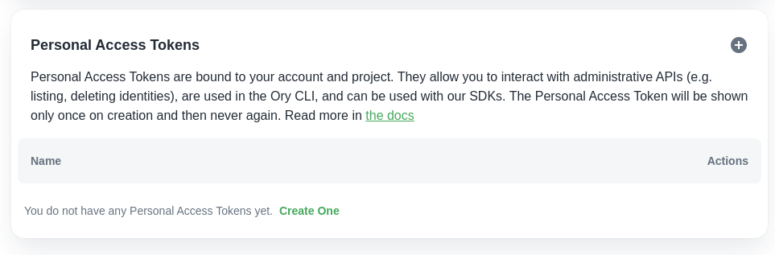

:::info

Ory Open Source documentation has moved in the navigation on the left. Ory (the
SaaS product) is currently only available to Ory Insiders and
[haslimitations](./early-access.mdx).

:::

To get started, head over to [console.ory.sh](https://console.ory.sh) and sign
up for an account.


## Create Project

Once your account is set up, you will be greeted with your projects list.


Next, [create a project](https://console.ory.sh/projects/create). You will be
prompted for an invite code. If you do not have an invite code but would like to
become an Ory Insider, please click the "Contact Us" button. Once Ory is GA,
this step will no longer be needed.


Once entered, you will be greeted with the project creation screen.


Enter a project name and leave the application URL empty for now.


The Identity Model is a JSON Schema which describes your identity's (e.g. your
customers / users / ...) fields. In Ory, every identity can have their own
model, allowing you to separate between different customer types, user types
(e.g. employees and customers).

[Learn more about the Identity Model](concepts/identity.mdx) and the available
profiles! For the quickstart, we will use the "Demo Profile" model.

:::note

The "Demo Profile" is a preset for technical demonstrations. Do not use it in
real applications as we will eventually change or delete this profile.

:::


For demo applications, we recommend enabling sign in after registration.

:::note

Enable sign in after registration disables account enumeration defenses!

:::


Next, hit "create" and fill out the details on the check out page. Your project
should come alive shortly after!


## Create Personal Access Token

Personal Access Tokens are bound to a project. They are needed to access
administrative APIs (e.g. deleting an identity, using the Ory CLI, ...).

:::note

Personal Access Tokens are an interim security mechanism. In the future, more
secure mechanisms such as JWT Assertions and mTLS will be supported.

:::

Head over to the "Personal Access Token" page


and click on the plus symbol to create a new token.



Once created, a dialog will appear on the bottom left containing your personal
access token. Copy this into a password manager or another safe place. The token
will never be displayed again! If you forget it, you will need to create a new
token.


## Install the Ory CLI

The Ory CLI (Command-Line-Interface) makes integrating and interfacing with Ory
easy! For a more in-depth look at the CLI head over to
[install and use the Ory CLI](./guides/ory-cli-install-use.mdx)!

### Install on macOS

You can install the Ory CLI using [homebrew](https://brew.sh/) on macOS:

```shell
$ brew tap ory/ory
$ brew install ory/ory/ory
$ ory help
```

### Install on Linux

On linux, you can use `bash <(curl ...)` to fetch the latest stable binary
using:

```shell
$ bash <(curl https://raw.githubusercontent.com/ory/ory/master/install.sh) -b .
$ ./ory help
```

You may want to move the Ory CLI to your `$PATH`:

```shell
$ sudo mv ./ory /usr/local/bin/
$ ory help
```

### Install on Windows

You can install Ory CLI using [scoop](https://scoop.sh) on Windows:

```shell
> scoop bucket add ory-cli https://github.com/ory/scoop-ory.git
> scoop install ory
> ory help
```

## Integration

Now it's time to choose your integration!

<table>
  <thead>
  <tr>
    <th></th>
    <th />
  </tr>
  </thead>
  <tbody>
  <td>

[Integrate with ExpressJS](guides/integrate-nodejs.mdx)

  </td>
  <td>

More integrations soon!

  </td>
  </tbody>
</table>
