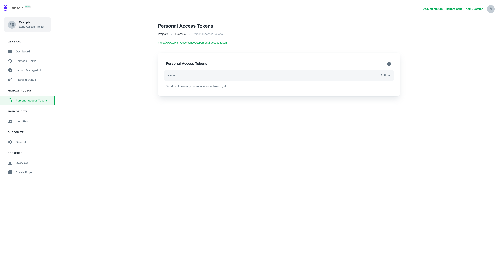

Head over to the "Personal Access Token" page



and click on the plus symbol to create a new token.

Choose a name that helps to remember what the token is used for or who is using it.


Once created, a dialog will appear on the bottom left containing your personal
access token. 

Copy this into a password manager or another safe place. The token
will never be displayed again! 
If you forget it, you will need to create a new
token.


Now you can use the token, for example by exporting it into your local environment.

Open a terminal and copy set the `ORY_ACCESS_TOKEN` env var to your
Personal Access Token:

```shell
export ORY_ACCESS_TOKEN=yOuRpErsOnAlaCceSsToKeNgOeShErE
```
