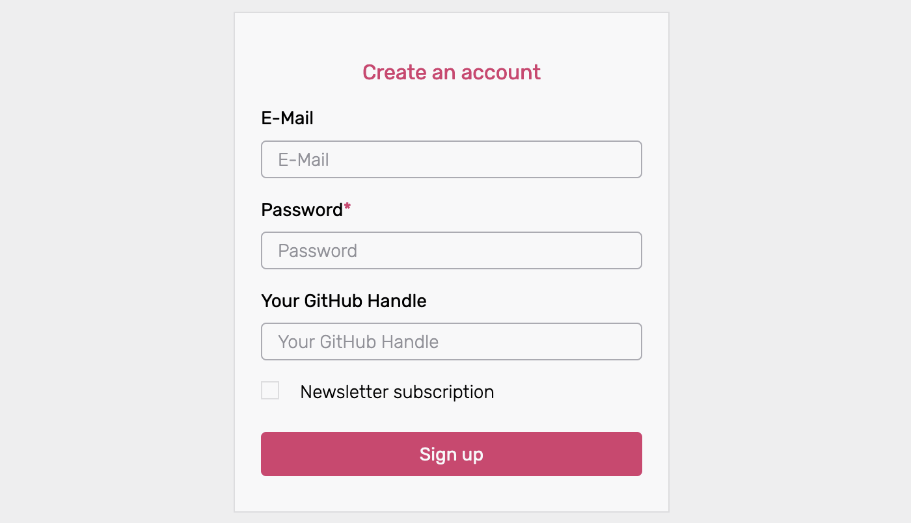
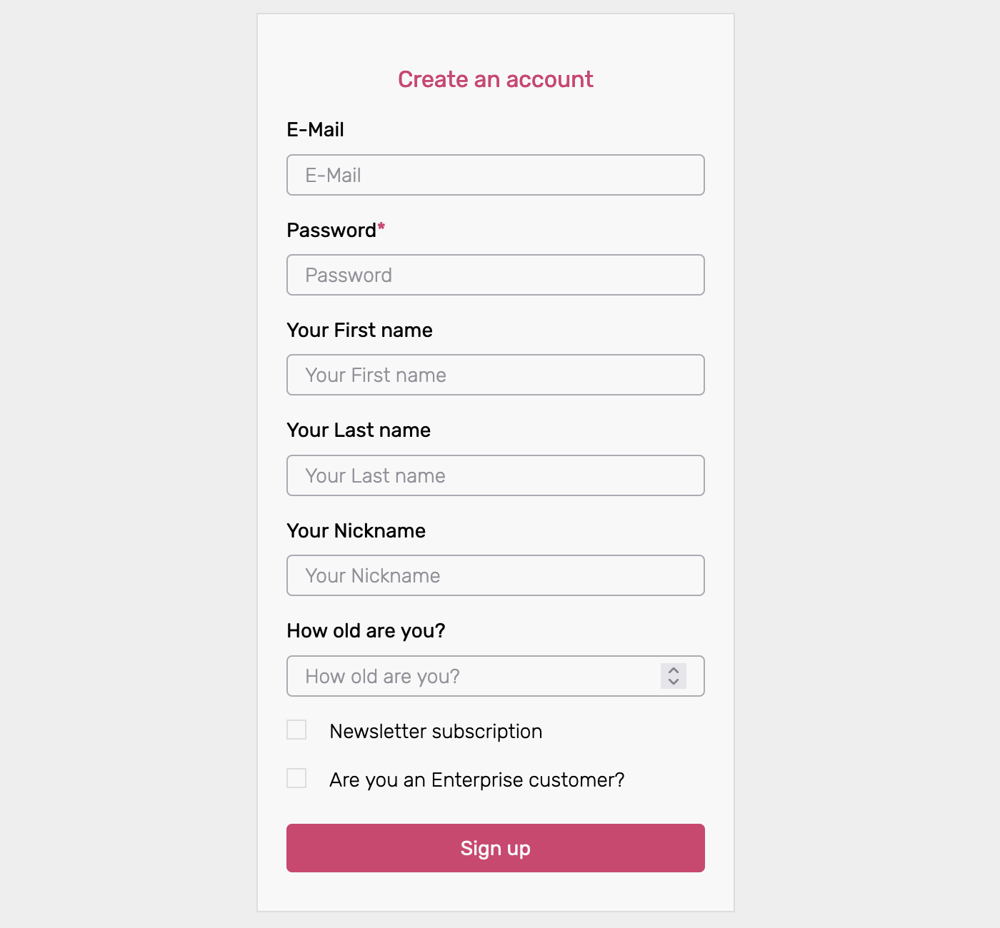

Ory supports custom Identity Models. To learn more about the concept of Identity
Models at Ory, please head over to
[Identity Data Model, Custom Fields](../concepts/identity.mdx).

This guide will help you create custom Identity Models as well as provide an
example Identity Model.

## Setup Custom Identity Model

- Select the Ory Cloud Project, you want to change under
  [Projects/Overview](https://console.ory.sh/projects/list).

- Head over to the "Customize / General" tab (URL:
  https://console.ory.sh/projects/$YOURPROJECTID/settings) and review the
  currently active Identity Model.

- Select a preset model or an empty template as the basis for your new custom
  Identity Model.

- Check the `Customize Identity Schema` box to enable editing on the Identity
  Model.

- Add or remove traits from the Identity Model as desired, more info in the
  [Customize Fields](#customize-fields) section.

- When finished editing name your custom Identity Model. Input the name in the
  textbox between the checkbox and the schema.

- Press `Enter` or hit the `Update` button to save it, once you have made your
  changes. Currently, it is not possible to edit an existing Identity Model, so
  make sure you are done before saving the Identity Model.

You can specify a title for your custom Identity Model. The default is
`"title": "Person",` but this can be changed to something that describes this
Identity Model more accurately, e.g.

```
"title": "Customer",
"title": "Administrator",
"title": "Foo",
etc...
```

## Customize Fields

An Identity Models traits are specified under

```json
"traits": {
"type": "object",
"properties": {
```

Each trait translates into a field on the user-facing frontend. For example the
"username & password" preset defines two traits - username and password:

```json
// username & password identity model
    "traits": {
      "type": "object",
      "properties": {
        "username": {
          "type": "string",
          "title": "Username",
          "ory.sh/kratos": {
            "credentials": {
              "password": {
                "identifier": true
              }
            },
            "recovery": {
              "via": "email"
            },
            "verification": {
              "via": "email"
            }
          }
        }
      },
      "required": [
        "username"
      ],
      "additionalProperties": false
    }
```

This Identity Model translates into the following sign-up screen:


The part highlighted below defines the identities `username` for the
username+password flow in the Ory Cloud. It also includes a method for
[`recovery`](https://www.ory.sh/kratos/docs/self-service/flows/account-recovery#recovery-link-method)
as well as
[`verification`](https://www.ory.sh/kratos/docs/self-service/flows/verify-email-account-activation/#verification-link-method).
Currently, only the `email` method is available (recovery/verification via a link
sent in an email).

```diff
    "traits": {
      "type": "object",
      "properties": {
+       "username": {
+         "type": "string",
+         "title": "Username",
+         "ory.sh/kratos": {
+           "credentials": {
+             "password": {
+               "identifier": true
+             }
+           },
            "recovery": {
              "via": "email"
            },
            "verification": {
              "via": "email"
            }
          }
        }
      },
      "required": [
        "username"
      ],
      "additionalProperties": false
    }
```

To add traits to the Identity Model, add them inside the `traits "properties"`

```json
"traits": {
"type": "object",
"properties": {
// your identities traits go here
       }
    }
```

for example the GitHub Handle as `string` :

```json
"traits": {
"type": "object",
"properties": {
        "handle": {
          "type": "string",
          "title": "Your GitHub Handle"
        }
      }
    }
```

or a mobile phone number as `integer`:

```json
"traits": {
"type": "object",
"properties": {
        "phone-number" : {
            "type": "integer",
            "title" : "Your Mobile Phone Number"
        }
      }
    }
```

Possible values for the `type` are `string`, `number`, `integer`, `boolean`.

Use `string` for text fields, `boolean` for true/false fields, `integer` or
`number` for integral or floating-point numbers. If you want to know more about
these types, please refer to the
[json-schema documentation](https://json-schema.org/understanding-json-schema/reference/type.html).

The `title` of each field is what the user as description or sample input. After
adding the above examples the sign-up screen would look like so:



### Required traits

To define certain traits as required, add them to the `required` array by name:

```json
  "properties": {
    "traits": {
      "type": "object",
      "properties": {
// your identities traits go here
       },
      "required": [
/add required fields to this array
        "email"
      ],
    }
  }
```

### Additional Properties

The
[`additionalProperties`](https://json-schema.org/understanding-json-schema/reference/object.html#additional-properties)
keyword is used to control the handling of properties whose names are not listed
in the properties keyword. This usually should be set to false.

```json
      "additionalProperties": false
```

## Example Identity Model

The following Identity Model includes first/last and nickname, as well as number
fields for the phone number and birthday. There are also two true/false fields
for specifying the newsletter subscription and enterprise status.

Please note that this is just a reference Identity Model, for practical uses it
contains probably too many traits.

```json
{
  "$id": "https://schemas.ory.sh/presets/kratos/identity.basic.schema.json",
  "title": "Person",
  "type": "object",
  "properties": {
    "traits": {
      "type": "object",
      "properties": {
        "email": {
          "type": "string",
          "format": "email",
          "title": "E-Mail",
          "ory.sh/kratos": {
            "credentials": {
              "password": {
                "identifier": true
              }
            },
            "recovery": {
              "via": "email"
            },
            "verification": {
              "via": "email"
            }
          }
        },
        "name": {
          "type": "object",
          "properties": {
            "first": {
              "type": "string",
              "title": "Your First name"
            },
            "last": {
              "type": "string",
              "title": "Your Last name"
            },
            "nickname": {
              "type": "string",
              "title": "Your Nickname"
            }
          }
        },
        "mobile-number": {
          "type": "integer",
          "title": "Your Mobile Number"
        },
        "birthday": {
          "type": "integer",
          "title": "Your Birthday"
        },
        "country": {
          "type": "boolean",
          "title": "Newsletter subscription"
        },
        "enterprise": {
          "type": "boolean",
          "title": "Are you an Enterprise customer?"
        }
      },
      "required": ["email"],
      "additionalProperties": false
    }
  }
}
```

This is what the above Identity Model would look like on the sign-up screen:



## Best Practices

- Keep your data lean!

Theoretically, any amount and type of data can be included in your Identity
model. We recommend that you do not include more fields than necessary in your
Identity Model. Ideally, the Identity Model should only include traits that are
necessary or relevant to the users' profile. If the data is related to something
else - e.g. business logic - it makes sense to store it somewhere else. It can
still be captured in the signup form, it just will need to be saved e.g. in your
backend database.
