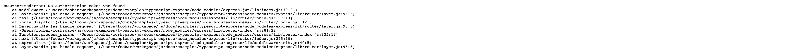

This page describes how to integrate different types of NodeJS apps with Ory.
Please have the [Ory CLI](./ory-cli-install-use.mdx) installed on your system as
well as a [running Ory Project](../get-started.mdx) and a [Personal Access Token](../guides/create-personal-access-token.mdx).

## ExpressJS with TypeScript

This example uses NodeJS with TypeScript support and ExpressJS to set up an app
with two endpoints:

- `/`: can be accessed without an active Ory Session;
- `/public`: can be accessed without an active Ory Session;
- `/protected`: can only be accessed after registration / login - with an active
  Ory Session.

:::note

You can find the [source code for this example on GitHub](https://github.com/ory/docs/tree/master/examples/typescript-express).

:::

To get started open a new terminal and set the environment variables:

- `ORY_ACCESS_TOKEN`: Use a personal access token here;
- `ORY_PROJECT_URL`: Use the Project URL which you can find on the "Services &
  APIs" page of your project.

```shell
# IMPORTANT - The URL MUST NOT end with a trailing slash!
export ORY_PROJECT_URL=...
# e.g.
# export ORY_PROJECT_URL=https://nostalgic-jemison-kj2qx0nhmk.projects.oryapis.com

export ORY_ACCESS_TOKEN=...
# e.g.
# export ORY_ACCESS_TOKEN=2123l8jJhSIYQZvfasd53YoRvcseg1
```

To get started, check out the example's source code, install the node packages,
and run the app:

```shell
git clone https://github.com/ory/docs.git
cd docs/examples/typescript-express
npm i

## ATTENTION ##
# Node, similar to Firefox, does not use the Operating System Certificate store.
# To get the self-signed SSL certificates working, we need to disable TLS Verification.
# NEVER, EVER do this in a live system.
NODE_TLS_REJECT_UNAUTHORIZED=0 npm start
```

Open another terminal and copy set the `ORY_ACCESS_TOKEN` env var to your
Personal Access Token:

```shell
export ORY_ACCESS_TOKEN=...
```

Next, run the Ory Proxy with

- `--protect-path-prefix /protected`: only the path /protected needs a valid Ory
  Session;
- `--port 4000`: the port on which the proxy should listen on;
- `http://localhost:8000/`: the host and port of the NodeJS app you are
  protecting.

```shell
ory proxy local \
  --protect-path-prefix /protected \
  --port 4000 \
  http://localhost:8000/
```

Your operating system will prompt you for your administrative password. The Ory
Proxy sets up a temporary SSL certificate in your operating system's certificate
store to enable HTTPS integration.

:::warning

The registration of the self-signed SSL certificate works only in Chrome and
Safari but not yet in FireFox. Also, programming languages like Golang, NodeJS,
and others often do not respect the operating system certificate store. In those
cases, you must disable TLS verification. This is not an issue in production!

:::

To see what the app can do, open it at the original endpoints:

- [localhost:8000/public](http://localhost:8000/public)
- [localhost:8000/protected](http://localhost:8000/protected)

The second URL `/protected` will greet you with an error because no Ory Session
is available.



However, if you open the URL through the proxy at
[https://localhost:4000/protected](https://localhost:4000/protected), your
browser will be redirected to a login screen! Once you created an account or
signed in, the application will show information about the session:


### Code Integration

import CodeFromRemote from '@theme/CodeFromRemote'

To get the app integrated with Ory, we use the following `npm` dependencies:

- [`@ory/client`](https://www.npmjs.com/package/@ory/client) contains the Ory
  SDK. While not needed, the app includes an example of how to set up the SDK
  and use it;
- [`dotenv`](https://www.npmjs.com/package/dotenv) loads environment variables
  from a `.env` file;
- [`express-jwt`](https://www.npmjs.com/package/express-jwt) is an express
  middleware for JWTs;
- [`jwks-rsa`](https://www.npmjs.com/package/jwks-rsa) a library to load the
  cryptographic keys for verifying JWTs using a remote URL.

Let's take a look at the annotated code!

<CodeFromRemote
  lang="js"
  link="https://github.com/ory/dpcs/blob/master/examples/typescript-express/src/index.ts"
  src="https://raw.githubusercontent.com/ory/dpcs/master/examples/typescript-express/src/index.ts"
/>

Great! You've made it! Integrating Ory is easy and straight forward. There are
many more things to come, and we are excited to have you on board!
