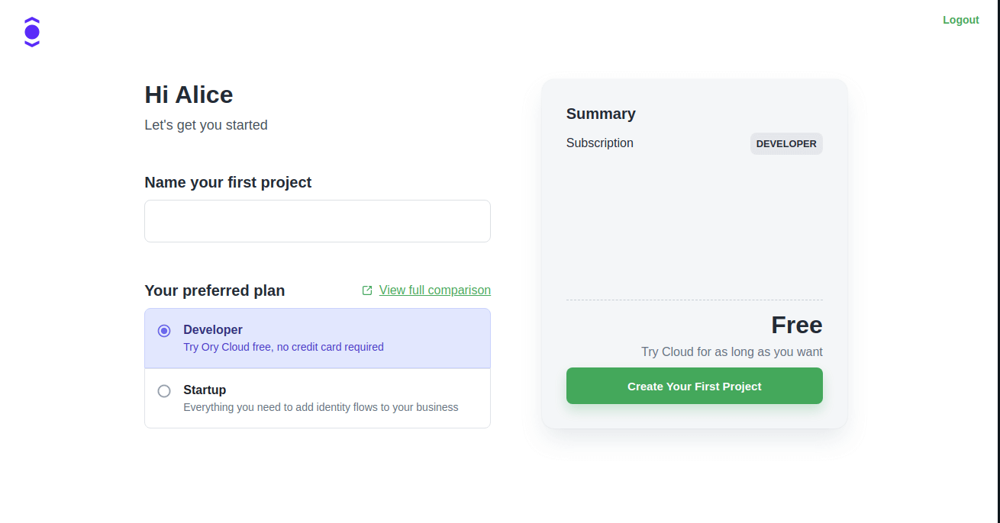

This guide describes the practical steps to create an Ory Cloud Project. If you
want to learn more about Ory Cloud Projects, please visit the
[concepts](../concepts/project.mdx) documentation.

## Set up Ory account

If you haven't already, sign up at the Ory Cloud Console:
[console.ory.sh](https://console.ory.sh)

## Create your first Ory Cloud Project

When you first sign up to Ory Cloud, you will be prompted to create a project.

Enter a project name to identify the project with. This name is only visible in
the Ory Cloud Console.

Choose your desired plan. You can update your plan at any time from your
subscriptions page.

Next, hit "Create Your First Project" and fill out the details on the checkout
page in case you're opting for a paid plan. Your project should come alive
shortly after!

## Creating additional projects

Your Ory Cloud account is not limited to a single project. You can create as
many as you like, and each project can have its own subscription.

To create another project after your first, locate the "Create Project" button
at the bottom of the Console's navigation menu:

This screen is more of the same - enter a project name, pick your desired plan,
and your project will be created shortly!

## Create Personal Access Token

Note that a personal access token is required to access administrative APIs
(e.g. deleting an identity, using the Ory CLI, ...). Personal Access Tokens are
bound to a project.

Head over to the
[Personal Access Tokens concept documentation](../concepts/personal-access-token.mdx)
to learn more.

## What's next?

You created your first Ory Cloud Project. Now it's time to
[start building](./start-building.mdx)!

Or if you want to learn more about Ory Cloud Projects, head to the
[concepts documentation](../concepts/project.mdx).
