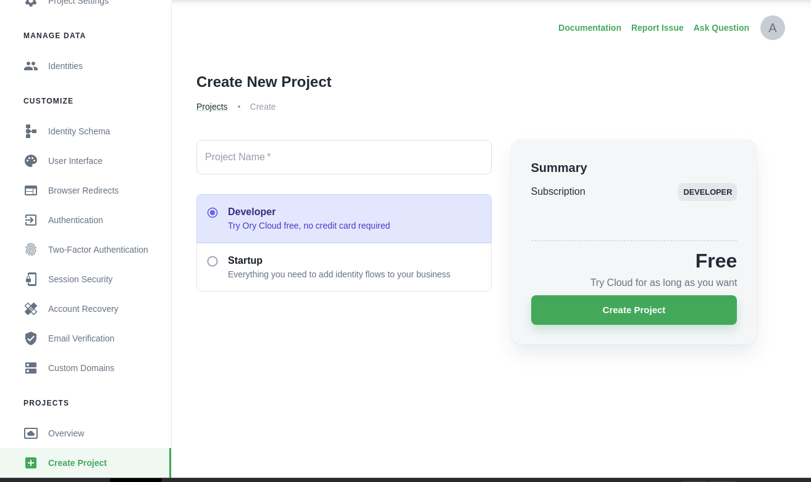
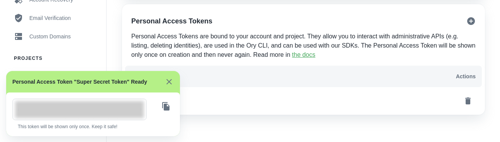

This guide describes the practical steps to create an Ory Cloud Project.

If you want to learn more about Ory Cloud Projects, please visit the
[concepts](../concepts/project.mdx) documentation.

## Set up Ory account

If you haven't already, sign up at the Ory Cloud Console:
[console.ory.sh](https://console.ory.sh)

## Create Ory Cloud Project

:::info

Ory Cloud is currently in [early access](./early-access.mdx) and invite-only. To
create an Ory Cloud Project,
[register and apply for Ory Early Access](https://console.ory.sh/). Once Ory is
in [Open Beta](../early-access#roadmap), this will no longer be needed. :::

Hit "Create Project" in the Console menu to bring up the project creation
screen.

### Project Name

Enter a project name to identify the project. This name is only visible in the
Ory Cloud Console.

### Identity Schema

The Identity Schema is a JSON Schema that describes your identity's (e.g. your
customers/users/...) fields. In Ory, every identity can have its schema,
allowing you to separate between different customer types, user types (e.g.
employees and customers).

[Learn more about the Identity Schema](concepts/identity.mdx), the available
profiles, and customization options! For the quickstart, we recommend the "Demo
Profile" model.

:::note

The "Demo Profile" is a preset schema for technical demonstrations. Do not use
it in real applications as we will eventually change or delete this profile.

:::

### Authentication Options

For demo applications, we recommend enabling sign-in after registration.

:::note

Enable sign-in after registration disables account enumeration defenses!

:::

### Finalize Creation

Next, hit "Create" and fill out the details on the checkout page. Your project
should come alive shortly after!

## Create Personal Access Token

Personal Access Tokens are bound to a project. They are needed to access
administrative APIs (e.g. deleting an identity, using the Ory CLI, ...).

Head over to the "Personal Access Token" page

and click on the plus symbol to create a new token.

Once created, a dialog will appear on the bottom left containing your access
token. Copy this into a password manager or another safe place. The token will
never be displayed again! If you forget it, you will need to create a new token.

To learn more about PATs, visit to the
[Personal Access Token concept documentation](../concepts/personal-access-token.mdx).

:::note

Personal Access Tokens are an interim security mechanism. In the future, more
secure mechanisms such as JWT Assertions and mTLS will be supported.

:::

## What's next?

You created your first Ory Cloud Project. Now it's time to
[start building](./start-building.mdx)!

Or if you want to learn more about Ory Cloud Projects, head to the
[concepts documentation](../concepts/project.mdx).
