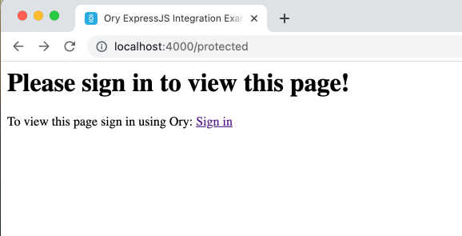

Ory supports server-side web apps natively. To get building, pick the technology
you are using:

- [NodeJS](#expressjs--nodejs) / [ExpressJS](#expressjs--nodejs)
- [Golang](./other-languages.mdx)
- [Java](./other-languages.mdx)
- [PHP](./other-languages.mdx)
- [Django](./other-languages.mdx)
- [Other language / framework](./other-languages.mdx)

Before you get started, please install the [Ory CLI](./ory-cli-install-use.mdx)
on your system, and have a
[running Ory Project](https://console.ory.sh/registration) and a
[Personal Access Token](../guides/create-personal-access-token.mdx) ready.

For more information on the Ory Cloud SDK and Services and please see the
[Services & APIs docs](../concepts/services-api.mdx).

## ExpressJS / NodeJS

This example uses NodeJS with TypeScript support and ExpressJS to set up an app
with two endpoints:

- `/`: can be accessed without an active Ory Session;
- `/public`: can be accessed without an active Ory Session;
- `/protected`: can only be accessed after registration / login - with an active
  Ory Session.

:::note

You can find this
[example's source code on GitHub](https://github.com/ory/docs/tree/master/examples/typescript-express).

:::

To get started open a new terminal and set the `ORY_SDK_URL` environment
variables. You can find the value on the
[Services & APIs page](../concepts/services-api.mdx). If you do not have a
project, use the playground!

```shell
export ORY_SDK_URL=https://playground.projects.oryapis.com
# or if you have a project:
# export ORY_SDK_URL=https://<project>.projects.oryapis.com
```

To get started, check out the example's source code, install the node packages,
and run the app:

```shell
git clone https://github.com/ory/docs.git
cd docs/examples/typescript-express
npm i
npm start
```

Open another terminal and again set up the `ORY_SDK_URL`:

```shell
export ORY_SDK_URL=https://playground.projects.oryapis.com
# or if you have a project:
# export ORY_SDK_URL=https://<project>.projects.oryapis.com
```

Next, run the Ory Proxy with

- `--port 4000`: the port on which the proxy should listen on;
- `http://localhost:8000/`: the host and port of the NodeJS app you are
  protecting.

```shell
ory proxy --port 4000 http://localhost:8000/
```

Great, let's open the app through the proxy
[localhost:4000/](http://localhost:4000/) and click the second URL `/protected`.
will greet you with an error because no Ory Session is available.



Once you created an account or signed in, the application will show information
about the session:


### Code Examples

import CodeFromRemote from '@theme/CodeFromRemote'

To get the app integrated with Ory, we use the following `npm` dependencies:

- [`@ory/kratos-client`](https://www.npmjs.com/package/@ory/kratos-client)
  contains the Ory Kratos SDK.
- [`dotenv`](https://www.npmjs.com/package/dotenv) loads environment variables
  from a `.env` file;
- [`express-jwt`](https://www.npmjs.com/package/express-jwt) is an express
  middleware for JWTs;
- [`jwks-rsa`](https://www.npmjs.com/package/jwks-rsa) a library to load the
  cryptographic keys for verifying JWTs using a remote URL.

Let's take a look at the annotated code!

#### Root App

All you need is a plain ExpressJS skeleton:

<CodeFromRemote
  lang="js"
  link="https://github.com/ory/docs/blob/master/examples/typescript-express/src/index.ts"
  src="https://raw.githubusercontent.com/ory/docs/master/examples/typescript-express/src/index.ts"
/>

#### Middleware

The Ory Session Cookie is converted to a JSON Web Token by `ory proxy local`.
The cryptographic key to verify the JSON Web Token is available at
`https://<proxy>/.ory/proxy/.well-known`.

If the JSON Web Token is not available, or not valid, we redirect to the login:

<CodeFromRemote
  lang="js"
  link="https://github.com/ory/docs/blob/master/examples/typescript-express/src/middleware.ts"
  src="https://raw.githubusercontent.com/ory/docs/master/examples/typescript-express/src/middleware.ts"
/>

#### Protected Page

The protected page is doing a few extra things, such as fetching the identity
from Ory Cloud's Administrative APIs, and also creates a logout URL for the
user:

<CodeFromRemote
  lang="js"
  link="https://github.com/ory/docs/blob/master/examples/typescript-express/src/routes/protected.ts"
  src="https://raw.githubusercontent.com/ory/docs/master/examples/typescript-express/src/routes/protected.ts"
/>

### Conclusion

Great! You've made it! Integrating Ory is easy and straight forward. There are
many more things to come, and we are excited to have you on board!
