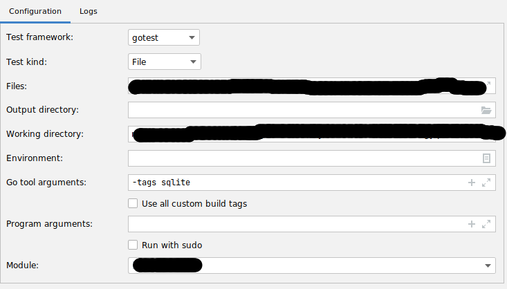

This document explains how you can contribute to Ory. 

If have have ideas to improve it, please have a look at the[ main template](https://github.com/ory/docs/blob/master/docs/ecosystem/contributing.md).

## Introduction

You can contribute in many ways beyond writing code. The goal of this document is to provide a high-level overview of how you can
get involved.

_Please note_: We are serious about Ory's security and our users' trust. If you believe you have found a security issue in Ory,
please disclose by contacting us at security@ory.sh.

First: As a potential contributor, your changes and ideas are welcome at any hour of the day or night, weekdays, weekends, and
holidays. Please do not ever hesitate to ask a question or send a pull request.

If you are unsure, just ask or submit the issue or pull request anyways. You won't be yelled at for giving it your best effort.
The worst that can happen is that you'll be asked to change something. We appreciate any sort of contributions, and don't want a
wall of rules to get in the way of that.

That said, if you want to ensure that a pull request is going to be merged, talk to us! You can find out our thoughts and ensure
that your contribution won't clash with Ory's normal direction. A great way to do this is via GitHub Discussions
(([Ory Network](https://github.com/ory/network/discussions), [Ory Kratos](https://github.com/ory/kratos/discussions),
[Ory Hydra](https://github.com/ory/kratos/discussions), [Ory Keto](https://github.com/ory/kratos/discussions),
[Ory Oathkeeper](https://github.com/ory/kratos/discussions))) or the [Ory Chat](https://www.ory.sh/chat).

## Frequently asked questions

- I am new to the community. Where can I find the
  [Ory Community Code of Conduct?](https://github.com/ory/kratos/blob/master/CODE_OF_CONDUCT.md)

- I have a question. Where can I get [answers to questions?](#communication)

- I would like to contribute but I am not sure how. Are there [easy ways to contribute?](#how-can-i-contribute)
  [Or good first issues?](https://github.com/search?l=&o=desc&q=label%3A%22help+wanted%22+label%3A%22good+first+issue%22+is%3Aopen+user%3Aory+user%3Aory-corp&s=updated&type=Issues)

- I want to talk to other Ory users. [How can I become a part of the community?](#communication)

- I would like to know what I am agreeing to when I contribute to Ory. Does Ory have
  [a Contributors License Agreement?](https://cla-assistant.io/ory/)

- I would like updates about new versions of Ory.
  [How are new releases announced?](https://ory.us10.list-manage.com/subscribe?u=ffb1a878e4ec6c0ed312a3480&id=f605a41b53)

## How can I contribute?

If you want to start contributing code right away, we have a
[list of good first issues](https://github.com/ory/kratos/labels/good%20first%20issue).

You can contribute without writing any code in multiple ways . Here are a few things you can do to help out:

- **Give us a star.** It may not seem like much, but it really makes a difference. This is something that everyone can do to help
  out Ory. Github stars help the project gain visibility and stand out.

- **Join the community.** Sometimes helping people can be as easy as listening to their problems and offering a different
  perspective. Join our Slack, have a look at discussions on GitHub and take part in events like the Community Calls. More info on
  this in [Communication](#communication).

- **Helping with open issues.** We have a lot of open issues for Ory and some of them may lack necessary information, some are
  duplicates of older issues. You can help out by guiding people through the process of filling out the issue template, asking for
  clarifying information, or pointing them to existing issues that match their description of the problem.

- **Reviewing documentation changes.** Most documentation just needs a review for proper spelling and grammar. If you think you
  can improve a document in any way, feel free to hit the `edit` button at the top of the page. More info on contributing to
  documentation [here](#documentation).

- **Help with tests.** Some pull requests may lack proper tests or test plans. These are needed for the change to be implemented.

## Communication

We use [Slack](https://www.ory.sh/chat). You are welcome to drop in and ask questions, discuss bugs and feature requests, talk to
other users of Ory, etc.

Check out discussions for [Ory Network](https://github.com/ory/network/discussions),
[Ory Kratos](https://github.com/ory/kratos/discussions), [Ory Hydra](https://github.com/ory/kratos/discussions),
[Ory Keto](https://github.com/ory/kratos/discussions), [Ory Oathkeeper](https://github.com/ory/kratos/discussions), and
[more](https://github.com/ory/kratos/discussions). This is a great place for in-depth discussions and lots of code examples, logs
and similar data.

You can also join our community hangout, if you want to speak to the Ory team directly or ask some questions. You can find more
info on the hangouts in [Slack](https://www.ory.sh/chat).

If you want to receive regular notifications about updates to Ory, consider joining the mailing list. We will _only_ send you
vital information on the projects that you are interested in.

Also [follow us on twitter](https://twitter.com/orycorp).

## Conduct

Whether you are a regular contributor or a newcomer, we care about making this community a safe place for you and we've got your
back.

- We are committed to providing a friendly, safe and welcoming environment for all, regardless of gender, sexual orientation,
  disability, ethnicity, religion, or similar personal characteristic.
- Please avoid using nicknames that might detract from a friendly, safe and welcoming environment for all.
- Be kind and courteous. Don't be mean or rude.
- We will exclude you from interaction if you insult, demean or harass anyone. In particular, we do not tolerate behavior that
  excludes people in socially marginalized groups.
- Private harassment is also unacceptable. No matter who you are, if you feel you have been or are being harassed or made
  uncomfortable by a community member, please contact a member of the Ory team.
- Likewise any spamming, trolling, flaming, baiting or other attention-stealing behavior is not welcome.

We welcome discussion about creating a welcoming, safe, and productive environment for the community. If you have any questions,
feedback, or concerns [please let us know](https://www.ory.sh/chat).

## Contributing Code

Unless you are fixing a known bug, we **strongly** recommend discussing it with the core team via a GitHub issue or
[in our chat](https://www.ory.sh/chat) before getting started to ensure your work is consistent with Ory's road map and
architecture.

All contributions are made via pull requests. To make a pull request, you will need a GitHub account; if you are unclear on this
process, see GitHub's documentation on [forking](https://help.github.com/articles/fork-a-repo) and
[pull requests](https://help.github.com/articles/using-pull-requests). Pull requests should be targeted at the `master` branch.
Before creating a pull request, go through this checklist:

1. Create a feature branch off of `master` so that changes do not get mixed up.
1. [Rebase](http://git-scm.com/book/en/Git-Branching-Rebasing) your local changes against the `master` branch.
1. Run the full project test suite with the `go test -tags sqlite ./...` (or equivalent) command and confirm that it passes.
1. Run `make format` if a `Makefile` is available, `gofmt -s` if the project is written in Go, `npm run format` if the project is
   written for Node.js.
1. Ensure that each commit has a descriptive prefix. This ensures a uniform commit history and helps structure the changelog.  
   Please refer to this [list of prefixes for Kratos](https://github.com/ory/kratos/blob/master/.github/semantic.yml) for an
   overview.
1. Sign-up with CircleCI so that it has access to your repository with the branch containing your PR. Simply creating a CircleCI
   account is sufficient for the CI jobs to run, you do not need to setup a CircleCI project for the branch.

If a pull request is not ready to be reviewed yet
[it should be marked as a "Draft"](https://docs.github.com/en/github/collaborating-with-pull-requests/proposing-changes-to-your-work-with-pull-requests/changing-the-stage-of-a-pull-request).

Before your contributions can be reviewed you need to sign our
[Contributor License Agreement](https://cla-assistant.io/ory/kratos).

This agreement defines the terms under which your code is contributed to Ory. More specifically it declares that you have the
right to, and actually do, grant us the rights to use your contribution. You can see the Apache 2.0 license under which our
projects are published [here](https://github.com/ory/meta/blob/master/LICENSE).

When pull requests fail testing, authors are expected to update their pull requests to address the failures until the tests pass.

Pull requests eligible for review

1. follow the repository's code formatting conventions;
2. include tests which prove that the change works as intended and does not add regressions;
3. document the changes in the code and/or the project's documentation;
4. pass the CI pipeline;
5. have signed our [Contributor License Agreement](https://cla-assistant.io/ory/kratos);
6. include a proper git commit message following the
   [Conventional Commit Specification](https://www.conventionalcommits.org/en/v1.0.0/).

If all of these items are checked, the pull request is ready to be reviewed and you should change the status to "Ready for review"
and
[request review from a maintainer](https://docs.github.com/en/github/collaborating-with-pull-requests/proposing-changes-to-your-work-with-pull-requests/requesting-a-pull-request-review).

Reviewers will approve the pull request once they are satisfied with the patch.

## Documentation

Please provide documentation when changing, removing, or adding features. Documentation resides in the
[Ory docs repository](https://github.com/ory/docs/tree/master/docs) folder.

For further instructions please head over to [docs/README.md](https://github.com/ory/docs/blob/master/README.md).

## Disclosing vulnerabilities

Please disclose vulnerabilities to [security@ory.sh](mailto:security@ory.sh). Do not use GitHub issues.

## Code Style

Please follow these guidelines when formatting source code:

- Go code should match the output of `gofmt -s` and pass `golangci-lint run`.
- Format Node.js and JavaScript code using `npm run format` where appropriate.

### Working with Forks

```shell
# First you clone the original repository
git clone git@github.com:ory/ory/kratos.git

# Next you add a git remote that is your fork:
git remote add fork git@github.com:<YOUR-GITHUB-USERNAME-HERE>/ory/kratos.git

# Next you fetch the latest changes from origin for master:
git fetch origin
git checkout master
git pull --rebase

# Next you create a new feature branch off of master:
git checkout my-feature-branch

# Now you do your work and commit your changes:
git add -A
git commit -a -m "fix: this is the subject line" -m "This is the body line. Closes #123"

# And the last step is pushing this to your fork
git push -u fork my-feature-branch
```

Now go to the project's GitHub Pull Request page and click "New pull request"

This document is a work in progress and documents the inner workings of the Ory GitHub ecosystem and project structures, as well
as providing more in-depth tips & guides to contributors. If you feel there is something missing or should be added, please open
an issue in [ory/docs](https://github.com/ory/docs) or contact us in the [Ory Chat](https://www.ory.sh/chat). We also offer
discussions on GitHub for all major projects: [Ory Kratos](https://github.com/ory/kratos/discussions),
[Ory Hydra](https://github.com/ory/hydra/discussions), [Ory Keto](https://github.com/ory/keto/discussions),
[Ory Oathkeeper](https://github.com/ory/oathkeeper/discussions/), as well as one for all other Ory projects, events and content:
[Ory Meta discussions](https://github.com/ory/meta/discussions).

## Releasing Software

To release a project, run the following bash command in the root of the project you would like to release. The first argument can
be one of:

- `patch` bumps `v1.2.3` to `v1.2.4` (doesn't work for pre-releases such as `v1.2.3-beta.1`)
- `minor` bumps `v1.2.3` to `v1.3.0` (doesn't work for pre-releases such as `v1.2.3-beta.1`)
- `major` bumps `v1.2.3` to `v2.0.0` (doesn't work for pre-releases such as `v1.2.3-beta.1`)
- Any [semver-valid](https://semver.org) version, for example `v1.2.3-beta.1`

```shell script
release_as=v1.2.3
bash <(curl -s https://raw.githubusercontent.com/ory/meta/master/scripts/release.sh) $release_as
```

### Defining Release Config

For the scripts to work, the project must be located in a directory structure that reflects the GitHub organization and repository
name, for example: `path/to/ory/hydra`.

#### Goreleaser

We use [goreleaser](https://github.com/goreleaser/goreleaser/releases).

The listed configuration options should be included in every `.goreleaser.yml` config. Make sure you set env vars and
`go mod download` and run e.g. packr2 and other tools first:

```yaml title=".goreleaser.yml"
env:
  - GO111MODULE=on

before:
  hooks:
    - go mod download
    # - go install github.com/gobuffalo/packr/v2/packr2
    # - packr2
```

Tag `-alpha.1` and other pre-release tags as pre-release on GitHub:

```yaml
release:
  prerelease: auto
```

Name snapshot releases `-next`:

```yaml
snapshot:
  name_template: "{{ .Tag }}-_next"
```

If you create a new goreleaser config, you may also want to create the following empty GitHub repositories:

Build and publish on Docker. You need to create a repository on Docker Hub first!

```yaml
# Build dockerfiles
dockers:
  - dockerfile: Dockerfile
    binaries:
      - $PROJECT_NAME
    image_templates:
      - "oryd/$PROJECT_NAME:v{{ .Major }}"
      - "oryd/$PROJECT_NAME:v{{ .Major }}.{{ .Minor }}"
      - "oryd/$PROJECT_NAME:v{{ .Major }}.{{ .Minor }}.{{ .Patch }}"
      - "oryd/$PROJECT_NAME:latest"
```

If you add [Scoop](https://scoop.sh) (Homebrew for Windows) you must also create a GitHub repository under the `ory` org named
`scoop-$PROJECT_NAME` (e.g. `scoop-hydra`).

```yaml
scoop:
  bucket:
    owner: ory
    name: scoop-$PROJECT_NAME
  homepage: https://www.ory.sh
  commit_author:
    name: aeneasr
    email: aeneas@ory.sh
```

If you add [Homebrew](https://brew.sh) you must also create a GitHub repository under the `ory` org named `homebrew-$PROJECT_NAME`
(e.g. `homebrew-hydra`).

```yaml
brews:
  - github:
      owner: ory
      name: homebrew-$PROJECT_NAME
    ids:
      - <<REPLACE-WITH-ARCHIVE-ID>>
    homepage: https://www.ory.sh
    commit_author:
      name: aeneasr
      email: aeneas@ory.sh
```

We use the following replacements:

```yaml
archives:
  - replacements:
      darwin: macOS
      386: 32-bit
      amd64: 64-bit
    format_overrides:
      - goos: windows
        format: zip
```

### Update install script

When you have finalized changes to the `.goreleaser.yml`, run:

```shell
GO111MODULES=off go get -u github.com/goreleaser/godownloader
godownloader .goreleaser.yml --repo=$(basename $(dirname $(pwd)))/$(basename $(pwd)) > ./install.sh
```

## CI

[Ory CI](http://github.com/ory/ci):

### ory/nancy

Enables nancy vulnerability scanning for the repository.

```yml
orbs:
  nancy: ory/nancy@0.0.9

workflows:
  test:
    jobs:
      - nancy/test:
        filters:
          tags:
            only: /.*/
```

## Toolchain

### Checking for vulnerabilities

#### Node.js

This is done automatically by GitHub

#### Go

```go
# Outside of a go module-enabled project:
  go get -u github.com/sonatype-nexus-community/nancy

# Inside your go module-enabled project:
  go mod list -m all | nancy
```

### Pinning indirect go module dependencies

Sometimes a project has an indirect dependency (another dependency requires that dependency) which doesn't pass, for example,
`nancy` vulnerability scanning. Because it's not possible to pin this dependency to a specific version, we need to explicitly
require it. But because it's not directly required by our code, it will be pruned when using `go mod tidy`. To prevent that,
create a file which imports the dependency without use:

```title="go_mod_indirect_pins.go
// +build go_mod_indirect_pins

package main

import _ "github.com/my/dependency"
```

You would do the same if the project uses dev tools such as `packr2`, `goimports`, `goreturns`, `swagutil`, ... as part of e.g.
the Makefile or other scripts.

## Development

### DBAL gobuffalo/pop

#### Table Names

Please define custom table names for all table structs. Keep in mind that `TableName()` must be a value receiver, not a pointer
receiver, for slices `[]Model` to work properly:

```diff
-func (m *Model) TableName(ctx context.Context) string {
+func (m Model) TableName(ctx context.Context) string {
   return "foo"
}
```

### SQL Migrations

Ory uses a lightweight DBAL across all projects that require a database. This DBAL is typically stored in the `persistence/`
directory. Since we just support SQL at the moment - there are no plans to add new databases and contributions won't be accepted
due to maintenance effort - you will find the implementation in `persistence/sql`.

:::info

This section just applies to Ory Kratos and Ory Keto. Ory Hydra is using an approach that doesn't rely on fizz migrations. Please
discuss with maintainers before making changes to the Ory Hydra SQL schemata.

:::

In order to provide a process to upgrade SQL schemata, we use migrations. These migrations are generated using the
[fizz language](https://github.com/gobuffalo/fizz) and then rendered to SQL using the Ory CLI.

This is necessary because there are differences between the SQL "dialects" of SQLite (doesn't support certain `ALTER TABLE`
statements for example), PostgreSQL, MySQL, and CockroachDB.

To change the schema, create a new fizz template using:

```shell
# In the project root - e.g. /kratos
  make .bin/ory

# If make .bin/ory fails use:
#   make .bin/cli
#
# and replace `.bin/ory` with `.bin/cli`.
# We're working on streamlining this
# across all repos.

  .bin/ory dev pop migration create persistence/sql/migrations/templates descriptive_change
```

This will create two new files:

```shell
  ls -la persistence/sql/migrations/templates | tail -n 2
-rw-r--r--   1 foobar  staff      0 Apr 28 17:25 20210428172500_descriptive_change.down.fizz
-rw-r--r--   1 foobar  staff      0 Apr 28 17:25 20210428172500_descriptive_change.up.fizz
```

Add you fizz migrations there. The `up` file is for applying your schema changes, the `down` file for reverting them.

Once your migrations are added, it's time to render them to SQL. Make sure that Docker is running and execute:

```shell
  .bin/ory dev pop migration render persistence/sql/migrations/templates persistence/sql/migrations/sql
```

If you encounter errors you can also try running this with the `--replace` option but please let maintainers know that you used
`--replace` in your PR:

```shell
  .bin/ory dev pop migration render --replace persistence/sql/migrations/templates persistence/sql/migrations/sql
```

This will render your migrations to SQL files. Add them to git (`git add -A`) and commit them.

Next, you need to update the migration tests. To do so, run the sync command:

```shell
  .bin/ory dev pop migration sync persistence/sql/migrations/templates persistence/sql/migratest/testdata
```

This will add create a new SQL file:

```shell
  ls -la  persistence/sql/migratest/testdata | tail -n 1
-rw-r--r--   1 foobar  staff      0 Apr 28 17:28 20210428172500_testdata.sql
```

Add an `INSERT` or `UPDATE` or `DELETE` statement that reflects the changes you have made to the schema to the file. Let's say you
added a new column `new_column` to table `bar`. In that case, write an `INSERT` statement that reflects this:

```sql
INSERT INTO bar (old_column, new_column) VALUES ('foo', 'bar');
```

Next, execute the tests:

```go
cd persistence/sql/migratest
go test -tags sqlite ./...
```

The tests will probably fail because the fixtures need to be updated. To update them, run:

```go
cd persistence/sql/migratest
go test -tags sqlite,refresh -short .
```

You might need to run the `go test` command two or three times before all fixtures have been updated.

That's it! :)

## OpenAPI Spec and Go Swagger

We use [go-swagger](https://goswagger.io) to generate OpenAPI Spec from source code. Here you can find conventions we use across
the code base.

### Models

Models should have a descriptive title, a body, and be camelCase. It's good practice to scope the model where needed.

```go
package some

// Title
//
// A description with a trailing dot.
//
// swagger:model someSpecificModel
type SpecificModel struct {}
```

### Routes

Routes should use tags for versioning. If a route is accessible through a privileged port (e.g. admin) it should be prefixed with
`admin`.

```go
// swagger:route POST /identities v0alpha1 adminCreateIdentity
```

Public endpoints don't need a prefix.

```go
// swagger:route POST /something-public v0alpha1 somethingPublic
```

#### Parameters

Parameters for routes should have the same name as the route. If they have a body, you must not use an embedded struct and the
struct's model name should be suffixed `Body`:

```go

// swagger:parameters adminCreateIdentity
// nolint:deadcode,unused
type adminCreateIdentity struct {
  // in: body
  Body adminCreateIdentityBody
}

// swagger:model adminCreateIdentityBody
type adminCreateIdentityBody struct {
  // SchemaID is the ID of the JSON Schema to be used for validating the identity's traits.
  //
  // required: true
  SchemaID string `json:"schema_id"`

  // Traits represent an identity's traits. The identity is able to create, modify, and delete traits
  // in a self-service manner. The input will always be validated against the JSON Schema defined
  // in `schema_url`.
  //
  // required: true
  Traits json.RawMessage `json:"traits"`
}

// swagger:route POST /identities v0alpha1 adminCreateIdentity
```

#### Responses

Where possible use models for responses.

```shell
// A list of identities.
// swagger:model identityList
// nolint:deadcode,unused
type identityList []Identity

// swagger:route GET /identities v0alpha0 adminListIdentities
//
// List Identities
//
// Lists all identities. Doesn't support search at the moment.
//
// Learn how identities work in [Ory Kratos' User And Identity Schema Documentation](https://www.ory.sh/docs/next/kratos/concepts/identity-user-model).
//
//     Produces:
//     - application/json
//
//     Schemes: http, https
//
//     Responses:
//       200: identityList
//       500: jsonError
```

## IDE Tips

### Goland

#### Goland Tests

While running tests inside the IDE make sure you have the tag `-tags sqlite` in the "Go Tool Arguments". In the example screenshot
we're looking at `login_test.go` and add it to the Run/Debug Configurations.



### Jetbrains

#### Debugging Tests

Jetbrains IDEs have an SQL debugger, that can open sqlite files. When debugging tests, you can set a bool flag to use an sqlite
file instead of in-mem and then debug after the test failed.
[Example](https://github.com/ory/keto/pull/638/files#diff-19d74043bd6f4fd4ffaf6dee2895a42da0a754b6135339343117614974ff6182R84):

```go
func GetSqlite(t testing.TB, mode sqliteMode) *DsnT {
  dsn := &DsnT{
    MigrateUp:   true,
    MigrateDown: false,
  }

  switch mode {
  case SQLiteMemory:
    dsn.Name = "memory"
    dsn.Conn = fmt.Sprintf("sqlite://file:%s?_fk=true&cache=shared&mode=memory", t.Name())
  case SQLiteFile:
    t.Cleanup(func() {
      _ = os.Remove("TestDB.sqlite")
    })
    fallthrough
  case SQLiteDebug:
    dsn.Name = "sqlite"
    dsn.Conn = "sqlite://file:TestDB.sqlite?_fk=true"
  }

  return dsn
}
```


To transfer the above to Kratos:

- Change the DSN to the following: `dsn.Conn = "sqlite://file:TestDB.sqlite?_fk=true"`.
- `mode=memory`.
- In case you have an sqlite file, migrators aren't automatically applied. Run them manually first with the
  [CLI](https://www.ory.sh/kratos/docs/cli/kratos-migrate-sql).

### VS Code

#### VS Code Tests

- Under Settings, search for `Go: Test Tags`.
- Click Edit in `settings.json`. 
- Add the following KV to the `settings.json`: `"go.testTags": "sqlite",`.
  
