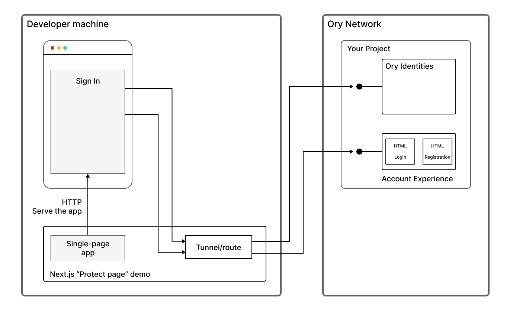

- **App type:** Single-page app (SPA)
- **Environment:** Development environment
- **UI type:** Ory Account Experience
- **Authentication flows:** Login, registration
- **What the app does:** Running on your local machine, this demo serves a single-page app to your browser, which requires you to
  log in to see a single protected page of content.



Because this app runs in a development environment, it differs from a production deployment in several respects:

- The app runs on your local machine, serving the single-page app from a local HTTP port.
- The local HTTP port uses the insecure HTTP protocol, instead of HTTPS.
- Requests to the Ory APIs are sent through a special tunnel/router, which works around the requirement for the application
  backend to be running in the same domain as the Ory Network project.

## Prerequisites

- A recent version of [Node Package Manager](https://www.npmjs.com/) (npm) is installed on your local machine. For instructions on
  installing npm, see the [npm installation documentation](https://docs.npmjs.com/downloading-and-installing-node-js-and-npm).
- You have already signed up to Ory Network, created your first project, and created an account for a user identity.

## Procedure

1. Open a command prompt on your local machine and clone the `ory/docs` repository:

   ```shell-session
   git clone https://github.com/ory/docs.git
   ```

2. Log in to the [Ory Console](https://console.ory.sh) and switch to the [Ory Network project](https://console.ory.sh/projects)
   you created earlier.
3. Go to the **Accesses & APIs** page of the Ory Console and copy the project's SDK URL from the **SDK Configuration** section.

4. At the command prompt, set the `ORY_SDK_URL` environment variable to the project's SDK URL (replacing the URL in the following
   command):

   ```shell-session
   export ORY_SDK_URL=https://{project.slug}.projects.oryapis.com
   ```

5. At the command prompt, go to the directory containing the Next.js example:

   ```shell-session
   cd docs/docs/code-examples/protect-page-login/nextjs
   ```

6. Install the required Next.js dependencies (defined in `package.json`):

   ```shell-session
   npm install
   ```

7. Run the example app from the command line:

   ```shell-session
   npm run dev
   ```

   Wait until you see the message, “compiled client and server successfully in xxx ms", in the command prompt.

8. Go to [http://localhost:3000](http://localhost:3000) to load the single-page app.

   :::note

   This app uses insecure HTTP, because it is running in a dev environment on your local machine. Always use HTTPS instead of HTTP
   in a production environment.

   :::

9. Sign in to your Ory Network project, using the account you created earlier.

   :::note

   If the sign-in fails, this might indicate that the SDK URL (configured by setting the `ORY_SDK_URL` environment variable) was
   not configured correctly. If the SDK URL is not set for this app, it defaults to the Ory playground
   ([https://playground.projects.oryapis.com/ui](https://playground.projects.oryapis.com/ui)).

   :::

10. Click the **Logout** button to log out again.

## Next steps

- To learn more about this Next.js example, see
  [Integrate authentication into Next.js](https://www.ory.sh/docs/getting-started/integrate-auth/nextjs).
