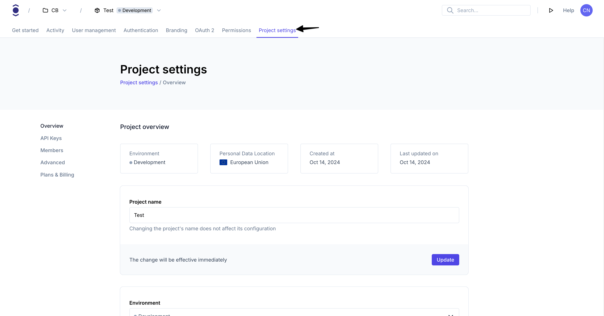
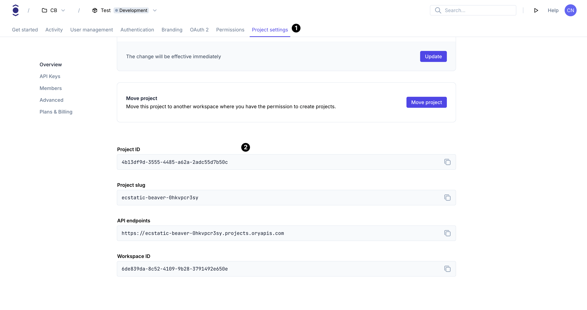

1. Create an Ory account at [https://console.ory.com](https://console.ory.com)
2. Create a new project at [https://console.ory.com/projects/create](https://console.ory.com/projects/create)
3. Go to your project settings

```mdx-code-block
import BrowserWindow from "@site/src/theme/BrowserWindow"

<BrowserWindow url="https://console.ory.com/projects/<id>/settings">



</BrowserWindow>
```

4. Note down your project credentials (ID, slug, endpoint)

```mdx-code-block

<BrowserWindow url="https://console.ory.com/projects/<id>/settings">



</BrowserWindow>
```
