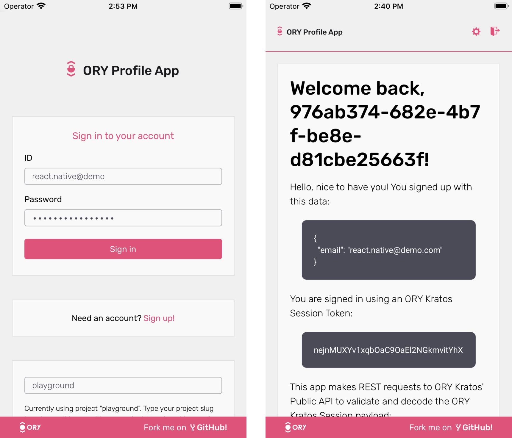

import CodeFromRemote from "@theme/CodeFromRemote"

This guide shows how to create a simple React application and secure it with authentication powered by Ory. You can use this guide
with both Ory Network and self-hosted Ory software.

This guide is perfect for you if:

- You have set up a [React Native development environment](https://reactnative.dev/docs/environment-setup).
- You want to build an app using React Native.
- You want to enable your users to sign up and sign in to your application.



:::info

You can find the code of the sample application [here](https://github.com/ory/kratos-selfservice-ui-react-native).

:::

## Clone React Native app

Start with cloning the repository with the sample application. Run:

```shell
# Clone using SSH
git clone git@github.com:ory/kratos-selfservice-ui-react-native.git

# Clone using HTTPS
git clone https://github.com/ory/kratos-selfservice-ui-react-native.git
```

## Prepare environment

To run the sample application, you must set up a React Native development environment and install mobile device emulators:

- Install [Expo CLI](https://docs.expo.dev/get-started/installation/).
- Install [Xcode](https://developer.apple.com/xcode/) and
  [Xcode Command Line Tools](https://www.czconsultants.com/2019/10/react-native-unable-to-verify-xcode-and-simulator-installation/)
  to run the application in an emulated iOS environment.

  :::note

  Xcode and its iOS emulation are available only on macOS.

  :::

- Install the [Android Studio Emulator](https://docs.expo.dev/workflow/android-studio-emulator/) to run the application in an
  emulated Android environment.

## Test your application

Follow these steps to run the app locally in an emulated iOS environment:

1. Enter the directory and install all dependencies:

   ```shell
   # Change directory
   cd kratos-selfservice-ui-react-native

   # Install dependencies
   npm i
   ```

2. Run `npm run ios` to start the iOS simulator and run the application.

   :::tip

   You can also use these commands:

   - `npm start` opens a dashboard where you can choose to run the app in iOS or Android simulated environments.
   - `npm run android` runs the app in the Android environment.

   :::

3. When the simulator starts, the **Expo Go** application opens on the simulated iOS device. If this doesn't happen, open the app
   manually.
4. In the **Expo Go** application, click the **+** icon in the top-right corner.
5. Enter the project URL provided by [Metro](https://facebook.github.io/metro/):

   ```shell
   npm run ios

   >@ory/expo-login-registration-template@v0.5.4-alpha.1.pre.5 ios
   >expo start --ios

   Starting project at /Users/ory/Desktop/kratos-selfservice-ui-react-native
   Developer tools running on http://localhost:19002
   Starting Metro Bundler

   # This is the exact URL you must provide in the simulator. Starts with 'exp://'.
   Opening exp://192.168.1.144:19000 on iPhone 13 mini
   ```

By default, the application uses the "Playground" project, which is a public demo environment available to all Ory users. When
using the application this way, make sure to anonymize any data you send to Ory!

### Connect to your project

Instead of using the public playground project, you can connect the application directly to your project and its admin APIs.
Follow these steps:

1. Go to <ConsoleLink route="project.settings" />, and copy the URL from the **API Endpoints** field.
2. Open the `app.config.js` file to configure the application.
3. Find the `KRATOS_URL` variable and replace the playground project URL with the SDK URL you copied from your project.

   <CodeFromRemote lang="js" src="https://github.com/ory/kratos-selfservice-ui-react-native/blob/master/app.config.js" />

## Understand the implementation

With the application live, running, and connected to your project, let's have a closer look at the code to understand the
implementation.

### React navigation with authentication session

The entry point for the app is [`App.tsx`](https://github.com/ory/kratos-selfservice-ui-react-native/blob/master/App.tsx). The
component loads fonts, sets up the views, but most importantly, it defines the structure of the application - including the
navigation:

<CodeFromRemote
  lang="tsx"
  startAt="export default"
  src="https://github.com/ory/kratos-selfservice-ui-react-native/blob/master/App.tsx"
/>

#### The `AuthProvider` component

The `<AuthProvider>` component is the main point of the integration as it adds authentication and login context to the React
Native component tree:

<CodeFromRemote
  lang="tsx"
  startAt="export default"
  src="https://github.com/ory/kratos-selfservice-ui-react-native/blob/master/src/components/AuthProvider.tsx"
/>

#### Helper methods

The helper methods in
[`src/helpers/auth.tsx`](https://github.com/ory/kratos-selfservice-ui-react-native/blob/master/src/helpers/auth.tsx) are simple
wrappers around the Expo [SecureStore](https://docs.expo.io/versions/latest/sdk/securestore/). To make them work in the web
environment, [`@react-native-community/async-storage`](https://github.com/react-native-async-storage/async-storage) is used as a
fallback:

<CodeFromRemote
  lang="tsx"
  startAt="// getAuthenticatedSession"
  src="https://github.com/ory/kratos-selfservice-ui-react-native/blob/master/src/helpers/auth.tsx"
/>

That's all it takes to make the magic happen! Everything else is handled by the
[Ory Session Token](../../identities/sign-in/check-session.mdx).

#### Navigation

With this setup in place, the application can store and refresh the user session. Additionally, this allows the app to verify if
the user session is still active in the navigation and shows the dashboard or login/registration screens accordingly:

<CodeFromRemote
  lang="tsx"
  startAt="export default"
  src="https://github.com/ory/kratos-selfservice-ui-react-native/blob/master/src/components/Navigation.tsx"
/>

### React Native authentication screens

To avoid writing a form renderer for every component - including styling - the app uses form rendering abstracted into separate
own components, which you can find in
[`src/components/Form`](https://github.com/ory/kratos-selfservice-ui-react-native/tree/master/src/components/Form).

#### Home component

The Home component receives the user's Session and displays all relevant information.

<CodeFromRemote
  lang="tsx"
  startAt="const Home ="
  src="https://github.com/ory/kratos-selfservice-ui-react-native/blob/master/src/components/Routes/Home.tsx"
/>

#### User settings component

The User Settings component performs a [User Settings API Flow](../../kratos/self-service/flows/user-settings.mdx).

<CodeFromRemote
  lang="tsx"
  startAt="const Settings ="
  src="https://github.com/ory/kratos-selfservice-ui-react-native/blob/master/src/components/Routes/Settings.tsx"
/>

## Go to production

```mdx-code-block
import ToProd from '../_common/going-to-prod.mdx'

<ToProd />
```
