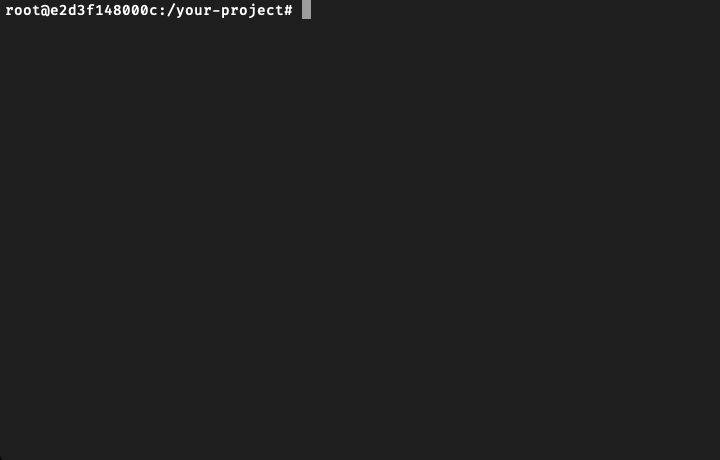
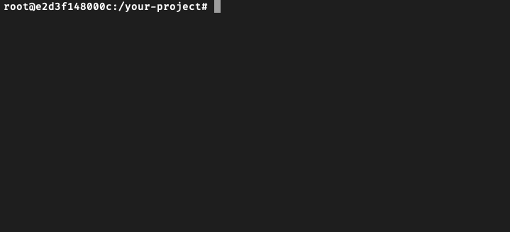
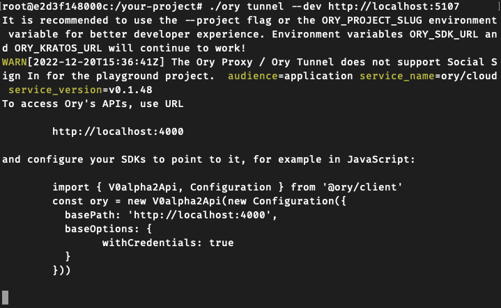

```mdx-code-block
import CodeBlock from '@theme/CodeBlock'
import Teaser from '../_common/teaser.mdx'
import mp4 from '../_static/go/screencast.mp4'
import webm from '../_static/go/screencast.webm'

<Teaser
  language={<a href="https://dotnet.microsoft.com/en-us/">.NET</a>}
  framework={<a href="https://dotnet.microsoft.com/en-us/apps/aspnet">ASP.NET Core</a>}
  mp4={mp4}
  webm={webm}
  url="https://github.com/ory/docs/tree/master/code-examples/protect-page-login/dotnet/01-basic"
/>
```

## Install Ory CLI

Follow [this guide](../../guides/cli/01_installation.mdx) to install the Ory CLI on your machine.

### Why do I Need the Ory CLI?

```mdx-code-block
import OryCLI from '../_common/ory-cli.mdx'

<OryCLI />
```

### Usage of Ory Tunnel

For this example we will be using the [Ory Tunnel](../../guides/cli/proxy-and-tunnel#ory-tunnel). The interactions beeing
performed in his example are shown here:
[](https://mermaid-js.github.io/mermaid-live-editor/edit#pako:eNq9U01LxDAQ_StDLh60dAVFyEFoUcSDH2AvQi8xnW6DbVInE0XE_27Srq7rLujJHkJn5s3LzJvMm9CuQSGFx6eAVuOZUUtSQ20hfiqws2F4QJrtUREbbUZlGUpQHkpyL35XtEjRexcIinEExduIKiFu6BWqYC32OyhuL1eQPZ8MX9sZVGanp_uFhIvzCjrmUeZ577TqO-dZHh8uTmZYkWCVBN2hfgSP3hu3YqgmhtvLncHoj-EsZrbK9NisU7Ji05duyEoJhI0h1Azstgs6WiwWuce-zaJQz0ZjjC2NzR--S1euat3Z0p8Y1i0ljl_h144RyCw7BtfClDcitY6G2M3SeCbFURFQtskdwcQwnfqnSD5oHeVrQz-jvsn1mzTrWf3bSFfVbs50w_k51CQegnaW0cbnKw7EgDQo08RleUvQWnCHA9ZCxt9G0WMtavsecWlr7l6tFpIp4IEIY6P4c7GEbFXvv7znjWFHX06czKt5JafNfP8AW_kqnQ)

## Setup

### Create an ASP.NET Core app

We will base this on the empty web template. Run these commands:

```shell-session
mkdir your-project
cd your-project

dotnet new web
```


### Install Ory SDK

Run this command to install the Ory SDK which allows you to interact with Ory APIs:

```shell-session
dotnet add package Ory.Client
```



### Configure the SDK

We will need to add the Ory Client to this app. Make the following changes to the `Program.cs` file that was generated:

```csharp title="Program.cs" showLineNumbers {1-2,7-12}
using Ory.Client.Api;
using Ory.Client.Client;

var builder = WebApplication.CreateBuilder(args);
var app = builder.Build();

// create a new Ory Client with the BasePath set to the Ory Tunnel enpoint
var oryBasePath = builder.Configuration.GetValue<string>("ORY_BASEPATH") ?? "http://localhost:4000";
var ory = new FrontendApi(new Configuration
{
	BasePath = oryBasePath
});

app.MapGet("/", () => "Hello World!");

app.Run();
```

## Validate and login

Next, create middleware that checks if the user has a valid session. The session is considered valid when the user is
authenticated.

The middleware passes the current `HttpContext` cookies to the Ory client to check if the session is valid.

If the session is valid, the user is presented with the protected page. When the session is not valid, which means that the user
is not authenticated or the session expired, the request is redirected for login using the Ory Account Experience.

```csharp title="Program.cs" showLineNumbers {14-44}
using Ory.Client.Api;
using Ory.Client.Client;

var builder = WebApplication.CreateBuilder(args);
var app = builder.Build();

// create a new Ory Client with the BasePath set to the Ory Tunnel enpoint
var oryBasePath = builder.Configuration.GetValue<string>("ORY_BASEPATH") ?? "http://localhost:4000";
var ory = new FrontendApi(new Configuration
{
	BasePath = oryBasePath
});

// add session middleware
app.Use(async (ctx, next) =>
{
	async Task Login()
	{
		// this will redirect the user to the managed Ory Login UI
		var flow = await ory.CreateBrowserLoginFlowAsync() ?? throw new InvalidOperationException("Could not create browser login flow");
		ctx.Response.Redirect(flow.RequestUrl);
	}

	try
	{
		// check if we have a session
		var session = await ory.ToSessionAsync(cookie: ctx.Request.Headers.Cookie, cancellationToken: ctx.RequestAborted);
		if (session?.Active is not true)
		{
			await Login();
			return;
		}

		// add session to HttpContext
		ctx.Items["req.session"] = session;
	}
	catch (ApiException)
	{
		await Login();
		return;
	}

	await next(ctx);
});

app.MapGet("/", () => "Hello World!");

app.Run();
```

## The protected page

As the final step, create an `Index` page that's presented to signed-in users. This page diplays the user's session data.

### Create the page

Create the `Index` RazorPage that renders the page with the session data:

```shell-session
dotnet new page --name Index --no-pagemodel --output Pages
```

Add this code to the `Pages/Index.cshtml` file to present the data to the user:

```cshtml title="Pages/Index.cshtml" {3-4,7-17}
@page
@{
  // try to retrieve session from HttpContext
  var session = HttpContext.Items.TryGetValue("req.session", out var item) && item is Ory.Client.Model.ClientSession s ? s.ToJson() : "<NO SESSION>";
}

<html lang="en">
  <head>
    <title>Ory Network secured ASP.NET Core web app</title>
  </head>
  <body>
    <h1>Dashboard</h1>
    <hr />
    <h2>Your Session Data:</h2>
    <pre><code>@session</code></pre>
  </body>
</html>
```

### App configuration

To configure the app to serve RazorPages, make the following changes in `Program.cs`:

```csharp title="Program.cs" showLineNumbers {6-7,24-25}
using Ory.Client.Api;
using Ory.Client.Client;

var builder = WebApplication.CreateBuilder(args);

// add support for RazorPages
builder.Services.AddRazorPages();

var app = builder.Build();

// create a new Ory Client with the BasePath set to the Ory Tunnel enpoint
var oryBasePath = builder.Configuration.GetValue<string>("ORY_BASEPATH") ?? "http://localhost:4000";
var ory = new FrontendApi(new Configuration
{
	BasePath = oryBasePath
});

// add session middleware
app.Use(async (ctx, next) =>
{
	// ... session middleware logic ...
});

// configure pipeline to use RazorPages
app.MapRazorPages();

app.Run();
```

## Test your application

With all of the pieces in place, it's time to test your application. Follow these steps:

1. Start your ASP.NET app:

```shell-session
dotnet run
```



2. Export the SDK configuration URL for the desired Ory project. You can use the provided playground project for testing, or
   export the SDK URL of your own project.

:::info

To get your project's SDK URL, sign in at [console.ory.sh](https://console.ory.sh/), select **Access & APIs** from the left
navigation panel, and copy the URL from the **SDK Configuration** section.

:::

```mdx-code-block
import SdkEnvVar from '@site/src/components/SdkEnvVar'

<SdkEnvVar />
```

3. Run the Ory Tunnel to mirror the Ory API endpoints on your application's domain (`localhost`):

```shell-session
ory tunnel --dev http://localhost:5107
```



:::caution

When running `dotnet new web` the default http port for the app is chosen at random. You can find the relevant configuration in
`/Properties/launchSettings.json`.<br/> Alternatively you can override the port as specified in the
[documentation](https://learn.microsoft.com/en-us/aspnet/core/fundamentals/servers/kestrel/endpoints).<br/><br/> The http port
used in this example is **5107**, which may be different from yours.

:::

4. Open [http://localhost:5107](http://localhost:5107) to access the application. As the initial call is made by an
   unauthenticated user, the middleware doesn't detect a valid session and redirects to the login page of the defined Ory project.
   <br /> <br /> From there, you can create a new account or sign in using an existing identity. When you sign in, the session
   becomes valid and the application shows the `Index` page with the session data.

## More advanced scenarios

For a more advanced example of integrating Ory with ASP.NET Core please have a look at the
[examples repository](https://github.com/ory/examples/tree/master/dotnet-ory-network).

## Go to production

```mdx-code-block
import ToProd from '../_common/going-to-prod.mdx'

<ToProd />
```

```csharp
// register a new Ory client with the URL set to the custom domain
var ory = new FrontendApi(new Configuration
{
	BasePath = "https://ory.example.org"
});
```
