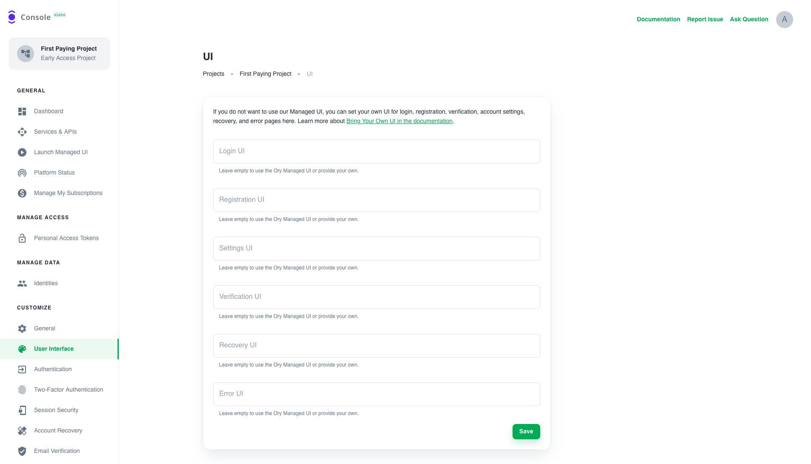
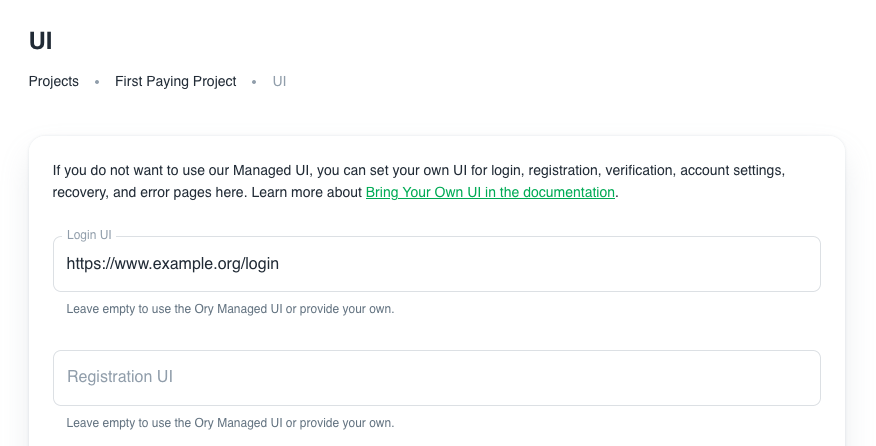

Ory provides a "managed UI" for essential pages such as User Login, User Registration, Account Recovery / Password Reset, Account
Verification / Email Verification, User Settings, and more. The Managed UI will be customizable in the future.

Further, Ory is an API-first service. Implementing these pages in your language and framework of choice is straightforward using
our SDKs.

Unless you are building a [Native App](#native-apps), you will need to configure the endpoints where your UI pages for the
individual flows (login, registration, ...) are located.

If you leave fields empty, the Ory cloud Managed UI will be used for that flow.

Let's say you have an app hosted at `https://www.example.org` with a login screen at `https://www.example.org/login` but have no
other screens implemented yet? Your configuration would look as follows:

All other flows (registration, settings, verification, recovery, error) would still use Ory Cloud's managed UI!

## Reference Implementations and Guided Examples

There are several reference implementations and guides available for building your own login, registration, ... user interface and
forms on top of Ory's APIs:

- [Add Custom Login, Registration, User Settings to Your Next.js & React Single Page Application (SPA)](https://www.ory.sh/nextjs-authentication-spa-custom-flows-open-source/)
- [NodeJS / ExpressJS UI Reference Implementation](https://github.com/ory/kratos-selfservice-ui-node)
- [React Native UI Reference Implementation](https://github.com/ory/kratos-selfservice-ui-react-native)

## Development

If you are developing locally, you can set the configuration to, for example, `http://localhost:1234/login`. To make this work,
you will need to use the [Ory Proxy](./cli/proxy-and-tunnel) locally!

## Native Apps

Native Apps refer to applications that don't have a browser, such as React Native, Swift, Android SDK, and others.

You can interface with Ory's Cloud APIs to build your own UI for native apps today. Behind the scenes, we're using Ory Kratos to
provide the features around login, registration, recovery, verification, and account settings.

To learn more, head over to [this](../getting-started/integrate-auth/react-native) guide!

## Technical Concepts and APIs

Behind the scenes, Ory Cloud is powered by Open Source Ory Kratos. To learn more about the technical details of how the (login,
registration, ...) flows work and what the API interactions look like, head over to:

- [Ory Kratos User Interface](https://www.ory.sh/kratos/docs/concepts/ui-user-interface)
- [Ory Kratos Self-Service Flows](https://www.ory.sh/kratos/docs/self-service)
