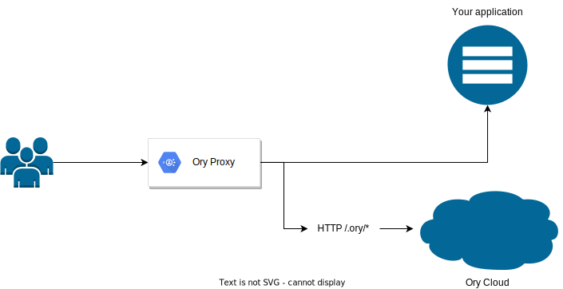

The CLI contains two important tools for local development or production environment when you don't have a custom domain:

- Ory Proxy
- Ory Tunnel

Before you start using these tools, export the SDK of your project. Run this command:

```shell
export ORY_SDK_URL=https://{your-project-slug-here}.projects.oryapis.com

# For a quick way to test, use the playground project:
export ORY_SDK_URL=https://playground.projects.oryapis.com
```

:::tip

To get your project's SDK URL, sign in at [console.ory.sh](https://console.ory.sh/), select **Connect** from the left navigation
panel, and copy the URL from the **SDK Configuration** section.

:::

## Ory Proxy

Ory Proxy is a reverse proxy deployed in front of your application. This allows the Ory endpoints to be mirrored on the same
domain as the app you're running.

The Proxy rewrites cookies to match the domain your application is currently on. As a result, the origin of the cookies is set
correctly to the domain you run the app on instead of `<your-project-slug>.projects.oryapis.com`.

This behavior is necessary to avoid issues with the browser
[CORS policy](https://developer.mozilla.org/en-US/docs/Web/Security/Same-origin_policy).

Additionally, the Proxy converts sessions into JSON Web Tokens (JWTs) and ensures that cookies and URLs are properly configured.

:::info

Using the Proxy is an alternative to [custom domains (CNAME)](../custom-domains), and a useful tool when developing locally. Even
though you can use the Proxy in production, we recommend using a CNAME where possible.

Using a custom domain is a more seamless solution for deploying on production - using Ory Proxy requires additional setup and
configuration.

:::

When an application runs on `http://localhost:3000`, Ory must be available on the same domain, for example at
`http://localhost:4000`. Thanks to such setup, the system can manage Anti-CSRF Cookies and Ory Session Cookies.



### URL structure

:::tip

Ory Proxy adds `/.ory` prefix when mirroring APIs and UIs of The Ory Network.

:::

For example, when using the Ory Proxy, calling `https://<proxy-host>/.ory/ui/login` is the same as calling
`https://<your-project-slug>.projects.oryapis.com/ui/login` directly.

#### Self-service flows

Ory Proxy provides URLs which you can use to initiate self-service flows:

| URL                                       | Self-service Flow                                                          |
| :---------------------------------------- | :------------------------------------------------------------------------- |
| `/.ory/self-service/login/browser`        | [Login](/kratos/self-service/flows/user-login)                             |
| `/.ory/self-service/registration/browser` | [Registration](/kratos/self-service/flows/user-registration)               |
| `/.ory/self-service/recovery/browser`     | [Recovery](/kratos/self-service/flows/account-recovery-password-reset)     |
| `/.ory/self-service/verification/browser` | [Verification](/kratos/self-service/flows/verify-email-account-activation) |
| `/.ory/self-service/settings/browser`     | [Settings](/kratos/self-service/flows/user-settings)                       |

If you redirect or link the user to one of those paths, the corresponding self-service flow is initiated, for example:

```html
<a href="/.ory/self-service/login/browser">Log in</a>
```

You can also append a `return_to=<your-url>` query parameter to the URL. This redirects the user to the set URL when they complete
the self-service flow.

:::info

The domain used in `return_to` must be an allow-listed URL set in the project configuration.

The URL must include the protocol and domain. Relative URLs aren't supported.

:::

```html
<a href="/.ory/self-service/login/browser?return_to=https://localhost:4000/my-url">Log in</a>
```

### Zero trust

Ory Proxy translates known Ory credentials, such as Ory Session Tokens or Ory Session Cookies, to JSON Web Tokens.

When the user calls Ory Proxy with a valid Ory Session Cookie:

```shell
GET /some-path
Host: localhost:4000
Cookie: ory_session_jollyproskuriakovaxe98qw5t8g=MTYyNzU1OTgyNHxEdi1CQkFFQ180SUFBUkFCRUFBQVJfLUNBQUVHYzNSeWFXNW5EQThBRFhObGMzTnBiMjVmZEc5clpXNEdjM1J5YVc1bkRDSUFJR3RGU1d4dlUwOXVSR2w1UjJONmFVRlhaWEIxWVhCVlNHWlZOVTQxWWtGMnwhbFZh8BCCQ3tMemDczrB9-epefXl1E7whiChUt62LuA==
User-Agent: Mozilla/5.0 (Macintosh; Intel Mac OS X 10_15_7) AppleWebKit/537.36 (KHTML, like Gecko) Chrome/91.0.4472.164 Safari/537.36
...
```

Ory Proxy resolves the session and converts it to a JSON Web Token. The token is included in the `Authorization` HTTP header of
the request made to the your application (the URL protected by the Ory Proxy).

The session is also included in the request so that you can use it to, for example, generate a logout URL.

```shell
GET /some-path
Host: <your-application>:3000
Authorization: eyJhbGciOiJFUzI1NiIsInR5cCI6IkpXVCJ9.eyJleHAiOjE2Mjc1NjAxMjQsImlhdCI6MTYyNzU2MDA2NCwiaXNzIjoiaHR0cHM6Ly9qb2xseS1wcm9za3VyaWFrb3ZhLXhlOThxdzV0OGcucHJvamVjdHMub3J5YXBpcy5jb20iLCJqdGkiOiJlYWFlYzI0My0yY2IwLTQ2OGEtYmViZS0xYTAzNDkyNDJjZjAiLCJuYmYiOjE2Mjc1NjAwNjQsInNlc3Npb24iOnsiaWQiOiJiNzNkN2RjNC1mNTY1LTRmZWEtOTUxZS04YzIzZWUwNTc4M2YiLCJhY3RpdmUiOnRydWUsImV4cGlyZXNfYXQiOiIyMDIxLTA3LTMwVDEyOjAxOjAyLjk2NjYzWiIsImF1dGhlbnRpY2F0ZWRfYXQiOiIyMDIxLTA3LTI5VDEyOjAxOjAzLjAyNDM2NVoiLCJpc3N1ZWRfYXQiOiIyMDIxLTA3LTI5VDEyOjAxOjAyLjk2NjY1MloiLCJpZGVudGl0eSI6eyJpZCI6IjBmMGM5YmVjLTZiNjgtNDdmMy1iNjJiLTc3NTBmMDY1MzU5YyIsInNjaGVtYV9pZCI6ImRlZmF1bHQiLCJzY2hlbWFfdXJsIjoiaHR0cHM6Ly9qb2xseS1wcm9za3VyaWFrb3ZhLXhlOThxdzV0OGcucHJvamVjdHMub3J5YXBpcy5jb20vYXBpL2tyYXRvcy9wdWJsaWMvc2NoZW1hcy9kZWZhdWx0Iiwic3RhdGUiOiJhY3RpdmUiLCJzdGF0ZV9jaGFuZ2VkX2F0IjoiMjAyMS0wNy0yOVQxMjowMTowMi44NDQ0NzJaIiwidHJhaXRzIjp7ImVtYWlsIjoiZGV2K2RvY3NAb3J5LnNoIiwiZmlyc3RuYW1lIjoiT3J5IERvY3MiLCJ2ZWdldGVyaWFuIjp0cnVlfSwidmVyaWZpYWJsZV9hZGRyZXNzZXMiOlt7ImlkIjoiNjRiM2YyNzAtNzBmYy00OGI4LTg3MDQtODA4NWM3ODMzNjJiIiwidmFsdWUiOiJkZXYrZG9jc0Bvcnkuc2giLCJ2ZXJpZmllZCI6ZmFsc2UsInZpYSI6ImVtYWlsIiwic3RhdHVzIjoic2VudCIsInZlcmlmaWVkX2F0IjpudWxsLCJjcmVhdGVkX2F0IjoiMjAyMS0wNy0yOVQxMjowMTowMi44ODg1NjJaIiwidXBkYXRlZF9hdCI6IjIwMjEtMDctMjlUMTI6MDE6MDIuODg4NTYyWiJ9XSwicmVjb3ZlcnlfYWRkcmVzc2VzIjpbeyJpZCI6IjUyNmEyYjI1LTJiOWEtNDQ1Yi05ODJkLTk3ODYyZDliYmM5YiIsInZhbHVlIjoiZGV2K2RvY3NAb3J5LnNoIiwidmlhIjoiZW1haWwiLCJjcmVhdGVkX2F0IjoiMjAyMS0wNy0yOVQxMjowMTowMi44OTc0MDdaIiwidXBkYXRlZF9hdCI6IjIwMjEtMDctMjlUMTI6MDE6MDIuODk3NDA3WiJ9XSwiY3JlYXRlZF9hdCI6IjIwMjEtMDctMjlUMTI6MDE6MDIuODc3NDE3WiIsInVwZGF0ZWRfYXQiOiIyMDIxLTA3LTI5VDEyOjAxOjAyLjg3NzQxN1oifX0sInN1YiI6IjBmMGM5YmVjLTZiNjgtNDdmMy1iNjJiLTc3NTBmMDY1MzU5YyJ9.6vvdyNkNce39W8WPKwF5QUTOlBjF5VW6Xl3QzYHU9M1riiDVgQ4rK8XHEqcjhAQcis8EIbRm7K0UuLNGwKsKzQ",
Cookie: ory_session_jollyproskuriakovaxe98qw5t8g=MTYyNzU1OTgyNHxEdi1CQkFFQ180SUFBUkFCRUFBQVJfLUNBQUVHYzNSeWFXNW5EQThBRFhObGMzTnBiMjVmZEc5clpXNEdjM1J5YVc1bkRDSUFJR3RGU1d4dlUwOXVSR2w1UjJONmFVRlhaWEIxWVhCVlNHWlZOVTQxWWtGMnwhbFZh8BCCQ3tMemDczrB9-epefXl1E7whiChUt62LuA==
User-Agent: Mozilla/5.0 (Macintosh; Intel Mac OS X 10_15_7) AppleWebKit/537.36 (KHTML, like Gecko) Chrome/91.0.4472.164 Safari/537.36
...
```

We strongly encourage you to validate the JWT using Ory Proxy's public key. The public key is available at
`/.ory/proxy/jwks.json`:

```shell
curl -sk https://<proxy-host>/.ory/proxy/jwks.json | jq
{
  "keys": [
    {
      "use": "sig",
      "kty": "EC",
      "kid": "f8f2e6ff-0480-4343-9dee-0d2a463146dc",
      "crv": "P-256",
      "alg": "ES256",
      "x": "Say2LSWvHxUnyxuW5lxsTFkKopZq402eH4YqcRiBgvA",
      "y": "7XaYgYsW-Mjb5qIq47LxyaPHjPZfRHRnnfir8aqd9BU"
    }
  ]
}
```

The token contains all session and identity information linked to the Ory Session Cookie.

This is an example of a JWT with session and identity data:

```json
{
  "exp": 1627560124,
  "iat": 1627560064,
  "iss": "https://<project-slug>.projects.oryapis.com",
  "jti": "eaaec243-2cb0-468a-bebe-1a0349242cf0",
  "nbf": 1627560064,
  "session": {
    "id": "b73d7dc4-f565-4fea-951e-8c23ee05783f",
    "active": true,
    "expires_at": "2021-07-30T12:01:02.96663Z",
    "authenticated_at": "2021-07-29T12:01:03.024365Z",
    "issued_at": "2021-07-29T12:01:02.966652Z",
    "identity": {
      "id": "0f0c9bec-6b68-47f3-b62b-7750f065359c",
      "schema_id": "default",
      "schema_url": "https://<project-slug>.projects.oryapis.com/schemas/default",
      "state": "active",
      "state_changed_at": "2021-07-29T12:01:02.844472Z",
      "traits": {
        "email": "dev+docs@ory.sh",
        "firstname": "Ory Docs",
        "vegetarian": true
      },
      "verifiable_addresses": [
        {
          "id": "64b3f270-70fc-48b8-8704-8085c783362b",
          "value": "dev+docs@ory.sh",
          "verified": false,
          "via": "email",
          "status": "sent",
          "verified_at": null,
          "created_at": "2021-07-29T12:01:02.888562Z",
          "updated_at": "2021-07-29T12:01:02.888562Z"
        }
      ],
      "recovery_addresses": [
        {
          "id": "526a2b25-2b9a-445b-982d-97862d9bbc9b",
          "value": "dev+docs@ory.sh",
          "via": "email",
          "created_at": "2021-07-29T12:01:02.897407Z",
          "updated_at": "2021-07-29T12:01:02.897407Z"
        }
      ],
      "created_at": "2021-07-29T12:01:02.877417Z",
      "updated_at": "2021-07-29T12:01:02.877417Z"
    }
  },
  "sub": "0f0c9bec-6b68-47f3-b62b-7750f065359c"
}
```

### Usage in local development

When using the Proxy for local development, point to the URL where your application runs.

For example, if your application is available at `http://localhost:3000`, run this command:

```shell
ory proxy http://localhost:3000
```

By default, the Proxy creates an entry point at `http://localhost:4000`. To get access to Ory endpoints, you must access the app
through the proxy using This URL instead of the actual address on which your application is running.

If you want to adjust the entry point URL, pass the desired address along with the application URL, for example:

```shell
ory proxy http://localhost:3000 http://localhost:3001
```

### Usage in production

You can use Ory Proxy in a production setup when you are self-hosting Ory components. To do that, set the entry point URL to the
domain where you want to expose the app through the Ory Proxy:

```shell
ory proxy http://localhost:3000 https://my-domain.com
```

### Run on virtual and dedicated servers

To use the Proxy with an application deployed on a VM or a Dedicated Server, run the application server and the Proxy in parallel.

For example, if you are running a Node.js server on port `3000` and you expose web traffic on port `8080`:

```shell
ory proxy --port 8080 http://127.0.0.1:3000 https://your-domain.com &

# This should be your server command
node your-entrypoint.js
```

:::tip

The Ory Proxy shouldn't be the main entry point to your application. Always run an ingress proxy such as Nginx or Traefik in
front.

:::

### Run in Docker

To use the Proxy in Docker, add your application and the Proxy to a single Docker container.

:::warning

This is not a perfect solution as Docker watches only the processes running in the foreground. With the application and the Proxy
in one container, you must decide which becomes the foreground process.

When the processes crash, Docker notifies only of the failures of the foreground process and gives no information about the
background process.

In this example, Ory Proxy is the background process.

Read the [Docker documentation](https://docs.docker.com/config/containers/multi-service_container/) to learn more about running
multiple processes in a single container.

:::

To run Ory Proxy in one container with your application, create an `entrypoint.sh` file similar to this:

```shell
#!/bin/bash
set -e

# This assumes that your server is running on port 3000. If it's running on a different port,
# remember to adjust the command to point to the port where your server is running at!
ory proxy --port 8080 http://127.0.0.1:3000 https://your-domain.com &

# This should be your server command
node your-entrypoint.js

# Or, depending on the tech you use:
#   go run main.go
#   php index.php
#   ...
```

Then, add the script to your Dockerfile and run it:

```Dockerfile
# ...

EXPOSE 8080

COPY ./docker-entrypoint.sh /
ENTRYPOINT ["/docker-entrypoint.sh"]
```

## Ory Tunnel

The main role of the Ory Tunnel is exposing the Ory APIs under the same top-level domain as your application to ensure that there
are no CORS issues.

The Tunnel shares most of its code with the Ory Proxy, and from the user's point of view, it works in a similar way. There are,
however, several important differences between these tools:

❌ Ory Tunnel doesn't handle your application's traffic routing and instead only routes traffic to Ory APIs <br /> ❌ Ory Tunnel
doesn't mirror Ory URLs and as such doesn't add the `.ory` prefix to any of the Ory URLs <br /> ❌ Ory Tunnel doesn't alter
incoming HTTP headers <br /> ❌ Ory Tunnel doesn't convert sessions into JSON Web Tokens, doesn't issue JTWs, and doesn't use JWTs
natively

To run the Tunnel, use the `ory tunnel` command and point to the URL with your application, for example:

```shell
ory tunnel http://localhost:3000
```

:::tip

To get a full list of arguments and options available for use with the Ory Tunnel, run:

```shell
ory tunnel --help
```

:::

### Usage

You can use Ory Tunnel the same way you can use Ory Proxy. The tool can be used for local development, in production, on different
server types, and in Docker.

For more details, refer to the [Ory Proxy documentation](#ory-proxy).
