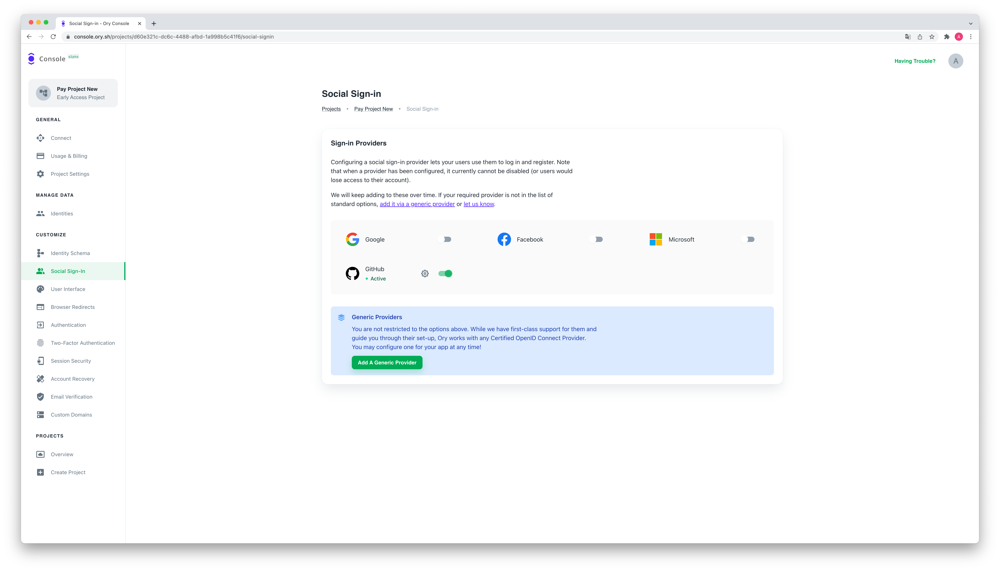

Ory's components use the same configuration format and APIs regardless of
whether you consume them via Ory Cloud or self-hosting. In this guide, you'll
learn how to use the Ory Configuration format to configure Ory Cloud and
self-hosted Ory components.

## Ory Cloud

The easiest way to configure Ory Cloud is through the User Interface of Ory
Console:



However, not all configuration options are available in the User Interface. Or
you want to use automation (for example GitOps) to configure Ory Cloud. In those
cases you can use the Ory CLI to configure the desired settings.

### Ory CLI

To get started, install the CLI and sign in to Ory Cloud:

```shell
ory auth
```

Next you have two options to manage Ory Cloud projects. You can either overwrite
the complete config, or you can patch only parts of it.

#### Overwrite / Import Configuration

To overwrite the complete configuration, create a file with the configuration
you want to use. The configuration format follows the
[updateProject API request payload](../reference/api.mdx#operation/updateProject).
The key `/services/identity/config`

```json
{
  "services": {
    "identity": {
      "config": ...
    }
  }
}
```

is fully compatible with the
[Ory Kratos configuration format](../docs/kratos/reference/configuration.md)
except for some keys (for example `serve`, `dsn`) which will be ignored.

Let's make an example. We want to modify the `from` name when sending out
recovery / verification emails.

First, we create a configuration file:

```json title="config.json"
{
  "name": "My Project Name"
  "services": {
    "identity": {
      "config": {
        "courier": {
          "smtp": {
            "from_name": "My Custom E-Mail Name"
          }
        }
      }
    }
  }
}
```

and use it in the Ory CLI:

```shell
ory update project <your-project-id> --file config.json
```

#### Patch Configuration

Most of the times you only want to modify a few parts of the configuration. In
that case, you can use the `patch` command in combination with
[JSON Patch](http://jsonpatch.com/) to target individual keys. If we look at the
example from import, the same could be achieved with:

```
ory patch project <your-project-id> \
  --replace '/services/identity/config/courier/smtp/from_name="My Custom E-Mail Name"'
```

:::note

Please notice that the part after `=` is interpreted as raw JSON:

- String: `/path/to/key="my string"`
- Bool: `/path/to/key=true`
- Number: `/path/to/key=123`
- Complex: `/path/to/key={"my": ["vaules", {"foo":"bar"}]}`

:::

## Self-Hosted

Ory's core components can be self-hosted. When self-hosting, all settings such
as disabling registration, to enabling advanced Multi-Factor Authentication
protocols, is configured using files.

## Identity Services

When self-hosting Ory's Identity Service, you will be running the
[Ory Kratos project](https://www.ory.sh/docs/kratos/). To configure Ory Kratos,
you need to create a configuration file on your file system

```yaml title="my-config.yaml"
# An Ory Kratos configuration file with an example configuration:
selfservice:
  flows:
    registration:
      enabled: false
```

and pass it to the CLI flags of Ory Kratos when starting the server:

```shell
kratos serve --config my-config.yaml
```

For a list of all possible configuration items, see the
[Ory Kratos documentation](../kratos/reference/configuration.md).
