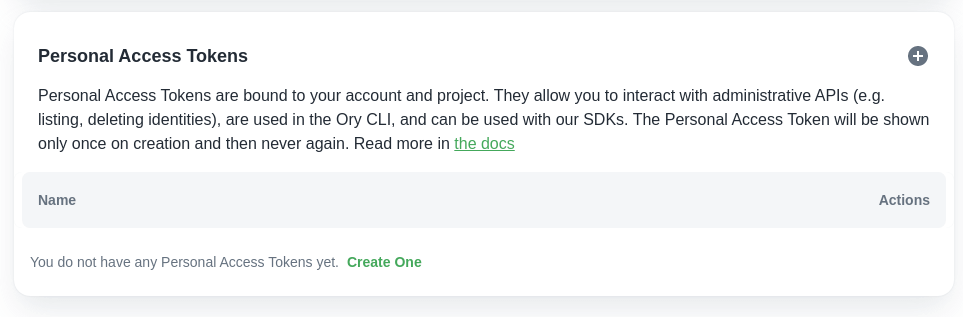
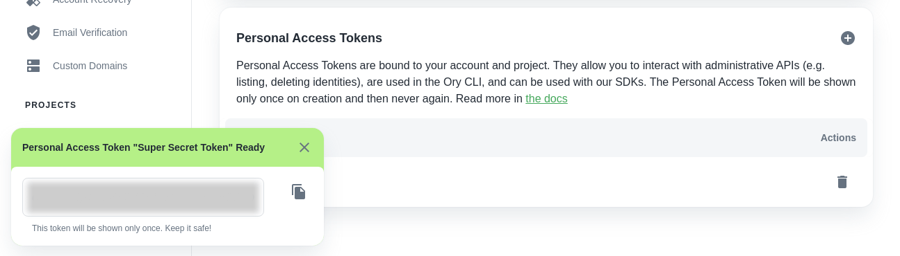

Head over to the "Connect" page and click on the plus symbol in the Personal
Access Tokens section to create a new token.



Choose a name that helps to remember what the token is used for or who is using
it.

Once created, a dialog will appear on the bottom left containing your personal
access token.

Copy this into a password manager or another safe place. Keep it secret - anyone
with the token will have full access to the administrative functions of your Ory
Cloud project.

:::info

The token will only be displayed once! If you lose it, you will need to create a
new token.

:::



Now you can use the token, for example by exporting it into your local
environment.

Open a terminal and copy set the `ORY_ACCESS_TOKEN` env var to your Personal
Access Token:

```shell
export ORY_ACCESS_TOKEN=yOuRpErsOnAlaCceSsToKeNgOeShErE
```
