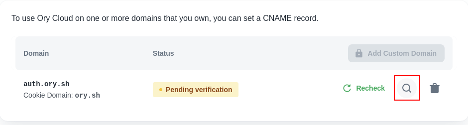

To use Ory Cloud on one or more domains that you own, you can set a CNAME
record.

:::note

This feature is only available on paid plans. If you're using the free plan, you
will have to upgrade before being able to add a custom domain.

:::

## Adding a Custom Domain to your Cloud project

Locate "Custom Domains" in Cloud Console's navigation menu.

When you click it and navigate to the "Custom Domains" page, your list of custom
domains will likely be empty at this point. If you're not on a paid plan, you
won't be able to add one.

Click "Add one now" to add your first domain. You will be greeted by a creation
screen:

The domain you enter in the first step will be the domain that you'll use for
requests to Ory Cloud. You will have to create a CNAME record with the DNS
provider with which the domain is registered, with the value that's provided in
this form (you will be able to see this value later as well).

Note that the value in the above screenshot **is an example**. You will have
your own value that you will need to copy.

The Cookie Domain is the domain cookies will be scoped to. This is an important
security setting. In all likelihood, you'll want this to be the root domain of
whatever you supplied in the first step. See the
[Cookie configuration section in the Kratos docs](https://www.ory.sh/kratos/docs/guides/configuring-cookies/)
and [this Stackoverflow answer](https://stackoverflow.com/a/23086139).

## Waiting for propagation

When you've added the domain in Cloud Console, we will continuously recheck its
status to see if it was configured with your registrar. Note that it can take up
to 24 hours for your changes to propagate.

You may also manually recheck on the custom domains page, or check the value to
set with your DNS provider by clicking the magnifying icon in the custom domains
section:

When the domain is reachable, it will have the "Active status".

Once active the Ory Managed UI is reachable at
`https://<your-custom-domain>/ui/welcome`.  
Learn how to configure a custom UI:
[Bring Your Own UI](bring-your-user-interface.mdx).

You may also remove your custom domain from the Console, but please note that
**any requests to it will no longer resolve** once you do.

## Setting up a CNAME record

If you're with any of these registrars, you can use their respective guide on
how to add a CNAME record:

- [GoDaddy](https://www.godaddy.com/help/add-a-cname-record-19236)
- [Namecheap](https://www.namecheap.com/support/knowledgebase/article.aspx/9646/2237/how-to-create-a-cname-record-for-your-domain/)
- [Domain.com](https://www.domain.com/help/article/dns-management-how-to-update-cname-aliases)
- [Cloudflare](https://support.cloudflare.com/hc/en-us/articles/360019093151-Managing-DNS-records-in-Cloudflare)
- [Bluehost](https://my.bluehost.com/hosting/help/resource/714)

If not, don't worry - your registrar likely has a similar guide, or a similar
process. Setting up a CNAME record typically requires you to specify 3 values:

1. A record type, CNAME in this case
2. The Host, which is the subdomain that will be reachable. With most
   registrars, entering `@` as the value signifies that you want to use the root
   domain.
3. The value, which is provided by us. Check the value provided in the form
   (detailed in the first step of this article) to know what this should be for
   your Ory Cloud project.
