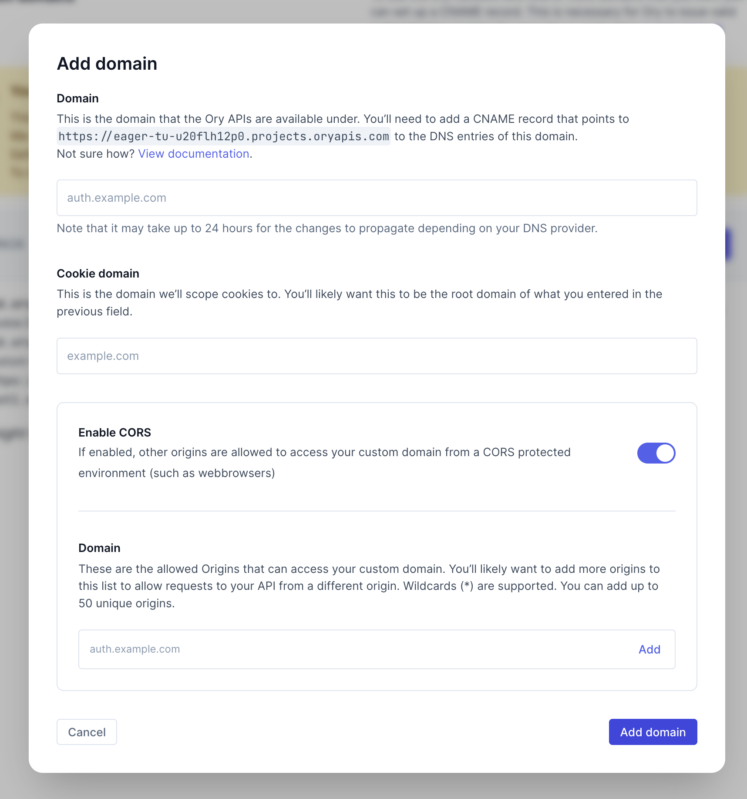
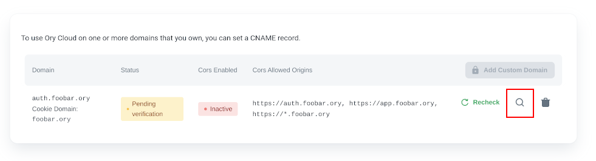
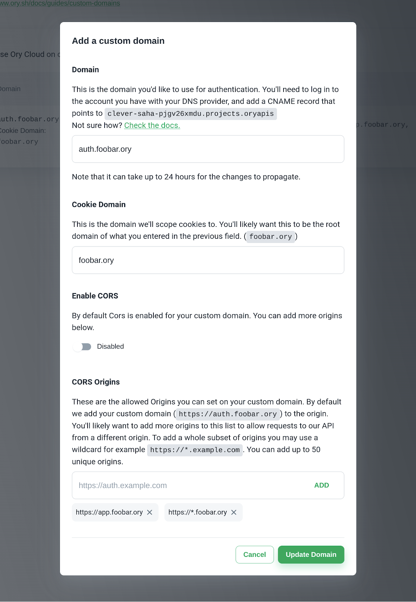

To use The Ory Network on one or more domains that you own, you can set a CNAME record.

:::note

This feature is only available on paid plans. If you're using the free plan, you will have to upgrade before being able to add a
custom domain.

:::

## Adding a custom domain to your project

Locate "Custom Domains" in the Ory Console navigation menu.

When you click it and navigate to the "Custom Domains" page, your list of custom domains will likely be empty at this point. If
you're not on a paid plan, you won't be able to add one.

Click "Add one now" to add your first domain. You will be greeted by a creation screen:

The domain you enter in the first step will be the domain that you'll use for requests to The Ory Network. You will have to create
a CNAME record with the DNS provider with which the domain is registered, with the value that's provided in this form (you will be
able to see this value later as well).

Note that the value in the above screenshot **is an example**. You will have your own value that you will need to copy.

The Cookie Domain is the domain cookies will be scoped to. This is an important security setting. In all likelihood, you'll want
this to be the root domain of whatever you supplied in the first step. See the
[Cookie configuration document](https://www.ory.sh/kratos/docs/guides/configuring-cookies/) and
[this Stackoverflow answer](https://stackoverflow.com/a/23086139).

## CORS

Cross-Origin Resource Sharing (CORS) is also enabled by default on the custom domain you add, in this example we have
`auth.foobar.ory` set as our custom domain which will point to your project. It is important that you add CORS origins to your
custom domain to **ensure Single Page Applications (SPAs) support**. We allow up to **50 origins**. If you plan on us ing
server-side rendering or native applications, you can safely disable CORS. You can read more about
[CORS at MDN](https://developer.mozilla.org/en-US/docs/Web/HTTP/CORS).

:::note

We do not allow setting the CORS origins to be `*`, `null` or `localhost/127.0.0.1`. You can, however, use a wildcard subdomain
such as `https://*.foobar.ory`. To be on the safe side, we recommend setting the CORS origins to be an exact match instead of a
wildcard subdomain. To use `localhost/127.0.0.1` for development we recommend using the
[Ory Cli Proxy](./cli/20_proxy-and-tunnel.mdx).

:::

## Waiting for propagation

When you've added the domain in Ory Console, we will continuously recheck its status to see if it was configured with your
registrar. Note that it can take up to 24 hours for your changes to propagate.

You may also manually recheck on the custom domains page, or check the value to set with your DNS provider by clicking the
magnifying icon in the custom domains section:

When the domain is reachable, it will have the "Active status".

The CORS status will show "Inactive" while the domain is pending verification. After the domain is verified, the CORS status will
show "Enabled/Disabled".

Once active, the Ory Account Experience is reachable at `https://<your-custom-domain>/ui/welcome`. Learn how to configure a custom
UI: [Bring Your Own UI](../kratos/bring-your-own-ui/configure-ory-to-use-your-ui).

You may also remove your custom domain from the Console, but please note that **any requests to it will no longer resolve** once
you do.

When editing your custom domain entry, you can update the CORS settings independent of the custom domain or cookie domain
settings.

## Setting up a CNAME record

If you're with any of these registrars, you can use their respective guide on how to add a CNAME record:

- [GoDaddy](https://www.godaddy.com/help/add-a-cname-record-19236)
- [Namecheap](https://www.namecheap.com/support/knowledgebase/article.aspx/9646/2237/how-to-create-a-cname-record-for-your-domain/)
- [Domain.com](https://www.domain.com/help/article/dns-management-how-to-update-cname-aliases)
- [Cloudflare](https://support.cloudflare.com/hc/en-us/articles/360019093151-Managing-DNS-records-in-Cloudflare)
- [Bluehost](https://my.bluehost.com/hosting/help/resource/714)

If not, don't worry - your registrar likely has a similar guide, or a similar process. Setting up a CNAME record typically
requires you to specify 3 values:

1. A record type, CNAME in this case
2. The Host, which is the subdomain that will be reachable. With most registrars, entering `@` as the value signifies that you
   want to use the root domain.
3. The value, which is provided by us. Check the value provided in the form (detailed in the first step of this article) to know
   what this should be for your project.
