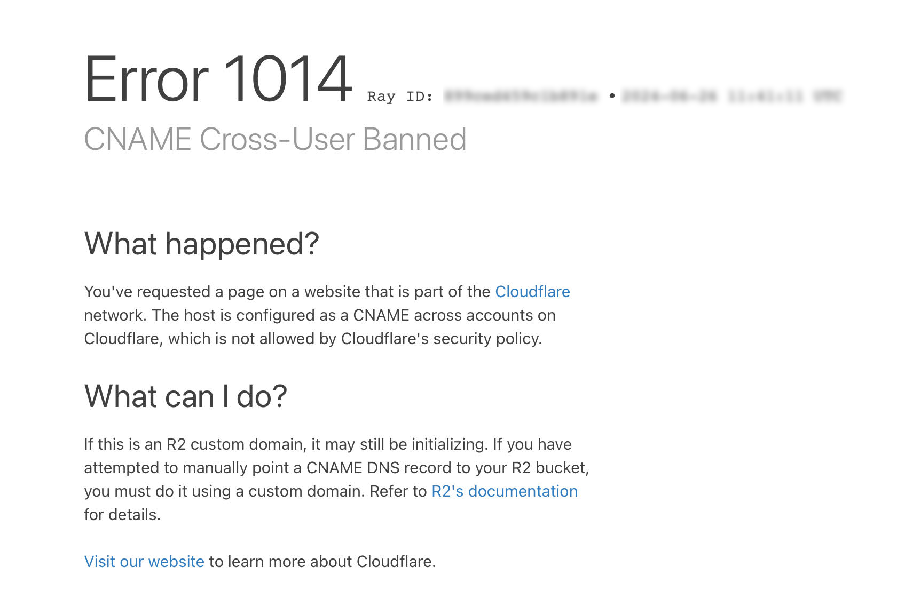

To use the Ory Network on one or more domains that you own, you can set a CNAME record.

:::note

This feature is only available on paid plans.

:::

## Adding a custom domain to your project

1. Go to <ConsoleLink route="project.cname" />.
2. Click **Add Custom Domain** and fill out the dialog.


:::info

<p>
  When you add a custom domain, it becomes your project's SDK Configuration URL. To check your SDK Configuration URL, go to
  <ConsoleLink route="project.settings" />
</p>
:::

The domain you enter in the first step will be the domain that you'll use for requests to Ory Network. You will have to create a
CNAME record with the DNS provider with which the domain is registered, for the project's slug. See
[Setting up a CNAME record](#setting-up-a-cname-record).

Note that the slug in the above screenshot **is an example**. You will have your own value that you will need to copy.

The Cookie Domain is the domain cookies will be scoped to. Ory Network will issue the session cookie to this domain. This means,
that the cookie is available on this domain and all subdomains. In most cases you want this to be root domain of the CNAME record
you set up. See the [Cookie configuration document](https://www.ory.com/kratos/docs/guides/configuring-cookies) and
[this Stack Overflow answer](https://stackoverflow.com/a/23086139).

:::warning

Browsers reject cookies that are set on domains that appear on the [public suffix list](https://publicsuffix.org/) (PSL). These
domains are therefore not allowed as cookie domains.

:::

## CORS

Cross-Origin Resource Sharing (CORS) is also enabled by default on the custom domain you add, in this example we have
`auth.foobar.ory` set as our custom domain which will point to your project. It's important that you add CORS origins to your
custom domain to **ensure Single Page Applications (SPAs) support**. Ory Network allows up to **50 origins**. If you plan on using
server-side rendering or native applications, you can disable CORS. You can read more about
[CORS at MDN](https://developer.mozilla.org/en-US/docs/Web/HTTP/CORS).

:::note

Ory Network doesn't allow setting the CORS origins to be `*`, `null` or `localhost/127.0.0.1`. You can, however, use a wildcard
subdomain such as `https://*.foobar.ory`. To be on the safe side, Ory recommends setting the CORS origins to be an exact match
instead of a wildcard subdomain. For local development with `localhost/127.0.0.1` use [Ory Tunnel](./cli/20_proxy-and-tunnel.mdx).

:::

## Setting up a CNAME record

:::note

If your DNS provider/registrar automatically activates a proxy on the CNAME record, it can keep the custom domain in a pending
state. Please make sure to deactivate proxying on the CNAME record. We use a tailored Cloudflare configuration on our side, to
ensure requests to the custom hostname are fully protected.

:::

:::note

In case you are using Cloudflare as your DNS provider, make sure
["Zone Hold" is released](https://developers.cloudflare.com/fundamentals/setup/account/account-security/zone-holds/#release-zone-holds).
It needs to be released temporarily so that we can preconfigure the subdomain in our account.

:::

:::note

Please check if you have configured CAA records for your domain. If you have, you may need to add `pki.goog` to the CAA record of
your (sub)domain. Read more about **CAA records** in this section: [CAA records](#caa-records).

:::

If you're with any of these registrars, you can use their respective guide on how to add a CNAME record:

- [GoDaddy](https://www.godaddy.com/help/add-a-cname-record-19236)
- [Namecheap](https://www.namecheap.com/support/knowledgebase/article.aspx/9646/2237/how-to-create-a-cname-record-for-your-domain/)
- [Domain.com](https://www.domain.com/help/article/dns-management-how-to-update-cname-aliases)
- [Cloudflare](https://support.cloudflare.com/hc/en-us/articles/360019093151-Managing-DNS-records-in-Cloudflare)
- [Bluehost](https://my.bluehost.com/hosting/help/resource/714)

If not, don't worry - your registrar likely has a similar guide, or a similar process. Setting up a CNAME record typically
requires you to specify 3 values:

1. A record type, CNAME in this case
2. The Host, which is the subdomain that will be reachable. With most registrars, entering `@` as the value signifies that you
   want to use the root domain.
3. The value, which is provided by us. Check the value provided in the form (detailed in the first step of this article) to know
   what this should be for your project.

If your Custom Hostname remains in `pending` or `error` state, you can check your configuration using a command line tool like
`dig`, which outputs how the DNS query is resolved:

```
❯ dig auth.foobar.com

; <<>> DiG 9.10.6 <<>> auth.foobar.com
;; global options: +cmd
;; Got answer:
;; ->>HEADER<<- opcode: QUERY, status: NOERROR, id: 7283
;; flags: qr rd ra; QUERY: 1, ANSWER: 3, AUTHORITY: 0, ADDITIONAL: 1

;; OPT PSEUDOSECTION:
; EDNS: version: 0, flags:; udp: 512
;; QUESTION SECTION:
;auth.foobar.com.             IN      A

;; ANSWER SECTION:
auth.foobar.com.      300     IN      CNAME   <your-project-slug>.projects.oryapis.com.
<your-project-slug>.projects.oryapis.com. 300 IN A 104.18.12.126
<your-project-slug>.projects.oryapis.com. 300 IN A 104.18.13.126

;; Query time: 28 msec
;; SERVER: 8.8.8.8#53(8.8.8.8)
;; WHEN: Tue Oct 31 11:47:22 CET 2023
;; MSG SIZE  rcvd: 135
```

If the ANSWER SECTION lists an IP address instead of the generic Ory network URL `<your-project-slug>.projects.oryapis.com`, it
indicates you did not deactivate proxying. Check the configuration of your CNAME record in your DNS Provider/registrar and disable
proxying.

### Troubleshooting

#### Cloudflare Error 1014



If you're using Cloudflare to manage your DNS and you get an `Error 1014 - CNAME Cross-User Banned` when adding a custom domain to
your Ory Network project, please check that:

- **Proxying** is disabled for your CNAME record in Cloudflare. See
  https://developers.cloudflare.com/dns/manage-dns-records/reference/proxied-dns-records/ for more information.
- **Zone Lock** is temporarily disabled in your Cloudflare account until the set up process completes. See
  https://developers.cloudflare.com/fundamentals/setup/account/account-security/zone-holds/#release-zone-holds for more
  information.

## CAA records

If your domain is protected by CAA record, issuing a certificate for a custom hostname will only work, if `pki.goog` is already
whitelisted to issue certificates for your domain. If not, you will need to add `pki.goog` to the CAA record of your domain.

### What is a CAA record?

A Certification Authority Authorization (CAA) record is used to specify which
[certificate authorities (CAs)](https://support.dnsimple.com/articles/what-is-certificate-authority/) are allowed to issue
certificates for a domain. CAA records allow domain owners to declare which certificate authorities are allowed to issue a
certificate for a domain. They also provide a means of indicating notification rules if someone requests a certificate from an
unauthorized certificate authority.

If no CAA record is present, any CA is allowed to issue a certificate for the domain. If a CAA record is present, only the CAs
listed in the record(s) are allowed to issue certificates for that hostname. CAA records can set policy for the entire domain, or
specific hostnames, and are inherited by subdomains. For example, a CAA record set on `example.com` also applies to
`subdomain.example.com`.

[https://support.dnsimple.com/articles/caa-record/](https://support.dnsimple.com/articles/caa-record/)

### How do I tell if my domain is configured to use a CAA record?

You can use any DNS lookup tool to search for the CAA record of your domain (if one exists). Below is an example using the Command
Line tool dig:

```
$ dig +noall +answer example.com caa
example.com.        1800    IN  CAA 0 issue "digicert.com"
```

If the response is empty, stop here! You're good to go.

If the domain lookup results include **issue** along with the name of a **certificate authority**, then your domain is configured
with CAA protection. If the issuer is a certificate authority other than `pki.goog`, you must take additional action to use a
custom hostname with Ory Network.

### What must I do if my domain is configured with a CAA record?

Certificate Authority Authorization (CAA) records can be defined at various levels of your domain hierarchy. It's important to
understand that the most specific (or "closest") CAA record to a given subdomain is the one that applies. This means:

1. A **CAA record on a subdomain** takes precedence over a CAA record on its parent domain.
2. If **no CAA record exists for a specific subdomain**, the system will look for a CAA record on its parent domain, and so on up
   to the root domain.

Given this behavior, you need to consider where your CAA record is defined when adding `pki.goog` as an authorized certificate
authority. Here are the two main scenarios:

1. **Root domain CAA records:** <br/>If you're configuring a custom hostname like auth.example.com and you have a CAA record
   defined on the root domain (example.com), you need to add `pki.goog` to this root domain CAA record. This is because the system
   will check auth.example.com for a CAA record, find none, and then check example.com.

2. **Subdomain CAA records:** <br/>If you're configuring a custom hostname like auth.brand1.example.com and you have a CAA record
   defined on the subdomain level (brand1.example.com), you need to add `pki.goog` to this subdomain CAA record. In this case, the
   CAA record on brand1.example.com will be used because it's the closest match to auth.brand1.example.com.

To add `pki.goog` to your CAA record, you'll typically need to add a new CAA record entry to the right level of your domain
hierarchy like this:

1. **For the root domain:** <br/>

```
example.com. IN CAA 0 issue "pki.goog"
```

2. **For a subdomain:** <br/>

```
brand1.example.com. IN CAA 0 issue "pki.goog"
```

(Replace example.com with the appropriate domain or subdomain where your CAA record should be defined.)

Here are some guides on how to add a CAA record with some popular DNS providers:

- **GoDaddy:** [Change a CAA record](https://www.godaddy.com/help/change-a-caa-record-27289)
- **Namecheap:**
  [CAA Record and why it is needed (SSL related)](https://www.namecheap.com/support/knowledgebase/article.aspx/9991/38/caa-record-and-why-it-is-needed-ssl-related/)
- **Cloudflare:** [Add CAA records](https://developers.cloudflare.com/ssl/edge-certificates/caa-records/)
- **Google Domains:**
  [Create or edit a resource record with Google Domains](https://support.google.com/domains/answer/3290350?hl=en)

### Additional reading

[https://letsencrypt.org/docs/caa/](https://letsencrypt.org/docs/caa/)

## Waiting for propagation

When you've added the domain in Ory Console, we will continuously recheck its status to see if it was configured with your
registrar. Note that it can take up to 24 hours for your changes to propagate.

You may also manually recheck on the custom domains page, or check the value to set with your DNS provider by clicking the
magnifying icon in the custom domains section:


When the domain is reachable, it will have the "Active status".

The CORS status will show "Inactive" while the domain is pending verification. After the domain is verified, the CORS status will
show "Enabled/Disabled".


Once active, the Ory Account Experience is reachable at `https://<your-custom-domain>/login`. Learn how to configure a custom UI:
[Bring Your Own UI](../kratos/bring-your-own-ui/configure-ory-to-use-your-ui).

You may also remove your custom domain from the Console, but please note that **any requests to it will no longer resolve** once
you do.

When editing your custom domain entry, you can update the CORS settings independent of the custom domain or cookie domain
settings.


## Automated emails

The Ory Network sends emails for certain actions a user can take, for example
[account recovery](./../kratos/self-service/flows/account-recovery-password-reset.mdx) or
[address verification](./../kratos/self-service/flows/verify-email-account-activation.mdx). Since most email providers take
measures against spam and phishing attacks, for example "fake" link campaigns, it's advised to only link to domains that match the
sender of the email.

However, when using a custom domain in the Ory Network without a custom SMTP server, links inside the automated Ory Identities
emails won't match the domain these emails were sent from. For example the address verification link will point to
`ory.your-custom-domain.com`, but the email was sent from the default Ory Network email sender domain (e.g.
`courier-eu.oryapis.com`). Some email providers, such as Gmail, might interpret this as a phishing attack and mark the email as
spam, or block it entirely.

To prevent this, configure a custom SMTP server, that matches at least the root domain of your custom domain. For example, if you
configured the custom domain `ory.your-custom-domain.com`, you should also configure an email server that lives under
`your-custom-domain.com`.

:::tip

To learn how to set up a custom SMTP server on the Ory Network, read
[Send emails using your SMTP server](https://www.ory.com/docs/kratos/emails-sms/sending-emails-smtp#your-own-server).

:::
