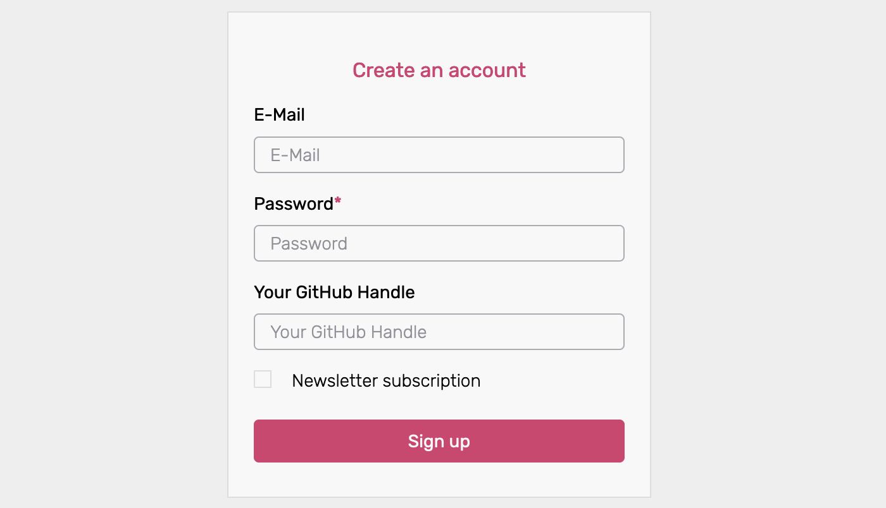
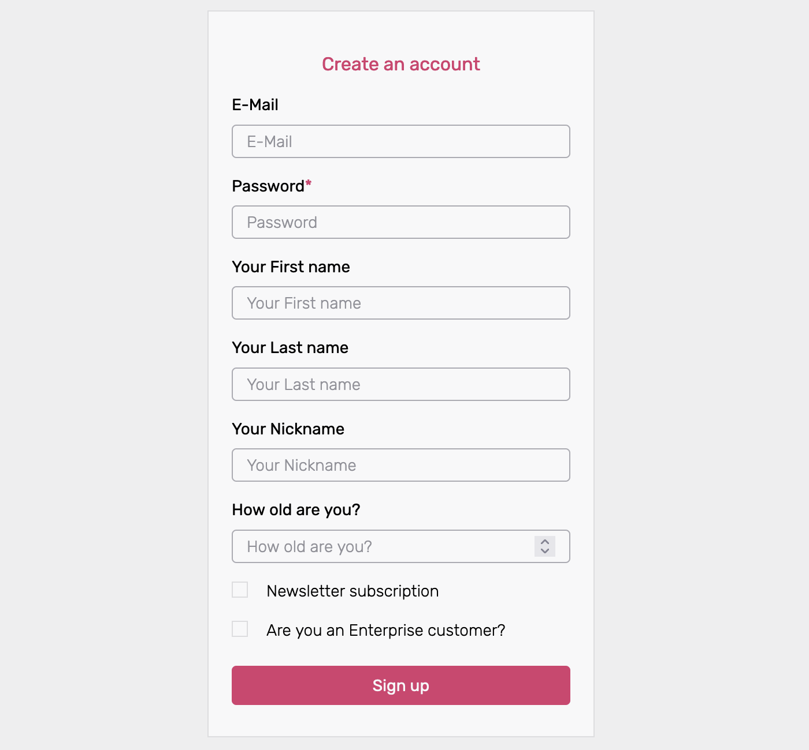

Ory supports custom Identity schemas. The Identity schema is a JSON Schema that describes the traits that make up an Identity.
This document describes how to create custom Identity schemas.

## Create custom Identity schema

Follow these steps to create a custom Identity schema in Ory Cloud:

1. Open the [Ory Console](https://console.ory.sh/) and sign in.
2. Select **Customize → Identity Schema** from the left navigation bar.
3. Using the dropdown menu, select one of the preset schemas or the empty template as the starting point for your custom schema.
4. Check the **Customize Identity Schema** box to enable editing of the schema.
5. Adjust the schema to your needs - adjust or remove traits.
6. Define the name of the custom schema in the **Identity Model Schema** text box.
7. Click the **Update** button to save.

## Customize fields

An Identity Schemas traits are specified under

```json
"traits": {
  "type": "object",
    "properties": {
```

Each trait translates into a field on the user-facing frontend. For example, the "email & password" preset defines two traits -
email and password:

```json
    "traits": {
      "type": "object",
      "properties": {
        "email": {
          "type": "string",
          "format": "email",
          "title": "E-Mail",
          "ory.sh/kratos": {
            "credentials": {
              "password": {
                "identifier": true
              }
            },
            "recovery": {
              "via": "email"
            },
            "verification": {
              "via": "email"
            }
          }
        }
      },
      "required": [
        "email"
      ],
      "additionalProperties": false
    }
```

This Identity Schema translates into the following sign-up screen:


The part highlighted below defines the identities `email` for the email+password flow in Ory Cloud. It also includes a method for
[`recovery`](https://www.ory.sh/kratos/docs/self-service/flows/account-recovery#recovery-link-method) as well as
[`verification`](https://www.ory.sh/kratos/docs/self-service/flows/verify-email-account-activation/#verification-link-method).
Only the `email` method is available (recovery/verification via a link sent in an email).

```diff
    "traits": {
      "type": "object",
      "properties": {
+       "email": {
+         "type": "string",
+         "format": "email",
+         "title": "E-Mail",
+         "ory.sh/kratos": {
+           "credentials": {
+             "password": {
+               "identifier": true
+             }
+           },
            "recovery": {
              "via": "email"
            },
            "verification": {
              "via": "email"
            }
          }
        }
      },
      "required": [
        "username"
      ],
      "additionalProperties": false
    }
```

To add traits to the Identity Schema, add them inside the `traits "properties"`

```diff
"traits": {
  "type": "object",
    "properties": {
+      "customtrait": {
+        "type": "string",
+        "title": "Your Custom Trait Title"
+        }
       }
    }
```

for example the GitHub Handle as `string` :

```json
"traits": {
  "type": "object",
    "properties": {
      "handle": {
        "type": "string",
        "title": "Your GitHub Handle"
        }
      }
    }
```

or a checkbox as `boolean`:

```json
"traits": {
  "type": "object",
    "properties": {
      "newsletter": {
        "type": "boolean",
        "title": "Newsletter subscription"
        }
      }
    }
```

Possible values for the `type` are `string`, `number`, `integer`, `boolean`.

Use `string` for text fields, `boolean` for checkboxes fields, `integer` or `number` for integral or floating-point numbers. If
you want to know more about these types, please refer to the
[json-schema documentation](https://json-schema.org/understanding-json-schema/reference/type.html).

The `title` of each field is what the user as description or sample input. After adding the above examples the sign-up screen
would look like so:



### Change existing Identity schemas

While it's not possible to directly edit existing Identity Schemas, you can make revisions.

For example, an Identity Schema named "Customer Type 1" exists and you would like to make changes to it:

- Select the "Customer Type 1" Identity Schema and press `Customize Identity Schema`.
- Make the necessary changes.
- Enter a new name, for example "Customer Type 2".
- Press the `Enter` key or `Update` to save it.

### Add Identity metadata

It is possible to add metadata to an identity, either as a protected field that can only be read by the admin or as a public field
that can be read by the user as well.
[Visit the Manage Identity Metadata documentation](https://www.ory.sh/docs/guides/manage-identities/managing-users-identities-metadata)
for details on how to add metadata to identities.

### Additional properties

The [`additionalProperties`](https://json-schema.org/understanding-json-schema/reference/object.html#additional-properties)
keyword is used to control the handling of properties whose names aren't listed in the properties keyword. This has no effect and
should be set to false.

```json
      "additionalProperties": false
```

## Reference Identity schema

The following Identity Schema includes first/last and nickname, as well as number fields for the users' age. There are also two
true/false fields for specifying the newsletter subscription and enterprise status.

Please note that this is just a reference Identity Schema, for practical uses it contains probably too many traits.

```json
{
  "$id": "https://schemas.ory.sh/presets/kratos/identity.basic.schema.json",
  "title": "Person",
  "type": "object",
  "properties": {
    "traits": {
      "type": "object",
      "properties": {
        "email": {
          "type": "string",
          "format": "email",
          "title": "E-Mail",
          "ory.sh/kratos": {
            "credentials": {
              "password": {
                "identifier": true
              }
            },
            "recovery": {
              "via": "email"
            },
            "verification": {
              "via": "email"
            }
          }
        },
        "name": {
          "type": "object",
          "properties": {
            "first": {
              "type": "string",
              "title": "Your First name"
            },
            "last": {
              "type": "string",
              "title": "Your Last name"
            },
            "nickname": {
              "type": "string",
              "title": "Your Nickname"
            }
          }
        },
        "age": {
          "type": "integer",
          "title": "How old are you?"
        },
        "newsletter": {
          "type": "boolean",
          "title": "Newsletter subscription"
        },
        "enterprise": {
          "type": "boolean",
          "title": "Are you an Enterprise customer?"
        }
      },
      "required": ["email"],
      "additionalProperties": false
    }
  }
}
```

This is what the above Identity schema would look like on the sign-up screen:


