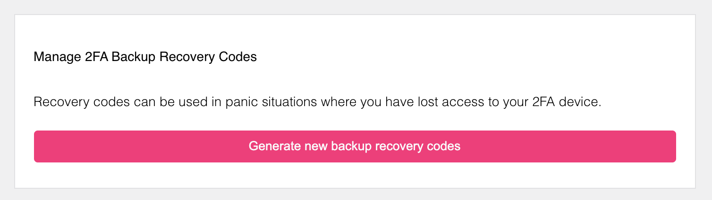
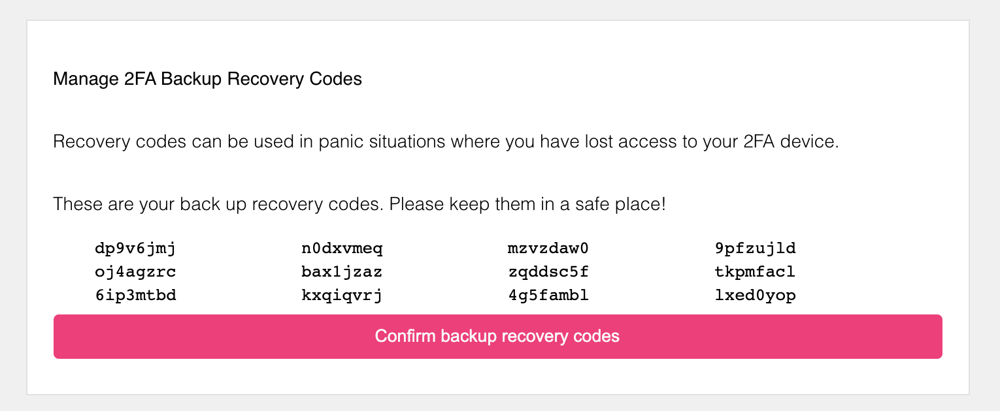
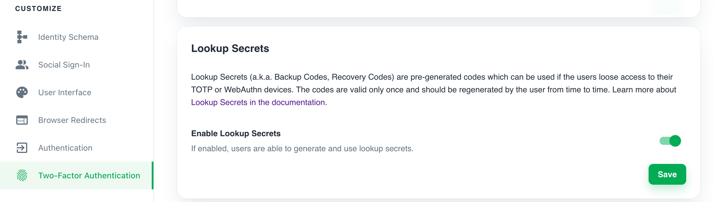

Lookup Secrets, also known as Backup Codes or Recovery Codes, can be used to perform 2FA when the user doesn't have access to
their selected 2FA method.

Lookup Secrets are:

- server-generated
- valid for a single use
- non-expiring - they become invalid only when the user generates a new set of codes

If you enable Lookup Secrets, users can get a list of codes that they must store securely for future use. This is how it looks in
the UI:

:::note

The example screenshots are captured using the Ory Managed UI.

:::





After the server generates the codes, the user must confirm that they received them. To confirm, the user must have a privileged
Session.

If the privileged session expired, the user is prompted to authenticate:


:::warning

The codes are valid only when the user confirms they received the codes. It is the user's responsibility to generate new secretes
before they use all of the available secrets.

:::

## Configuration

Follow these steps to enable Lookup Secrets:

### Ory Cloud Console

1. Sign in to the **Ory Cloud Console** and go to **Two-Factor Authentication**.
2. In the **Lookup Secrets** section, use the switch to enable Webauthn.
3. Click **Save** to finish.



### Ory CLI

1. Get the Identity Service configuration from your project and save it to a file:

   ```shell
   ## List all available projects
   ory list projects

   ## Get config
   ory get identity-config <project-id> --format yaml > identity-config.yaml
   ```

2. Find `lookup_secret` in `selfservice/methods` and set `enabled` to `true`:

   ```yaml title="identity-config.yaml"
   lookup_secret:
     enabled: true
   ```

3. Update the Ory Cloud Identity Service configuration using the file you worked with:

   ```shell
   ory update identity-config <project-id> --file identity-config.yaml
   ```

### Self-hosted instances

When working with self-hosted instances of the Ory Identity Service (Kratos), add the `lookup_secret` method to
`selfservice/methods` in the configuration file:

```yaml title="kratos.config.yml"
selfservice:
  methods:
    lookup_secret:
      enabled: true
```

## Identity credentials

When the user generates and/or uses Lookup Secrets, Ory adds the following entries to the `credentials` object of the associated
Identity:

```yaml
credentials:
  password:
    id: lookup_secret
    identifiers:
      # This is the identity's ID
      - 802471b9-06f5-49d4-a88d-5e7d6bcfed22
    config:
      recovery_codes:
        - code: 3zg9abc
        - code: 1bc6bea
          used_at: 2021-10-14T07:38:51Z
```
