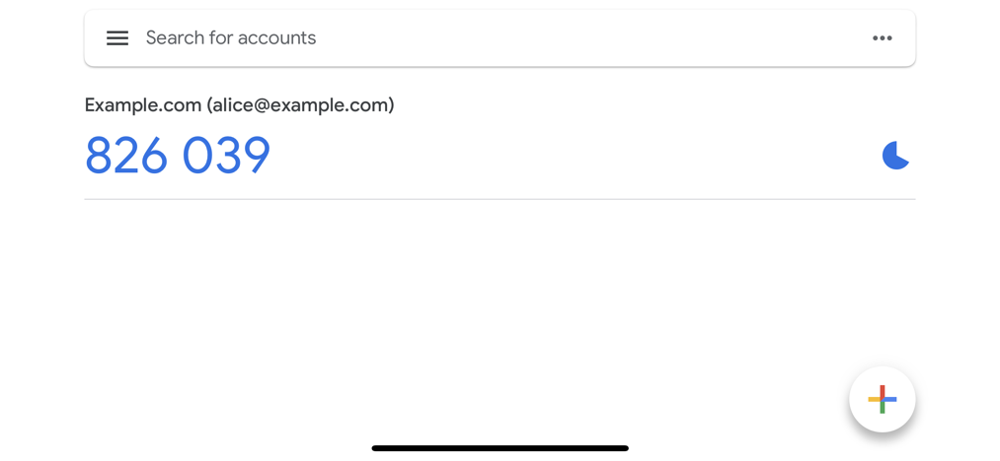

You can enable Time-Based One-Time Password authentication in the Ory Identity Service (Kratos) 
to allow users to perform 2FA with TOTP apps such as the Google Authenticator. 

When enabled, users can pair a TOTP app with their account: 

:::note

The example screenshot is captured using the Ory Managed UI.

:::

When attempting to perform actions secured with 2FA, users get a TOTP code with the application 
identifier:
 

:::info

In this example, the user identifier (email - `alice@example.com`) is used. To learn how to enable this
behavior, read [this section](#distinguishing-identities-requesting-totp). 

:::