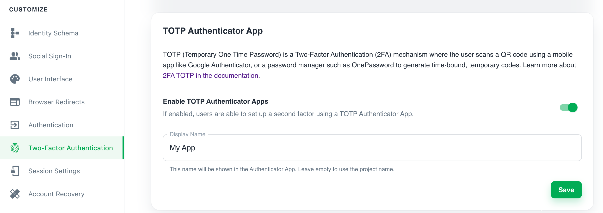

Follow these steps to enable Time-Based One-Time Password (TOTP) as the second
authentication factor: 

1. Sign in to the **Ory Cloud Console** and go to **Two-Factor Authentication**.
2. In the **TOTP Authenticator App** section, use the switch to enable TOTP. 
3. Define the name of the requesting party in the **Display Name**. The users sees
this name in the TOTP application when getting a one-time password.
4. Click **Save** to finish.

## Writing E2E Tests

When writing end-to-end (E2E) tests for TOTP implementation in your app, 
[you can reference the Cypress tests used in Ory Identity Service (Kratos)](https://github.com/ory/kratos/blob/fc2cecfbeab811aa1a851f953b6bc2a4c119c412/test/e2e/cypress/integration/profiles/mfa/totp.spec.ts).