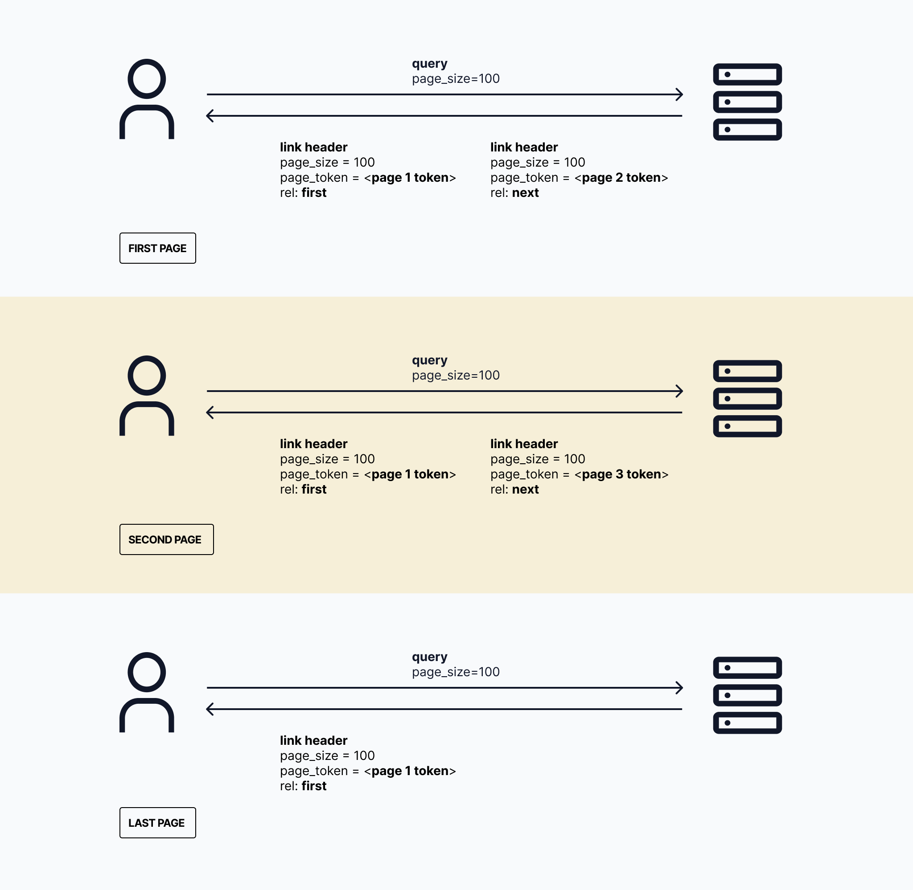
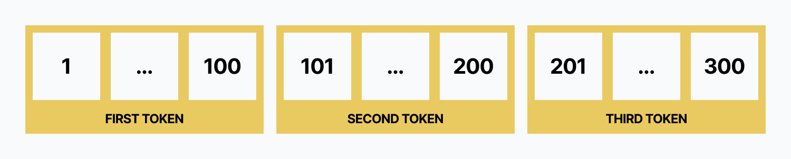

Pagination is a strategy that limits access to large datasets by dividing the data into manageable chunks or "pages." This
approach provides mechanisms for accessing subsequent or previous pages of data.

When dealing with API responses that could potentially return large datasets, pagination becomes essential for two main reasons:

1. **Mitigate data access abuse**: Pagination limits the amount of data that can be accessed in a single request. Clients or
   consumers can only retrieve a defined subset of data per page, preventing potential system overload or abuse.

2. **Improve response performance**: By returning smaller sets of data, pagination ensures faster response times. This is
   particularly beneficial when dealing with large datasets, as it reduces the load on both the server and the client.

Ory supports two pagination strategies:

- **Token-based pagination**: The primary and recommended method for paginating through data in Ory's API.
- **Offset pagination**: A deprecated method that is still supported but not recommended for new implementations.

In the following sections, we'll explore each of these pagination strategies in detail, with a focus on the recommended
token-based approach.

## Token pagination

Ory implements token-based pagination as the primary method for handling large datasets in list operations. This approach offers
better performance and consistency compared to traditional offset-based pagination.



### Pagination parameters

Ory uses two parameters to paginate through data:

1. `page_size`: Determines the number of items returned per page.
2. `page_token`: Acts as a pointer to a specific page in the dataset.

### How it works



Let's walk through an example to illustrate how token pagination works in Ory:

Imagine you have 300 customers in your Ory project, and you want to list them 100 at a time.

1. **Initial request**: Set the `page_size` query parameter to 100 for your first request:

   ```shell
   GET https://$PROJECT_SLUG.projects.oryapis.com/admin/identities?page_size=100
   Authorization: Bearer $ACCESS_TOKEN
   ```

2. **Response**: You'll receive a response payload containing the first 100 customers. Additionally, the response header will
   include a `link` header with details about the first and next pages:

   ```shell
   link:
     </admin/identities?page_size=100&page_token=00000000-0000-0000-0000-000000000000>; rel="first",
     </admin/identities?page_size=100&page_token=30f8507f-40e6-44b9-924f-5f814e3f072e>; rel="next"
   ```

3. **Understanding the Link Header**:
   - The `first` link always points to the first page of results. Its token (in this case, `00000000-0000-0000-0000-000000000000`)
     remains constant.
   - The `next` link points to the next page of results. Its token (e.g., `30f8507f-40e6-44b9-924f-5f814e3f072e`) is unique and
     changes with each page.

4. **Subsequent requests**: To retrieve the next page, use the `next` token in your follow-up request:

   ```shell
   GET https://$PROJECT_SLUG.projects.oryapis.com/admin/identities?page_size=100&page_token=30f8507f-40e6-44b9-924f-5f814e3f072e
   Authorization: Bearer $ACCESS_TOKEN
   ```

### Best practices

- Always use the tokens provided in the `link` header for navigation. Do not attempt to generate or modify these tokens yourself.
- If you need to start from the beginning, use the `first` link or omit the `page_token` parameter.
- Keep track of the previous/current `next` token to allow for backward pagination through your results.
- Be prepared for the maximum `page_size` to change. Your implementation should handle such changes gracefully.
- Do not attempt to reverse engineer or make assumptions about the `page_token` format, as it may change without notice. Always
  treat it as an opaque string.

By leveraging token-based pagination, you can efficiently navigate through large datasets in Ory, ensuring consistent and
performant data retrieval.

## Usage examples

The following examples demonstrate how to use token-based pagination with Ory's SDKs in Python and Ruby.

### Scenario 1: Python SDK

This example shows how to fetch a single page of identities using the Python SDK:

```python
import os
from pprint import pprint
from ory_client.api_client import ApiClient
from ory_client.configuration import Configuration
from ory_client.api.identity_api import IdentityApi

# Configure your Ory credentials
configuration = Configuration(
    access_token="{API_KEY}",
    host="https://{PROJECT_SLUG}.projects.oryapis.com",
)

# Enter a context with an instance of the API client
with ApiClient(configuration) as api_client:
    # Create an instance of the API class
    api_instance = IdentityApi(api_client)

    try:
        # List Identities
        api_response = api_instance.list_identities(
            page_size=1,
            page_token="<token>",
        )
        pprint(api_response)
    except Exception as e:
        print("Error fetching identities: %s\n" % e)
```

Key points:

- Replace `{API_KEY}` with your actual Ory API key.
- Replace `{PROJECT_SLUG}` with your Ory project slug.
- The `page_size` is set to 1 for demonstration purposes. Adjust this value based on your needs.
- Replace `<token>` with the actual page token received from a previous request, or omit it for the first request.

For more details, see the
[IdentityApi list documentation](https://github.com/ory/sdk/blob/master/clients/client/python/docs/IdentityApi.md#list_identities).

### Scenario 2: Ruby SDK

This example demonstrates how to fetch a single page of identities using the Ruby SDK:

```ruby
require 'ory-client'

# Configure your Ory credentials
OryClient.configure do |config|
  config.host = 'https://{PROJECT_SLUG}.projects.oryapis.com'
  config.access_token = '{API_KEY}'
end

# Create an OryClient instance
api_instance = OryClient::IdentityApi.new
opts = {
  page_size: 1,
  page_token: '<token>'
}

begin
  # List Identities based on pagination
  result = api_instance.list_identities(opts)
  p result
rescue OryClient::ApiError => e
  puts "Error fetching identities: #{e}"
end
```

Key points:

- Replace `{PROJECT_SLUG}` with your Ory project slug.
- Replace `{API_KEY}` with your actual Ory API key.
- The `page_size` is set to 1 for demonstration purposes. Adjust this value based on your needs.
- Replace `<token>` with the actual page token received from a previous request, or omit it for the first request.

For more information, refer to the
[IdentityApi list documentation](https://github.com/ory/sdk/blob/master/clients/client/ruby/docs/IdentityApi.md#list_identities).

## Offset pagination (Deprecated)

:::caution

Offset pagination is deprecated. It is strongly recommended to use Token pagination instead.

:::

While not recommended for new implementations, Ory still supports offset-based pagination for backwards compatibility. This method
allows you to paginate through data using an offset and a page size.

### How it works

Offset pagination uses two query parameters:

1. `per_page`: The number of items you want for each page.
2. `page`: The page number you want to retrieve (starts at 0).

### Example usage

Let's consider a scenario where you have 300 customers and you want to retrieve customers 101 to 200:

```shell
GET https://{PROJECT_SLUG}.projects.oryapis.com/admin/identities?per_page=100&page=2
Authorization: Bearer {YOUR_API_KEY}
```

In this example:

- `per_page` is set to 100, indicating you want 100 items per page.
- `page` is set to 2, which will return items 201-300.

### Migrating to token pagination

If you're currently using offset pagination, it's highly recommended to transition to token-based pagination. Refer to the
[Token Pagination section](#token-pagination) for implementation details and best practices.

## Handling pagination errors

Ory typically returns a 400 Bad Request error for pagination-related issues. Here's an example of an error response when supplying
an invalid token:

```json
{
  "error": {
    "code": 400,
    "status": "Bad Request",
    "request": "38308051-dd5e-9f91-b053-5b32f751b281",
    "reason": "The page token is invalid, do not craft your own page tokens",
    "message": "The request was malformed or contained invalid parameters"
  }
}
```

Key fields in the error response:

- `code`: The HTTP status code (e.g., 400 for Bad Request)
- `status`: A text representation of the HTTP status
- `request`: A unique identifier for the request, useful for troubleshooting
- `reason`: A specific description of what went wrong
- `message`: A general error message
