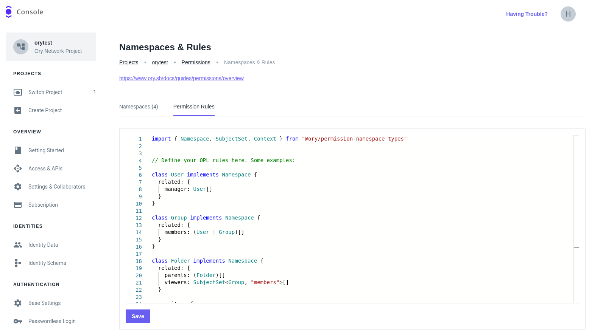

# Get started with Ory Permissions

```mdx-code-block
import CodeFromRemote from "@theme/CodeFromRemote"
import BrowserWindow from "@site/src/theme/BrowserWindow"
```

[Ory Permissions](https://www.ory.com/permissions) (based on [Ory Keto](https://github.com/ory/keto)) implements
[Google Zanzibar](https://research.google/pubs/pub48190/). This document explains the most fundamental concepts necessary to work
with Ory Permissions and gives you an opportunity to create and query a simple set of relationships.

## Basic concepts

Before you start, learn about the basic concepts used in Ory Permissions.

### Relations and relationships

The data model used by Ory Permissions are so-called [relationships](/keto/concepts/01_relation-tuples.mdx) that encode relations
between [subjects](/keto/concepts/15_subjects.mdx) and [objects](/keto/concepts/10_objects.mdx).

:::tip

Read the dedicated documents to learn more about [subjects](/keto/concepts/15_subjects.mdx) and
[objects](/keto/concepts/10_objects.mdx).

:::

Each relationship consists of:

- **Subject** – The entity that receives the role or permission.
- **Object** – The entity on which the role or permission is granted.
- **Relation** – The relationship between Subject and Object.

Examples:

```keto-natural
User:user1 is in members of Group:group1
admins of Group:group1 are readers of File:file1
```

As you can see, the subject of a relationship can either be a specific subject ID (e.g. User:user1), or subjects defined through
an indirection (e.g. all admins of Group:group1). The object is referenced by its ID (e.g. Group:group1, File:file1).

### Checking permissions

Permissions are just another form of relations. Therefore, a permission check is a request to check whether a subject has a
certain relation to an object, possibly through one or more indirections.

As a very simple example, let's assume the following tuples exist:

```keto-natural
User:user1 is in members of Group:group1
members of Group:group1 are readers of File:file1
```

Based on these tuples, you can run permission checks:

- Is `User:user1` a `reader` of `File:file1`?

  ```keto-natural
  is User:user1 in readers of File:file1?  // Yes
  ```

  Yes, because `user1` is in `members` of `Group:group1` and all `members` of `Group:group1` are `readers` of `File:file1`.

- Is `User:user2` a member of `Group:group1`?

  ```keto-natural
  is User:user2 in members of Group:group1?  // No
  ```

  No, because there is no relation between `User:user2` and `Group:group1`.

## Example

This example setup demonstrates the basics of relationship management and usage of the Check API.

This guide explains how to configure namespaces and relationship rules using the
[Ory Permission Language](../../keto/reference/ory-permission-language) (OPL). You can then run fine-grained checks against Ory
Permissions, which are answered based on a combination of OPL and the concrete high-level relationships stored.

The example describes a file store. Individual files are organized in a folder hierarchy, and can be accessed by individual users
or groups of users. Using the Ory Permission Language you can specify that if a user has access to a folder, the user also has
access to all files in that folder.

### Ory Network setup

The fastest way to get started with Ory Permissions is using [Ory Console](https://console.ory.sh/).

Go to <ConsoleLink route="project.permissions.relationships" /> and switch to the **Permission Rules** tab.

```mdx-code-block
<BrowserWindow url="https://console.ory.sh/projects/current/permissions/configuration">



</BrowserWindow>
```

Paste the following content into the editor:

```mdx-code-block
<CodeFromRemote src="https://github.com/ory/keto/blob/master/contrib/rewrites-example/namespaces.keto.ts" title="namespaces.keto.ts" />
```

:::info

The editor offers autocompletion for the Ory Permission Language.

:::

#### Connecting to Ory Network via CLI

Next, connect to the Ory Network using the Ory CLI. If you haven't done so already,
[install the Ory CLI](../cli/01_installation.mdx).

Follow these steps:

1. Sign in to your Ory Network account:

   ```shell
   ory auth
   ```

2. List your workspaces and projects:

   ```shell
   ory list workspaces
   ory list projects --workspace <workspace-id>
   ```

3. Use the project ID of the project in which you want to create permission rules:

   ```shell
   ory use project <project-id>
   ```

### Creating relationships

Next, create relationships in your Ory Network project using the Ory CLI.

The following relationships showcase the namespace configuration. The sample defines a `developer` group with two members and a
folder hierarchy. Through the rules in the Ory Permission Language, every member of the `developer` group can access the files in
the hierarchy.

You can create additional fine-grained permission rules for certain objects, similar to the `private` file.

```mdx-code-block
<CodeFromRemote src="https://github.com/ory/keto/blob/master/contrib/rewrites-example/relation-tuples/tuples.json" title="relationships.json" />
```

Save the file as `relationships.json` in your current working directory. To create these relationships in Ory Permissions, run
this command:

```shell
ory create relationships relationships.json

# Output:
#   NAMESPACE       OBJECT                  RELATION NAME   SUBJECT
#   Group           developer               members         User:Patrik
#   Group           developer               members         User:Henning
#   Folder          keto/                   viewers         Group:developer#members
#   File            keto/README.md          parents         Folder:keto/
#   Folder          keto/src/               parents         Folder:keto/
#   File            keto/src/main.go        parents         Folder:keto/src/
#   File            private                 owners          User:Henning
```

### Checking for permissions

With the relationships created, try running queries that illustrate use cases:

#### Transitive permissions for objects in the hierarchy

Patrik can view `keto/src/main.go`, because this file is in the `keto/src` folder, which is in `keto`. The `keto` directory has
the "developer" group as its "viewers". Patrik is a member of the "developer" group.

```
ory is allowed User:Patrik view File keto/src/main.go
Allowed
```

#### No transitivity for objects outside the hierarchy

Patrik cannot view the private file, since that file is not part of any folder hierarchy Patrik has access to.

```
ory is allowed User:Patrik view File private
Denied
```

#### Fine-grained permissions for any object

Henning can both edit and view the private file, since he is an "owner" of it.

```
ory is allowed User:Henning view File private
Allowed

ory is allowed User:Henning edit File private
Allowed
```

## Next steps

- Learn [what a permission model is and how to create one](../../keto/modeling/create-permission-model.mdx).
- Read the Ory Permission Language [specification](../../keto/reference/ory-permission-language.mdx).
