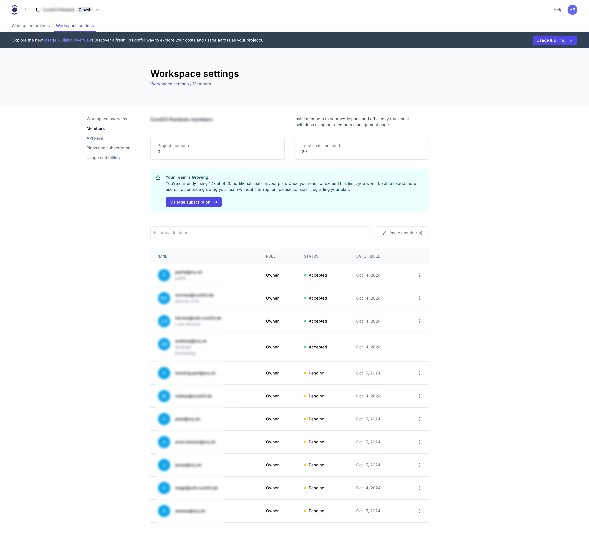

import Mermaid from "@site/src/theme/Mermaid"

# Understand Workspaces and Environments

Ory Network has introduced two key concepts to simplify and streamline the management of multiple projects: Workspaces and
Environments. This guide gives you an overview of what Workspaces and Environments are about.

## Workspaces

Workspaces serve as containers for your projects, offering several benefits:

1. Unified Project Management: Group related projects within a single Workspace.
2. Simplified Billing: One subscription per Workspace, covering all included projects.
3. Centralized Access Control: Manage user permissions across all Workspace projects from one place.

### Workspace-Level functionality

Workspaces provide centralized management for various aspects of your Ory Network experience:

- Workspace overview: Get a high-level view of your workspace, including project count and subscription details.
- Members: Manage team access and roles for all projects within the workspace.
- API keys: Create and manage API keys for workspace-level operations.
- Plans and subscription: View and manage your current subscription plan for the workspace.
- Usage and billing: Monitor resource usage and access billing information for all projects in the workspace.

### Workspace member management



The Workspace Members page provides a comprehensive view of your team and access management:

- Member Overview: Quickly see the number of project members and total seats included in your plan.
- Detailed Member List: View all members, their roles, acceptance status, and when they were added.
- Invite Functionality: Easily invite new members directly from this interface.
- Search and Filter: Quickly find specific members using the search bar.

:::note

The screenshot shows that all members are listed as "Owners". In practice, you may have different roles such as Owner or
Developer. For a full breakdown of what each role can do, see
[Roles and permissions in the Ory Console](../console/roles-and-permissions.mdx).

:::

## Environments

Each Workspace includes three environment types, each designed for specific use cases:

| Environment | Purpose             | Features Set available   | Rate Limits              |
| ----------- | ------------------- | ------------------------ | ------------------------ |
| Production  | Live applications   | Workspace subscription   | Workspace subscription   |
| Staging     | Pre-release testing | Workspace subscription   | Development subscription |
| Development | Development         | Development subscription | Development subscription |

Example for a Growth Subscription:

| Environment | Purpose             | Features Set available | Rate Limits      |
| ----------- | ------------------- | ---------------------- | ---------------- |
| Production  | Live applications   | Growth plan            | Growth plan      |
| Staging     | Pre-release testing | Growth plan            | Development      |
| Development | Development         | Development plan       | Development Plan |

:::note

The number of projects allowed in each environment depends on your plan. Please check the
[Pricing page](https://www.ory.com/pricing) for details.

:::

This diagram illustrates the relationship between Workspaces, Projects, and Environments:

```mdx-code-block
<Mermaid
  chart={`
graph TD
    subgraph "Workspace"
        Plan["Subscription Plan<br/>(Developer/Production/Growth/Enterprise)<br/><br/>Determines:<br/>• Feature Set<br/>• Number of Production/Staging/Dev Env Projects"]

        subgraph "Projects"
            Project1["Project A"]
            Project2["Project B"]
            Project3["Project C"]
        end

        subgraph "Environments"
            Prod["Production Environment<br/>🚀 Workspace Subscription Rate Limits<br/>✨ Full Feature Set"]
            Stage["Staging Environment<br/>🔄 Development Subscription Rate Limits<br/>✨ Full Feature Set"]
            Dev["Development Environment<br/>🔄 Development Subscription Rate Limits<br/>⚙️ Testing Features"]
        end

        Plan --> Project1
        Plan --> Project2
        Plan --> Project3

        Project1 --> Prod
        Project2 --> Stage
        Project3 --> Dev

        style Plan fill:#e6e6e6,stroke:#333,stroke-width:2px,color:#000
        style Prod fill:#d4edda,stroke:#333,stroke-width:2px,color:#000
        style Stage fill:#cce5ff,stroke:#333,stroke-width:2px,color:#000
        style Dev fill:#fff3cd,stroke:#333,stroke-width:2px,color:#000

        style Project1 fill:#ffffff,stroke:#333,stroke-width:2px,color:#000
        style Project2 fill:#ffffff,stroke:#333,stroke-width:2px,color:#000
        style Project3 fill:#ffffff,stroke:#333,stroke-width:2px,color:#000
    end
`}
/>
```

And here is a concrete example of a Workspace with a Production subscription:

```mdx-code-block
<Mermaid
  chart={`
graph TD
    subgraph "ACME Company Workspace"
        Plan["Production Subscription<br/><br/>Determines:<br/> • Production Plan Feature Set <br/> • 1 Production, 3 Staging, 5 Development Env Projects"]

        subgraph "Projects"
            Project1["ACME SaaS Production"]
            Project2["ACME SaaS Staging"]
            Project3["ACME SaaS UTA"]
            Project4["ACME PoC Passkey"]
            Project5["ACME PoC SSO Google"]
        end

        subgraph "Environments"
            Prod["Production Environment<br/>🚀 Production Rate Limits<br/>(80 rps /sessions/whoami)<br/>✨ Full Feature Set"]
            Stage["Staging Environment<br/>🔄 Developer Rate Limits<br/>(10 rps /sessions/whoami)<br/>✨ Full Feature Set"]
            Dev["Development Environment<br/>🔄 Developer Rate Limits<br/>(10 rps /sessions/whoami)<br/>⚙️ Testing Features"]
        end

        Project1 --> Prod
        Project2 --> Stage
        Project3 --> Stage
        Project4 --> Dev
        Project5 --> Dev

        Plan --> Project1
        Plan --> Project2
        Plan --> Project3
        Plan --> Project4
        Plan --> Project5

        style Plan fill:#e6e6e6,stroke:#333,stroke-width:2px,color:#000
        style Prod fill:#d4edda,stroke:#333,stroke-width:2px,color:#000
        style Stage fill:#cce5ff,stroke:#333,stroke-width:2px,color:#000
        style Dev fill:#fff3cd,stroke:#333,stroke-width:2px,color:#000

        style Project1 fill:#ffffff,stroke:#333,stroke-width:2px,color:#000
        style Project2 fill:#ffffff,stroke:#333,stroke-width:2px,color:#000
        style Project3 fill:#ffffff,stroke:#333,stroke-width:2px,color:#000
        style Project4 fill:#ffffff,stroke:#333,stroke-width:2px,color:#000
        style Project5 fill:#ffffff,stroke:#333,stroke-width:2px,color:#000
    end
`}
/>
```

## Comparison with previous model

| Aspect                  | Previous model      | New Workspace model                            |
| ----------------------- | ------------------- | ---------------------------------------------- |
| Project Organization    | Individual projects | Projects grouped in Workspaces                 |
| Subscription Scope      | Per project         | Per Workspace                                  |
| Environment Distinction | Not inherent        | Built-in (Production, Staging, Development)    |
| User Management         | Per project         | Centralized per Workspace and on project level |
