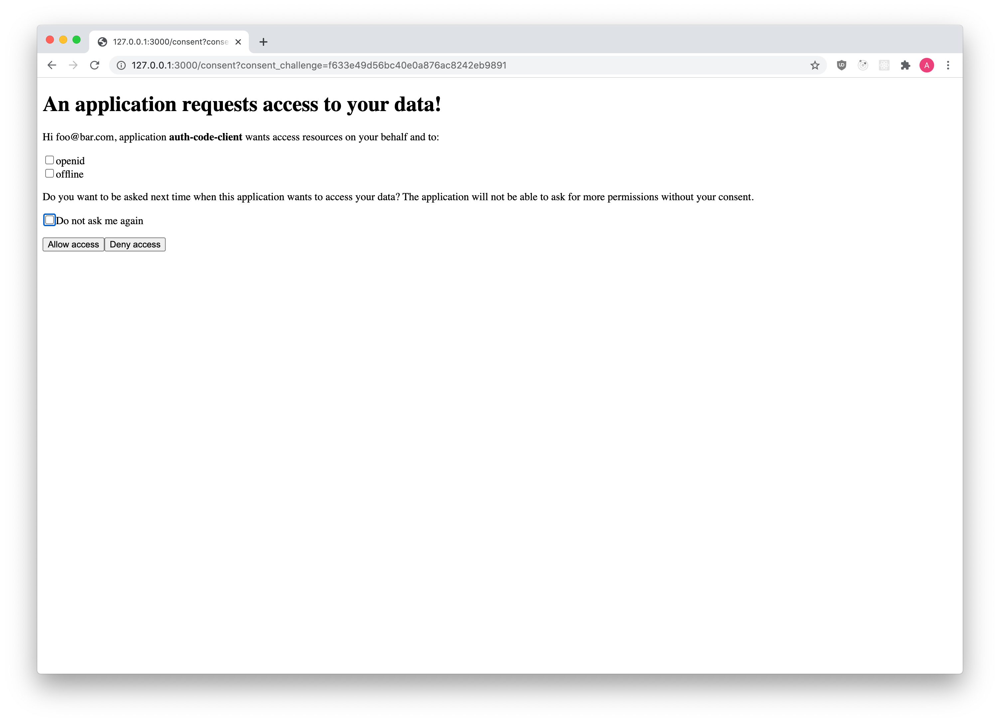

import Tabs from "@theme/Tabs"
import TabItem from "@theme/TabItem"
import CodeFromRemote from "@theme/CodeFromRemote"

:::note

Please read the [Consent Flow Documentation](../concepts/consent.mdx) first!

:::

In this document, you will learn how to implement the Consent Endpoint using our Ory Hydra SDKs. The goal for this document is to
have document this for multiple programming languages. If you are an expert in one of these languages, your help is highly
appreciated in improving these docs!

Code shown here is taken out of the Ory Hydra Login & Consent Node Reference application which you can find on GitHub.

## Implementing the consent HTML form

:::note

The Consent HTML Form can't be only a Single Page App (Client-side browser application) or a Mobile App! There has to be a
server-side component with access to Ory Hydra's Admin Endpoint!

:::

<Tabs
  defaultValue="ui"
  values={[
    {label: 'UI', value: 'ui'},
    {label: 'Node.js', value: 'node'},
    {label: 'HTML Example', value: 'html'},
  ]}>
  <TabItem value="ui">

  </TabItem>
  <TabItem value="node">
    <CodeFromRemote
      src="https://github.com/ory/hydra-login-consent-node/blob/master/src/routes/consent.ts"
    />
  </TabItem>
  <TabItem value="html">
    <CodeFromRemote
      src="https://github.com/ory/hydra-login-consent-node/blob/master/views/consent.pug"
    />
  </TabItem>
</Tabs>

## Accepting the consent request

<Tabs defaultValue="node" values={[{ label: "Node.js", value: "node" }]}>
  <TabItem value="node">
    <CodeFromRemote
      startAt="let grantScope = req.body.grant_scope"
      endAt="// label:docs-accept-consent"
      src="https://github.com/ory/hydra-login-consent-node/blob/master/src/routes/consent.ts"
    />
  </TabItem>
</Tabs>

## Rejecting the consent request

<Tabs defaultValue="node" values={[{ label: "Node.js", value: "node" }]}>
  <TabItem value="node">
    <CodeFromRemote
      startAt="if (req.body.submit === 'Deny access') {"
      endAt="// label:consent-deny-end"
      src="https://github.com/ory/hydra-login-consent-node/blob/master/src/routes/consent.ts"
    />
  </TabItem>
</Tabs>

## Skipping consent screen

<Tabs defaultValue="node" values={[{ label: "Node.js", value: "node" }]}>
  <TabItem value="node">
    <CodeFromRemote
      startAt="// This section processes consent requests and either shows the consent UI"
      endAt="// The consent request has now either been accepted automatically"
      src="https://github.com/ory/hydra-login-consent-node/blob/master/src/routes/consent.ts"
    />
  </TabItem>
</Tabs>

## Complete endpoint

<Tabs defaultValue="node" values={[{ label: "Node.js", value: "node" }]}>
  <TabItem value="node">
    <CodeFromRemote src="https://github.com/ory/hydra-login-consent-node/blob/master/src/routes/consent.ts" />
  </TabItem>
</Tabs>
