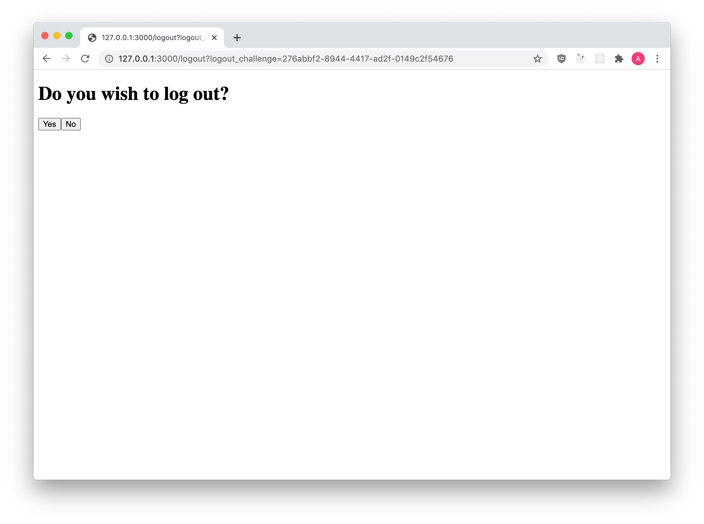

When using Ory OAuth2 and OpenID Connect, by default the logout operation is handled by the Ory Account Experience. Alternatively,
you can customize the logout experience by implementing a custom logout endpoint using the Ory SDK.

This document shows how to implement your own logout endpoint and customize the logout UI.

## OpenID Connect logout overview

OpenID Connect defines two types of logout mechanisms: back-channel logout and front-channel logout.

- Back-channel logout is initiated by the identity provider (IdP) and is a server-to-server call.
- Front-channel logout, is initiated by the client and is a client-to-server call.

## Customize logout experience

To customize the logout experience, you must implement a custom logout endpoint that can handle back-channel and front-channel
logout requests. The logout HTML Form can't be a Single Page App (Client-side browser application) or a mobile. There has to be a
server-side component with access to an Ory API Key.

:::tip

Check out the reference implementation of this endpoint provided by Ory Hydra.
[Click here to view the code on GitHub](https://github.com/ory/hydra-login-consent-node).

:::

The reference implementation includes the necessary code to handle back-channel and front-channel logout requests, as well as a
basic UI for the logout page. However, you can customize the UI to fit your needs.



## Code example

To implement your own logout endpoint using the Ory SDK, you can use the following code as a starting point:

```mdx-code-block
import revokeClient from '!!raw-loader!../../../code-examples/sdk/typescript/src/oauth2/logout.ts'
import CodeBlock from '@theme/CodeBlock'

<CodeBlock language="js">{revokeClient}</CodeBlock>
```

This code handles both back-channel and front-channel logout requests, as well as redirects the user to the homepage after logout.

## Mermaid diagram

The following diagram illustrates the flow of a logout request:

```mdx-code-block
import Mermaid from "@site/src/theme/Mermaid";

<Mermaid
  chart={`sequenceDiagram
User Agent->>Ory Oauth2: Calls logout endpoint
Ory Oauth2-->>Ory Oauth2: Validates logout endpoint
Ory Oauth2->>Custom logout UI: Redirects end user with logout challenge
Custom logout UI-->Ory Oauth2: Fetches logout request info
Custom logout UI-->>Custom logout UI: Acquires user consent for logout (optional)
Custom logout UI-->Ory Oauth2: Informs that logout request is granted
Custom logout UI->>Ory Oauth2: Redirects end user to redirect url with logout challenge
Ory Oauth2-->>Ory Oauth2: Performs logout routines
Ory Oauth2-->User Agent: Redirects to specified redirect url
`} />
```
