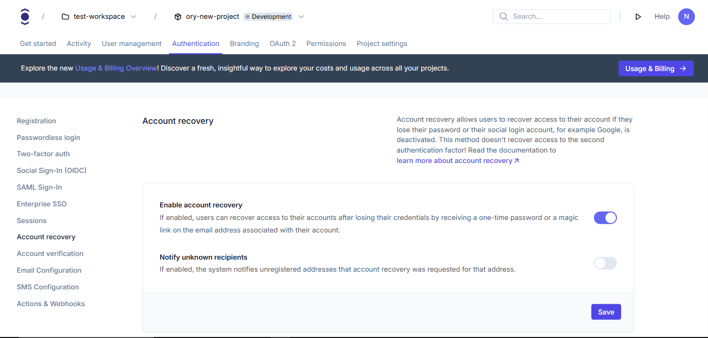
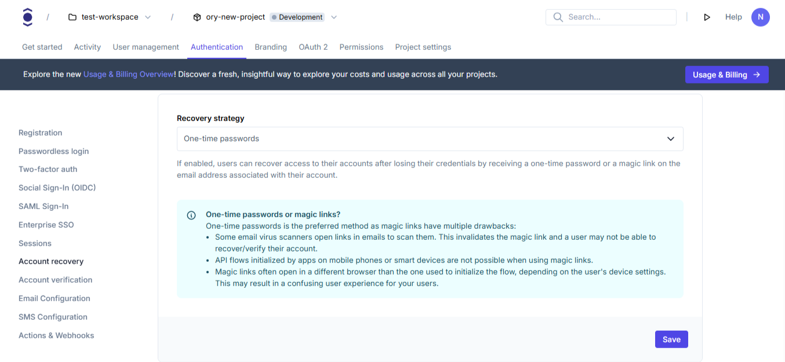
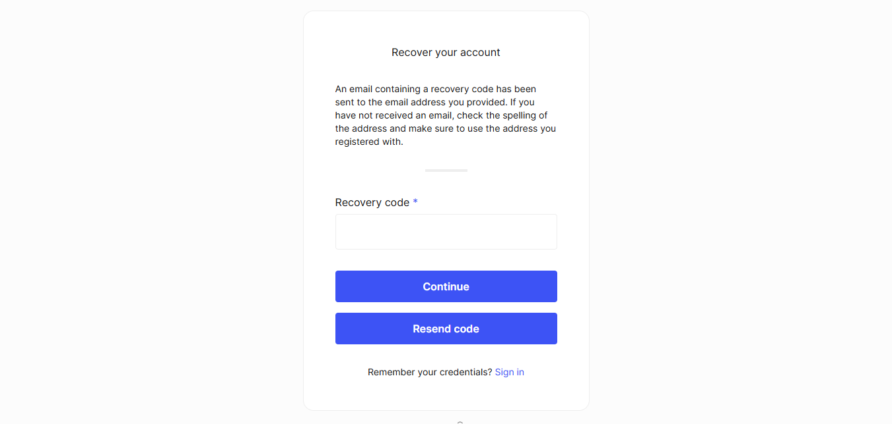

# Account recovery

```mdx-code-block
import Tabs from "@theme/Tabs"
import TabItem from "@theme/TabItem"
import CodeBlock from "@theme/CodeBlock"
import { FrameworkCodeTabs, ImplementationSteps } from '@site/src/components/GuidesComponents'
```

Account recovery allows users to regain access to their accounts when they forget their passwords. This guide shows how to
configure account recovery in your Ory project.

## Set up account recovery

```mdx-code-block
<Tabs
  defaultValue="console"
  values={[
    {label: 'Ory Console', value: 'console'},
    {label: 'Ory CLI', value: 'cli'},
  ]}>
<TabItem value="console">
```

### Enable and configure account recovery

1. Log in to your [Ory Console](https://console.ory.com/)
2. Select your workspace and project
3. Navigate to **Authentication** → **Account recovery**
4. Toggle "Enable account recovery" to on
5. Click **Save**

```mdx-code-block
<BrowserWindow url="https://console.ory.com/projects/<id>/authentication/recovery">
    
</BrowserWindow>
```

### Enable users to choose email or SMS recovery method

This feature is enabled via a project-level feature flag, which is `on` by default for new projects in Ory Network.

This feature is only available for the one-time password recovery option, and not when using magic links for recovery.

A [SMS HTTP gateway](../../kratos/emails-sms/10_sending-sms.mdx) must be configured to deliver SMS messages.

#### As a user

For users that use only email as their identifier (a phone number was not provided), the recovery process remains the same.

To receive a recovery code via SMS, the user's phone number must be registered as a recovery address.

If the user has multiple recovery addresses registered, they will be prompted to choose one from a masked list during the recovery
process.

To confirm ownership, the user may be asked to enter the complete address after selecting it. This verification step is skipped if
they already entered that same address to begin the recovery process.

#### As an administrator

Enable the `choose_recovery_address` feature flag to send a SMS containing a recovery code.

It is safe to toggle this feature flag. Changes only take effect when a new recovery flow is initiated; existing flows are
unaffected.

##### When using EOL/Open-source

Edit the configuration of Kratos (Ory Identities) to set the `choose_recovery_address` feature flag to `true`:

```diff
feature_flags:
    use_continue_with_transitions: true
+   choose_recovery_address: true
```

##### When using Ory Network

1. Log in to your [Ory Console](https://console.ory.com/)
2. Select your workspace and project
3. Navigate to <ConsoleLink route="project.settings.advanced" />
4. Toggle "Receive a recovery code via SMS" to 'on'
5. Click **Save**

##### As a developer

When integrating with the API directly, your applications must send and receive these fields. Refer to the
[API documentation](../../reference/api#tag/frontend/operation/updateRecoveryFlow) for more details.

When using the built-in Account Experience UI, there is nothing special to do. Otherwise, you need to do some changes.

New fields have been added to the payload when getting and updating the recovery flow that are exclusively used when this feature
flag is enabled:

- `recovery_address`
- `recovery_select_address`
- `recovery_confirm_address`
- `screen`

And these fields will have no effect anymore (they can be present in the payload, but will be ignored):

- `email`

A maximum of 10 recovery addresses are shown to a user during the recovery flow.

### Recovery strategy

You can choose between the following recovery strategies:

- One-time passwords: Sends a one-time code via email, or SMS (with the feature flag `choose_recovery_address` enabled)
- Magic link: Sends a recovery link via email

1. In the Account recovery section
2. Select the recovery strategy
3. Click **Save**

```mdx-code-block
import BrowserWindow from "@site/src/theme/BrowserWindow"

<BrowserWindow url="https://console.ory.com/projects/<id>/authentication/recovery">

    

</BrowserWindow>
```

```mdx-code-block
</TabItem>
<TabItem value="cli">
```

### Download your current configuration

First, get your current identity configuration:

```shell
# List all available workspaces
ory list workspaces

# List all available projects
ory list projects --workspace <workspace-id>

# Get the configuration
ory get identity-config --project <project-id> --workspace <workspace-id> --format yaml > identity-config.yaml

# Toggle the feature flag 'on'
ory patch project --replace '/services/identity/config/feature_flags/choose_recovery_address=true'

ory get project --format='jsonpointer=/services/identity/config/feature_flags/choose_recovery_address'
```

### Edit recovery configuration

Add or modify the recovery section in your configuration file:

```yaml
selfservice:
  methods:
    code: # Configure the "one-time code" method. Use "link" to enable "magic link" method.
      enabled: true
      config:
        lifespan: 15m # Defines how long the code or link are valid for.
  flows:
    recovery:
      enabled: true
      lifespan: 1h # Defines how long the recovery flow is valid in the UI.
      use: code # Defines which method is used, one of "code" or "link".
      notify_unknown_recipients: false # Define if the system sends automated recovery notifications to unknown email addresses.
```

### Update your configuration

After editing, update your configuration:

```shell
ory update identity-config --project <project-id> --workspace <workspace-id> --file identity-config.yaml
```

```mdx-code-block
</TabItem>
</Tabs>
```

## Initiate account recovery

To start the account recovery flow, send the user to the recovery page:

```html
<a href="$ORY_SDK_URL/self-service/recovery/browser">Recover your account</a>
```

## What users will see

When a user initiates account recovery:

```mdx-code-block
<BrowserWindow url="https://<base-url>/ui/recovery?flow">
    
</BrowserWindow>
```

### User flow

When the feature flag `choose_recovery_address` is enabled and the `code` method is in use:

1. They enter their email address on the recovery page
2. If they have multiple recovery addresses, they can pick which one to use
3. They receive a one-time code on their recovery address, via email or SMS, depending on the type of address
4. After entering the code, they're prompted to set a new password
5. Once completed, they regain access to their account with a new password

---

When the feature flag `choose_recovery_address` is disabled, or the `link` method is in use:

1. They enter their email address on the recovery page
2. They receive either:
   - A recovery link via email if using the `link` method
   - A one-time code via email if using the `code` method
3. After clicking the link or entering the code, they're prompted to set a new password
4. Once completed, they regain access to their account with a new password

## What happens if the address provided by the user is 'wrong'?

If the address is malformed, or well-formed but not registered as a recovery address for this user:

- The recovery flow will not complete. This means that no recovery code will be generated and sent.
- The UI will look indistinguishable from the case of a valid recovery address provided. That is to prevent an attacker from
  probing the system to discover which addresses are registered.
- If the address is a valid email address but not registered as a recovery address for this user, and the configuration value
  `selfservice.flows.recovery.notify_unknown_recipients` is enabled, an email will be sent to this address with this wording (this
  can be [customized](../../kratos/emails-sms/sending-emails-smtp#send-emails-using-an-http-server)):
  > Hi,
  >
  > you (or someone else) entered this email address when trying to recover access to an account.
  >
  > However, this email address is not on our database of registered users and therefore the attempt has failed.
  >
  > If this was you, check if you signed up using a different address.
  >
  > If this was not you, please ignore this email.
- If the address is a phone number (meaning an SMS would be sent), or if the configuration value
  `selfservice.flows.recovery.notify_unknown_recipients` is disabled, nothing will be sent.
