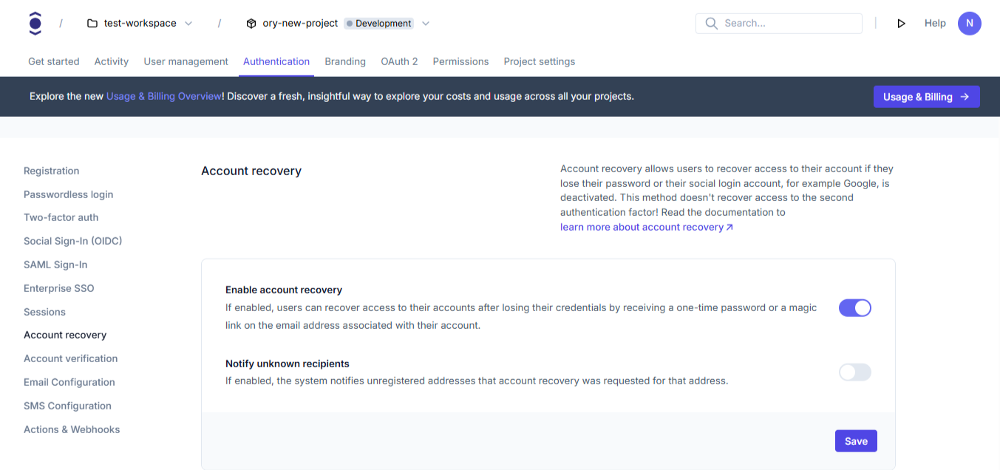

# Account recovery

```mdx-code-block
import Tabs from "@theme/Tabs"
import TabItem from "@theme/TabItem"
import CodeBlock from "@theme/CodeBlock"
import { FrameworkCodeTabs, ImplementationSteps } from '@site/src/components/GuidesComponents'
```

Account recovery allows users to regain access to their accounts when they forget their passwords. This guide shows how to
configure account recovery in your Ory project.

## Set up account recovery

```mdx-code-block
<Tabs
  defaultValue="console"
  values={[
    {label: 'Ory Console', value: 'console'},
    {label: 'Ory CLI', value: 'cli'},
  ]}>
<TabItem value="console">
```

**Enable and configure account recovery**

1. Log in to your [Ory Console](https://console.ory.sh/)
2. Select your workspace and project
3. Navigate to **Authentication** → **Account recovery**
4. Toggle "Enable account recovery" to on
5. Click **Save**

```mdx-code-block
<BrowserWindow url="https://console.ory.sh/projects/<id>/authentication/recovery">
    
</BrowserWindow>
```

**Recovery strategy**

You can choose between the following recovery strategies:

- **One-time passwords**: Sends a one-time code via email
- **Magic link**: Sends a recovery link via email

1. In the Account recovery section
2. Select the recovery strategy
3. Click **Save**

```mdx-code-block
import BrowserWindow from "@site/src/theme/BrowserWindow"

<BrowserWindow url="https://console.ory.sh/projects/<id>/authentication/recovery">

    

</BrowserWindow>
```

```mdx-code-block
</TabItem>
<TabItem value="cli">
```

**Download your current configuration**

First, get your current identity configuration:

```shell
# List all available workspaces
ory list workspaces

# List all available projects
ory list projects --workspace <workspace-id>

# Get the configuration
ory get identity-config --project <project-id> --workspace <workspace-id> --format yaml > identity-config.yaml
```

**Edit recovery configuration**

Add or modify the recovery section in your configuration file:

```yaml
selfservice:
  methods:
    code: # Configure the "one-time code" method. Use "link" to enable "magic link" method.
      enabled: true
      config:
        lifespan: 15m # Defines how long the code or link are valid for. Default: 1h.
  flows:
    recovery:
      enabled: true
      lifespan: 1h # Defines how long the recovery flow is valid in the UI. Default: 1h.
      use: code # Defines which method is used, one of "code" or "link".
      notify_unknown_recipients: false # Define if the system sends automated recovery notifications to unknown email addresses.
```

**Update your configuration**

After editing, update your configuration:

```shell
ory update identity-config --project <project-id> --workspace <workspace-id> --file identity-config.yaml
```

```mdx-code-block
</TabItem>
</Tabs>
```

## What users will see

When a user initiates account recovery:

```mdx-code-block
<BrowserWindow url="https://console.ory.sh/projects/<id>/authentication/recovery">
    
</BrowserWindow>
```

### User flow

1. They enter their email address on the recovery page
2. They receive either:
   - A recovery link via email (if using the link method)
   - A one-time code via email (if using the code method)
3. After clicking the link or entering the code, they're prompted to set a new password
4. Once completed, they regain access to their account with a new password
