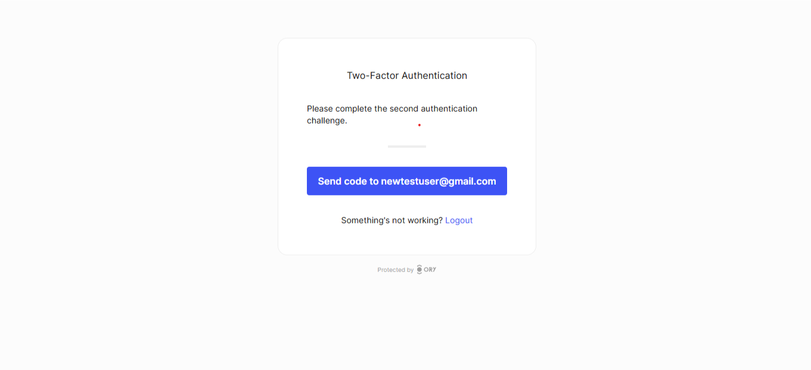

# Multi-factor authentication

```mdx-code-block
import Tabs from "@theme/Tabs"
import TabItem from "@theme/TabItem"
import CodeBlock from "@theme/CodeBlock"
import { FrameworkCodeTabs, ImplementationSteps } from '@site/src/components/GuidesComponents'
```

<p>
  Multi-factor authentication (MFA) adds an additional layer of security to your application by requiring users to verify their
  identity using multiple methods. Ory supports One-Time Codes (OTC) for multi-factor authentication, which can be enabled and
  configured through the Ory Console.
</p>

## Enabling Multi-Factor Authentication

To enable MFA for your application, follow these steps:

1. Log in to your [Ory Console](https://console.ory.sh/)
2. Select your workspace and project
3. Navigate to the **Authentication** tab
4. Click on **Two-factor auth** in the sidebar

### Configure One-Time Codes

In the Two-factor auth settings, you can enable and configure One-Time Codes for multi-factor authentication:

```mdx-code-block
import BrowserWindow from "@site/src/theme/BrowserWindow"

<BrowserWindow url="https://console.ory.sh/projects/<id>/settings">

</BrowserWindow>
```

Enable the "Enable one-time code multi factor authentication" toggle to allow users to receive one-time codes for MFA.


1. **Require second factor for login**: If enabled, users will be forced to complete a second factor challenge before logging in.
2. **Require second factor for self-service settings**: If enabled, users will need to complete a second factor challenge before
   they can access their settings (e.g., traits, password, and other credentials).

These settings control whether users need to complete a second factor challenge to sign in or modify their settings. If users do
not have a second-factor set up, this configuration does not affect them.

### What users will see

When MFA is enabled, users will see a second authentication screen after logging in:

```mdx-code-block

<BrowserWindow url="https://console.ory.sh/projects/<id>/settings">

</BrowserWindow>
```

1. The user enters their username/password or uses another primary authentication method
2. They see the MFA challenge screen
3. A one-time code is sent to their email
4. After entering the valid code, they gain access to the application or protected settings
