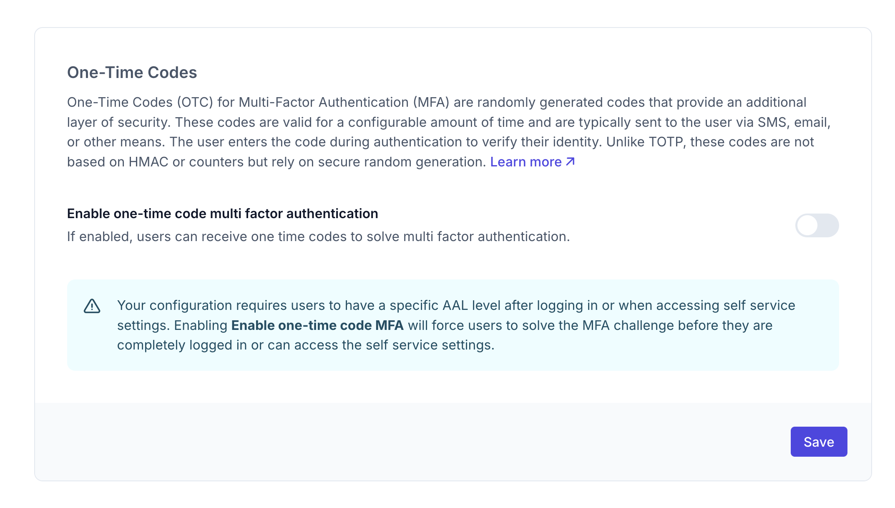

```mdx-code-block
import Tabs from "@theme/Tabs"
import TabItem from "@theme/TabItem"
import CodeBlock from "@theme/CodeBlock"
import { FrameworkCodeTabs, ImplementationSteps } from '@site/src/components/GuidesComponents'
import jsCheckAAL from '!!raw-loader!./_common/code-examples/js/session/check-aal.js'
import nextCheckAAL from '!!raw-loader!./_common/code-examples/nextjs/session/middleware-aal.ts'
import goCheckAAL from '!!raw-loader!./_common/code-examples/go/middleware-aal.go'
```

This guide shows you how to enable multi-factor authentication (MFA) for your Ory project.

```mdx-code-block
<Tabs
  defaultValue="console"
  values={[
    {label: 'Ory Console', value: 'console'},
    {label: 'Ory CLI', value: 'cli'},
  ]}>
<TabItem value="console">
```

To enable MFA using the Console:

1. Log in to your [Ory Console](https://console.ory.sh/)
2. Select your workspace and project
3. Navigate to the **Authentication** tab
4. Click on **Two-factor auth** in the sidebar

### Configure One-Time Codes

In the two-factor auth settings, you can enable and configure One-Time Codes for multi-factor authentication:

```mdx-code-block
import BrowserWindow from "@site/src/theme/BrowserWindow"

<BrowserWindow url="https://console.ory.sh/projects/<id>/mfa">

</BrowserWindow>
```

Toggle the "Enable one-time code multi factor authentication" toggle to allow users to receive one-time codes for MFA.

```mdx-code-block
</TabItem>
<TabItem value="cli">
```

To enable MFA using the CLI:

1. Get your current identity configuration:

```shell
# List all available workspaces
ory list workspaces

# List all available projects
ory list projects --workspace <workspace-id>

# Get the configuration
ory get identity-config --project <project-id> --workspace <workspace-id> --format yaml > identity-config.yaml
```

2. Edit the configuration file to enable One-Time Codes and set MFA requirements:

```yaml
# Enable One-Time Codes for MFA
selfservice:
  methods:
    code:
      enabled: true # Enable the one-time code method
      mfa_enabled: true
```

3. Update your configuration:

```shell
ory update identity-config --project <project-id> --workspace <workspace-id> --file identity-config.yaml
```

This configuration forces users to provide the highest authentication factor available to access their account settings. For
example, users without a second factor configured can access settings after they sign in with their password, but users that have
a second factor set up will need to complete the second factor challenge.

```mdx-code-block
</TabItem>
</Tabs>
```

## What users will see

When MFA is enabled, users will see a second authentication screen after logging in:

```mdx-code-block
  <BrowserWindow url="https://<base-url>/ui/login?flow">
  
</BrowserWindow>
```

## Check AAL

Authentication Authorization Level (AAL) is a concept that describes the strength of the authentication factor used to access a
resource.

- aal1: Password or OIDC - used one factor
- aal2: Password or OIDC and one-time code - used two factors

To check the AAL of the current session, use the `authenticator_assurance_level` on the `toSession` method.

```mdx-code-block
<FrameworkCodeTabs>
<TabItem value="javascript">
```

<CodeBlock className="language-js">{jsCheckAAL}</CodeBlock>

```mdx-code-block
</TabItem>
<TabItem value="nextjs">
```

<CodeBlock className="language-tsx" title={"middleware.ts"}>
  {nextCheckAAL}
</CodeBlock>

```mdx-code-block
</TabItem>
<TabItem value="go">
```

<CodeBlock className="language-go">{goCheckAAL}</CodeBlock>

```mdx-code-block
</TabItem>
</FrameworkCodeTabs>
```

### User flow

1. The user enters their username/password or uses another primary authentication method
2. They see the MFA challenge screen
3. A one-time code is sent to their email
4. After entering the valid code, they gain access to the application or protected settings
