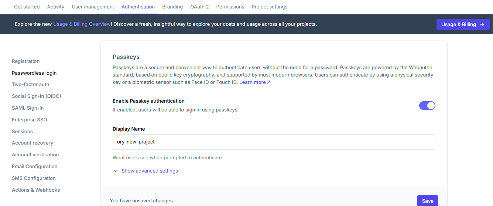

Passwordless login allows users to authenticate without using traditional passwords. This guide shows how to enable and configure
passwordless authentication methods in your Ory Network project.

## Enable passkeys

Passkeys are a secure and convenient way to authenticate users without passwords. They use public key cryptography and are
supported by most modern browsers.

```mdx-code-block
<Tabs
  defaultValue="console"
  values={[
    {label: 'Ory Console', value: 'console'},
    {label: 'Ory CLI', value: 'cli'},
  ]}>
<TabItem value="console">
```

To enable Passkeys:

1. Log in to [Ory Console](https://console.ory.com/)
2. Select your workspace and project
3. Navigate to the **Authentication** tab
4. Click on **Passwordless login** in the sidebar
5. Toggle "Enable Passkey authentication" to on
6. Configure the Display Name - this is what users see when prompted to authenticate
7. Click **Save**

```mdx-code-block
import BrowserWindow from "@site/src/theme/BrowserWindow"

<BrowserWindow url="https://console.ory.com/projects/<id>">



</BrowserWindow>
```

```mdx-code-block
</TabItem>
<TabItem value="cli">
```

To enable the passkey strategy using the Ory CLI, run the following command:

```bash
ory patch identity-config --project <your-project-id> \
--add '/selfservice/methods/passkey/enabled=true' \
--add '/selfservice/methods/passkey/config/rp/display_name="My Display Name"'
```

```mdx-code-block
</TabItem>
</Tabs>
```

### What users will see

Users will see a browser prompt to use a passkey:

```mdx-code-block
<BrowserWindow url="https://<base-url>/ui/login?flow=">

</BrowserWindow>
```

## Enable one-time codes

One-time codes (OTC) provide a secure authentication method where codes are sent directly to the user's email.

```mdx-code-block
<Tabs
  defaultValue="console"
  values={[
    {label: 'Ory Console', value: 'console'},
    {label: 'Ory CLI', value: 'cli'},
  ]}>
<TabItem value="console">
```

To enable one-time codes:

1. In the Passwordless login section
2. Toggle "Enable one-time code passwordless" to on
3. Click "Save"

```mdx-code-block
<BrowserWindow url="https://console.ory.com/projects/<id>">

</BrowserWindow>
```

Users will receive a one-time code via email when they attempt to sign in.

```mdx-code-block
</TabItem>
<TabItem value="cli">
```

To enable the passkey strategy using the Ory CLI, run the following command:

```bash
ory patch identity-config --project <your-project-id> \
--add '/selfservice/methods/code/passwordless_enabled=true'
```

```mdx-code-block
</TabItem>
</Tabs>
```

### What users will see

When using one-time codes, users will:

1. Enter their email address
2. Receive a code via email
3. Enter the code to complete authentication

```mdx-code-block
<BrowserWindow url="https://<base-url>/ui/login?flow=">

</BrowserWindow>
```
