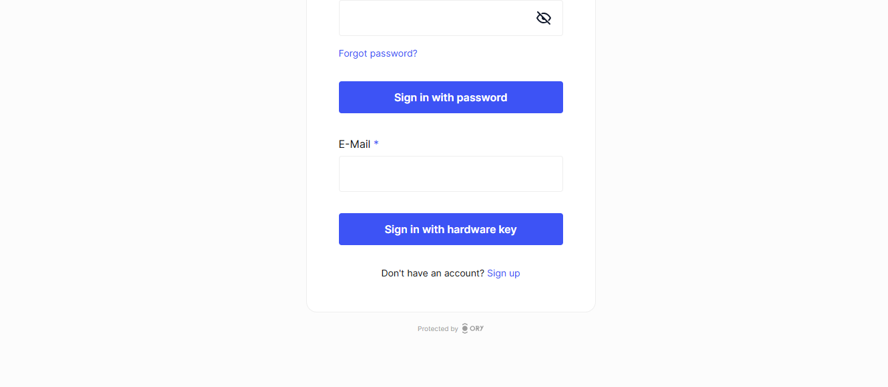

# Passwordless login

Passwordless login allows users to authenticate without using traditional passwords. This guide shows how to enable and configure
passwordless authentication methods in your Ory project.

## Enabling Passkeys

Passkeys are a secure and convenient way to authenticate users without passwords. They use public key cryptography and are
supported by most modern browsers.

To enable Passkeys:

1. Log in to your [Ory Console](https://console.ory.sh/)
2. Select your workspace and project
3. Navigate to the **Authentication** tab
4. Click on **Passwordless login** in the sidebar
5. Toggle "Enable Passkey authentication" to on
6. Configure the Display Name (what users see when prompted to authenticate)
7. Set the Hostname (the domain of the log-in page)
8. Add any required Origins (must match scheme://domain[:port])
9. Click "Save"

## Enabling One-Time Codes

One-Time Codes (OTC) provide a secure authentication method where codes are sent directly to the user's email or phone.

To enable One-Time Codes:

1. In the Passwordless login section
2. Toggle "Enable one-time code passwordless" to on
3. Click "Save"

Users will receive a one-time code via email when they attempt to sign in.

## Enabling WebAuthn

WebAuthn is a standard for hardware-based authentication using security keys or built-in platform authenticators.

To enable WebAuthn:

1. In the Passwordless login section
2. Toggle "Enable WebAuthn passwordless authentication" to on
3. Configure the Display Name
4. Click "Save"

## Recommended Approach

Ory recommends using the Passkey strategy for passwordless authentication as it offers a better user experience.

If you already have users using another method, you can keep both enabled during transition.

## What users will see
After enabling passwordless options, users will have new ways to authenticate:

### Passkeys
Users will see a browser prompt to use a passkey:

### One-Time Codes
When using one-time codes, users will:

1. Enter their email address
2. Receive a code via email
3. Enter the code to complete authentication

### WebAuthn
With WebAuthn enabled, users will be prompted to:

1. Insert a security key, or
2. Use their device's built-in authenticator (fingerprint, face recognition)

## Next steps

Now that you've enabled passwordless authentication, you can:

1. [Test the passwordless login flow](/docs/identities/get-started/sign-in.mdx) with your application
2. [Customize your authentication UI](/docs/kratos/bring-your-own-ui/01_overview.mdx) to include the passwordless options
3. [Manage session configuration](/docs/identities/get-started/session-management.mdx) for authenticated users
